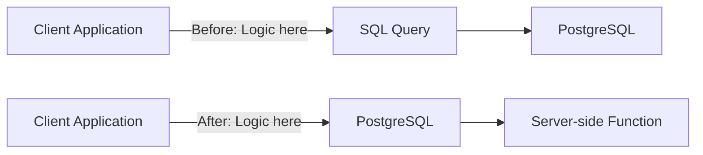
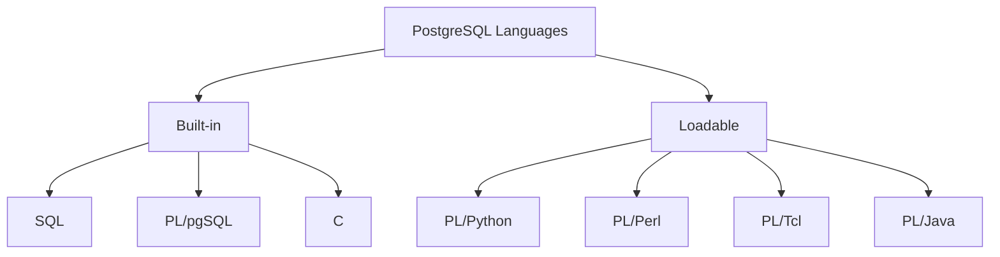
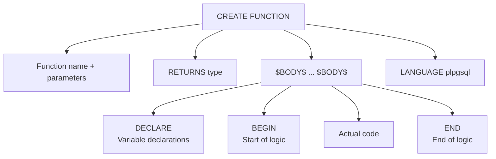
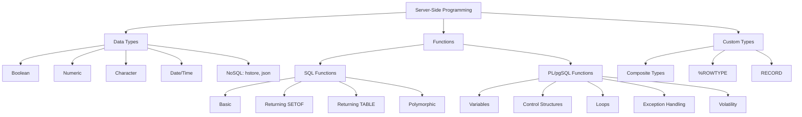
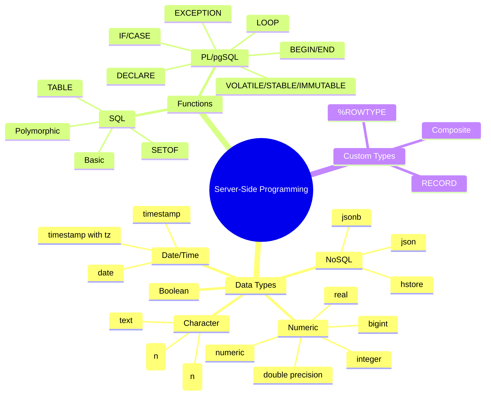

# Simple Explanation of Chapter 7: Server-Side Programming

This chapter teaches you how to write **code that runs inside PostgreSQL** — not just SQL queries, but actual functions and custom data types. Let me break it all down with simple words and diagrams.

---

## Part 1: What is Server-Side Programming?

### The Big Idea

Instead of writing logic in your application (client-side), you can put it **inside the database** (server-side).



**Benefits:**
- **Write once, use everywhere** — a function can be called from any SQL statement
- **Reusability** — modify in one place, all callers get the update
- **Performance** — process large data where it lives, not over the network
- **Extensibility** — add custom data types and functions to PostgreSQL

---

## Part 2: Data Types — The Building Blocks

### Standard Data Types

| Category | Types | Example |
|----------|-------|---------|
| **Boolean** | `BOOLEAN`, `BOOL` | `TRUE`, `FALSE`, `NULL` |
| **Numeric** | `integer`, `bigint`, `real`, `double precision`, `numeric` | `42`, `3.14` |
| **Character** | `char(n)`, `varchar(n)`, `text` | `'hello'` |
| **Date/Time** | `date`, `time`, `timestamp`, `timestamp with time zone` | `'2020-12-31'` |
| **NoSQL** | `hstore`, `xml`, `json`, `jsonb` | `'{"key": "value"}'` |

### Boolean Type

**Accepted TRUE values:** `true`, `yes`, `on`, `1`
**Accepted FALSE values:** `false`, `no`, `off`, `0`
**Also:** `NULL`

```sql
ALTER TABLE users ADD user_on_line BOOLEAN;
UPDATE users SET user_on_line = true WHERE pk = 1;
SELECT * FROM users WHERE user_on_line = true;
SELECT * FROM users WHERE user_on_line IS NULL;
```

### Numeric Types — Precision Matters

**Integer types truncate:**
```sql
SELECT 1.123456789::integer;    -- Result: 1
SELECT 1.123456789::bigint;     -- Result: 1
```

**Real (6 digits precision):**
```sql
SELECT 1.123456789::real;       -- Result: 1.1234568
```

**Double precision (15 digits):**
```sql
SELECT 1.123456789::double precision;  -- Result: 1.123456789
```

**Numeric (arbitrary precision, scale matters):**
```sql
SELECT 1.123456789::numeric(10,1);   -- Result: 1.1
SELECT 1.123456789::numeric(10,5);   -- Result: 1.12346
SELECT 1.123456789::numeric(10,9);   -- Result: 1.123456789
SELECT 1.123456789::numeric(10,11);  -- ERROR: scale > precision
```

**Rule:** precision = total digits, scale = digits after decimal point.

### Character Types — The Big Difference

| Type | Behavior |
|------|----------|
| `char(n)` | **Fixed length** — pads with spaces |
| `varchar(n)` | **Variable length** with max limit |
| `text` | **Variable length** with no limit |

**char(10) demonstration:**
```sql
CREATE TABLE new_tags (pk int, tag char(10));
INSERT INTO new_tags VALUES (1, 'first tag');  -- 9 chars
INSERT INTO new_tags VALUES (2, 'tag');        -- 3 chars

SELECT pk, tag, length(tag), octet_length(tag) FROM new_tags;
```
```
+----+------------+--------+--------------+
| 1  | first tag  | 9      | 10           |  ← padded to 10 bytes
| 2  | tag        | 3      | 10           |  ← padded to 10 bytes
+----+------------+--------+--------------+
```

**varchar(10) demonstration:**
```
+----+------------+--------+--------------+
| 1  | first tag  | 9      | 9            |  ← no padding
| 2  | tag        | 3      | 3            |  ← no padding
+----+------------+--------+--------------+
```

**text demonstration:**
```sql
INSERT INTO new_tags VALUES (3, 'this sentence has more than 10 characters');
-- Works! No limit.
```

### Date/Time Types

**DateStyle setting:**
```sql
SELECT * FROM pg_settings WHERE name = 'DateStyle';
-- Result: ISO, MDY (Month/Day/Year)
```

**Converting strings to dates:**
```sql
SELECT '12-31-2020'::date;                    -- Uses DateStyle
SELECT to_date('31/12/2020', 'dd/mm/yyyy');   -- Explicit format
```

**Formatting dates:**
```sql
SELECT to_char(created_on, 'dd-mm-yyyy') FROM posts;
-- Result: 03-01-2020
```

**Timestamp with vs without time zone:**
```sql
-- With time zone: stored as UTC, displayed in session's timezone
-- Without time zone: stored exactly as given

SET timezone = 'GMT';
-- Timestamp WITH time zone changes display
-- Timestamp WITHOUT time zone stays the same
```

### NoSQL Types — hstore and JSON

**hstore** = key-value pairs in a single column

```sql
CREATE EXTENSION hstore;

CREATE TABLE posts_options AS
SELECT p.pk, p.title,
       hstore(ARRAY['username', u.username, 'category', c.title]) AS options
FROM posts p
INNER JOIN users u ON p.author = u.pk
LEFT JOIN categories c ON p.category = c.pk;

SELECT * FROM posts_options WHERE options->'category' = 'orange';
```

**Result:**
```
+----+---------------+------------------------------------------------+
| 2  | my orange     | "category"=>"orange", "username"=>"myusername" |
| 4  | Re:my orange  | "category"=>"orange", "username"=>"scotty"     |
+----+---------------+------------------------------------------------+
```

**JSON/JSONB:**

```sql
CREATE TABLE post_json (jsondata jsonb);

INSERT INTO post_json
SELECT row_to_json(q) FROM (
    SELECT p.pk, p.title, string_agg(t.tag, ',') AS tag
    FROM posts p
    LEFT JOIN j_posts_tags jpt ON p.pk = jpt.post_pk
    LEFT JOIN tags t ON jpt.tag_pk = t.pk
    GROUP BY 1, 2 ORDER BY 1
) Q;

SELECT jsonb_pretty(jsondata) FROM post_json;
```

**JSON vs JSONB:**
- `json` = stored as text
- `jsonb` = stored in binary, indexable, faster

**Searching JSON:**
```sql
SELECT * FROM post_json WHERE jsondata @> '{"tag": "fruits"}';
```

---

## Part 3: Functions — Writing Code in PostgreSQL

### The Basic Structure

```sql
CREATE FUNCTION function_name(p1 type, p2 type, ...)
RETURNS type AS
BEGIN
    -- function logic
END;
LANGUAGE language_name;
```

### Languages Available



---

## Part 4: SQL Functions

### Basic Function

```sql
CREATE OR REPLACE FUNCTION my_sum(x integer, y integer)
RETURNS integer AS $$
    SELECT x + y;
$$ LANGUAGE SQL;

SELECT my_sum(1, 2);  -- Result: 3
```

### Positional Parameters (Old Way)

```sql
CREATE OR REPLACE FUNCTION my_sum(integer, integer)
RETURNS integer AS $$
    SELECT $1 + $2;
$$ LANGUAGE SQL;
```

### Returning a Set of Values

```sql
CREATE OR REPLACE FUNCTION delete_posts(p_title text)
RETURNS SETOF integer AS $$
    DELETE FROM posts WHERE title = p_title RETURNING pk;
$$ LANGUAGE SQL;

SELECT delete_posts('my tomato');  -- Returns deleted pk
```

### Returning a Table

```sql
CREATE OR REPLACE FUNCTION delete_posts(p_title text)
RETURNS TABLE (ret_key integer, ret_title text) AS $$
    DELETE FROM posts WHERE title = p_title RETURNING pk, title;
$$ LANGUAGE SQL;

SELECT * FROM delete_posts('my tomato');
```
```
+---------+-----------+
| ret_key | ret_title |
+---------+-----------+
| 5       | my tomato |
+---------+-----------+
```

### Polymorphic Functions

**Work with ANY data type:**

```sql
CREATE OR REPLACE FUNCTION nvl(anyelement, anyelement)
RETURNS anyelement AS $$
    SELECT COALESCE($1, $2);
$$ LANGUAGE SQL;

SELECT nvl(NULL::int, 1);      -- Result: 1
SELECT nvl(''::text, 'n');     -- Result: '' (empty string is not NULL)
SELECT nvl('a'::text, 'n');    -- Result: 'a'
```

---

## Part 5: PL/pgSQL Functions

### The PostgreSQL Procedural Language

```sql
CREATE OR REPLACE FUNCTION my_sum(x integer, y integer)
RETURNS integer AS
$BODY$
DECLARE
    ret integer;
BEGIN
    ret := x + y;
    RETURN ret;
END;
$BODY$
LANGUAGE plpgsql;

SELECT my_sum(2, 3);  -- Result: 5
```

### Structure Breakdown



### Parameter Declaration — Three Ways

**Way 1: Named parameters**
```sql
CREATE FUNCTION my_sum(x integer, y integer) ...
```

**Way 2: Positional with aliases**
```sql
CREATE FUNCTION my_sum(integer, integer) RETURNS integer AS $$
DECLARE
    x ALIAS FOR $1;
    y ALIAS FOR $2;
    ret integer;
BEGIN
    ret := x + y;
    RETURN ret;
END;
$$ LANGUAGE plpgsql;
```

**Way 3: Pure positional**
```sql
CREATE FUNCTION my_sum(integer, integer) RETURNS integer AS $$
DECLARE
    ret integer;
BEGIN
    ret := $1 + $2;
    RETURN ret;
END;
$$ LANGUAGE plpgsql;
```

### IN / OUT / INOUT Parameters

```sql
CREATE OR REPLACE FUNCTION my_sum_mul(
    IN x integer,
    IN y integer,
    OUT w integer,
    OUT z integer
) AS $$
BEGIN
    z := x + y;
    w := x * y;
END;
$$ LANGUAGE plpgsql;

SELECT * FROM my_sum_mul(2, 3);
```
```
+---+---+
| w | z |
+---+---+
| 6 | 5 |
+---+---+
```

**Types:**
- `IN` = input only (default)
- `OUT` = output only
- `INOUT` = both

### Function Volatility — Critical for Performance

| Category | Description | Example |
|----------|-------------|---------|
| **VOLATILE** | Can do anything, may return different results | `random()` |
| **STABLE** | Same result within a transaction | `now()` |
| **IMMUTABLE** | Same result forever for same args | `lower()` |

**STABLE example:**
```sql
BEGIN;
SELECT now();  -- 2020-02-19 16:33:35
SELECT now();  -- 2020-02-19 16:33:35 (same!)
COMMIT;

BEGIN;
SELECT now();  -- 2020-02-19 16:33:51 (different transaction)
COMMIT;
```

**IMMUTABLE example:**
```sql
SELECT lower('MICKY MOUSE');  -- Always 'micky mouse'
```

### Control Structures — IF Statements

```sql
CREATE OR REPLACE FUNCTION my_check(x integer DEFAULT 0, y integer DEFAULT 0)
RETURNS text AS
$BODY$
BEGIN
    IF x > y THEN
        RETURN 'first parameter is higher';
    ELSIF x < y THEN
        RETURN 'second parameter is higher';
    ELSE
        RETURN 'the 2 parameters are equal';
    END IF;
END;
$BODY$
LANGUAGE plpgsql;
```

### Control Structures — CASE Statements

**Simple CASE (compare with values):**
```sql
CREATE OR REPLACE FUNCTION my_check_value(x integer DEFAULT 0)
RETURNS text AS
$BODY$
BEGIN
    CASE x
        WHEN 1 THEN RETURN 'value = 1';
        WHEN 2 THEN RETURN 'value = 2';
        ELSE RETURN 'value >= 3';
    END CASE;
END;
$BODY$
LANGUAGE plpgsql;
```

**Searched CASE (compare with conditions):**
```sql
CASE
    WHEN x > y THEN RETURN 'x > y';
    WHEN x < y THEN RETURN 'x < y';
    ELSE RETURN 'x = y';
END CASE;
```

### Control Structures — Loops

```sql
CREATE OR REPLACE FUNCTION my_first_fun(p_id integer)
RETURNS SETOF my_ret_type AS
$$
DECLARE
    rw posts%ROWTYPE;  -- Row type from posts table
    ret my_ret_type;
BEGIN
    FOR rw IN SELECT * FROM posts WHERE pk = p_id LOOP
        ret.id := rw.pk;
        ret.title := rw.title;
        ret.record_data := hstore(ARRAY['title', rw.title,
            'Title and Content', format('%s %s', rw.title, rw.content)]);
        RETURN NEXT ret;
    END LOOP;
    RETURN;
END;
$$
LANGUAGE plpgsql;
```

**Key concepts:**
- `%ROWTYPE` = a variable that holds one row of a table
- `FOR ... IN ... LOOP` = loop through query results
- `RETURN NEXT` = add a row to the result set
- `RETURN` = end the function

### The RECORD Type (Generic Row)

```sql
DECLARE
    rw RECORD;  -- Can hold any table's row
```

**Difference:**
- `%ROWTYPE` = tied to a specific table
- `RECORD` = generic, works with any query

### Exception Handling

```sql
CREATE OR REPLACE FUNCTION my_second_except(x real, y real)
RETURNS real AS
$$
DECLARE
    ret real;
BEGIN
    ret := x / y;
    RETURN ret;
EXCEPTION
    WHEN division_by_zero THEN
        RAISE INFO 'DIVISION BY ZERO';
        RAISE INFO 'Error % %', SQLSTATE, SQLERRM;
        RETURN 0;
END;
$$
LANGUAGE plpgsql;

SELECT my_second_except(4, 0);
-- INFO: DIVISION BY ZERO
-- INFO: Error 22012 division by zero
-- Result: 0
```

**Variables:**
- `SQLSTATE` = error code
- `SQLERRM` = error message

---

## Part 6: Custom Data Types

### Composite Types

```sql
CREATE TYPE my_ret_type AS (
    id integer,
    title text,
    record_data hstore
);
```

**Using composite types:**
```sql
CREATE OR REPLACE FUNCTION my_first_fun(p_id integer)
RETURNS SETOF my_ret_type AS
$$
DECLARE
    rw posts%ROWTYPE;
    ret my_ret_type;
BEGIN
    FOR rw IN SELECT * FROM posts WHERE pk = p_id LOOP
        ret.id := rw.pk;
        ret.title := rw.title;
        ret.record_data := hstore(ARRAY['title', rw.title,
            'Title and Content', format('%s %s', rw.title, rw.content)]);
        RETURN NEXT ret;
    END LOOP;
    RETURN;
END;
$$
LANGUAGE plpgsql;
```

**Calling it:**
```sql
SELECT * FROM my_first_fun(3);
```
```
+----+--------------+----------------------------------------------------------+
| id | title        | record_data                                              |
+----+--------------+----------------------------------------------------------+
| 3  | my new apple | "title"=>"my new apple", "Title and Content"=>"my new..."|
+----+--------------+----------------------------------------------------------+
```

---

## Part 7: Complete Summary Diagram



---

## Part 8: Key Takeaways

### Data Types

1. **Boolean** accepts `true/false`, `yes/no`, `on/off`, `1/0`
2. **Integer** types truncate decimal parts
3. **real** = 6 digits, **double precision** = 15 digits, **numeric** = arbitrary
4. **char(n)** pads with spaces; **varchar(n)** doesn't; **text** has no limit
5. **DateStyle** controls date format interpretation
6. **timestamp with time zone** shifts with session timezone; **without** doesn't
7. **hstore** = key-value pairs; **jsonb** = binary, indexable JSON

### Functions

8. **SQL functions** are easiest — just wrap SQL in `$$...$$`
9. **PL/pgSQL** adds variables, control structures, loops, exceptions
10. **SETOF** returns multiple rows of one type
11. **TABLE** returns multiple rows of multiple columns
12. **Polymorphic functions** work with ANY data type (`anyelement`)
13. **IN/OUT/INOUT** parameters give flexibility
14. **VOLATILE** (default) = may return different results
15. **STABLE** = same result within transaction
16. **IMMUTABLE** = same result forever
17. **%ROWTYPE** = row from specific table; **RECORD** = generic row
18. **EXCEPTION** block catches errors; **SQLSTATE** and **SQLERRM** give details

### Custom Types

19. **Composite types** bundle multiple fields into one type
20. **CREATE TYPE ... AS (...)** defines a custom composite type

---

## Part 9: Quick Reference Card



---

## The Golden Rules

1. **Use SQL functions** for simple queries — they're easiest
2. **Use PL/pgSQL** when you need logic (IF, loops, variables)
3. **Choose the right numeric type** — precision matters!
4. **Use text over varchar** unless you need a length limit
5. **Always use ORDER BY** with window functions
6. **Mark functions STABLE or IMMUTABLE** for better performance
7. **Handle exceptions** in PL/pgSQL to avoid crashes
8. **Use composite types** to return multiple values
9. **JSONB is usually better** than JSON for storage and querying
10. **Functions are transactional** — they complete fully or not at all