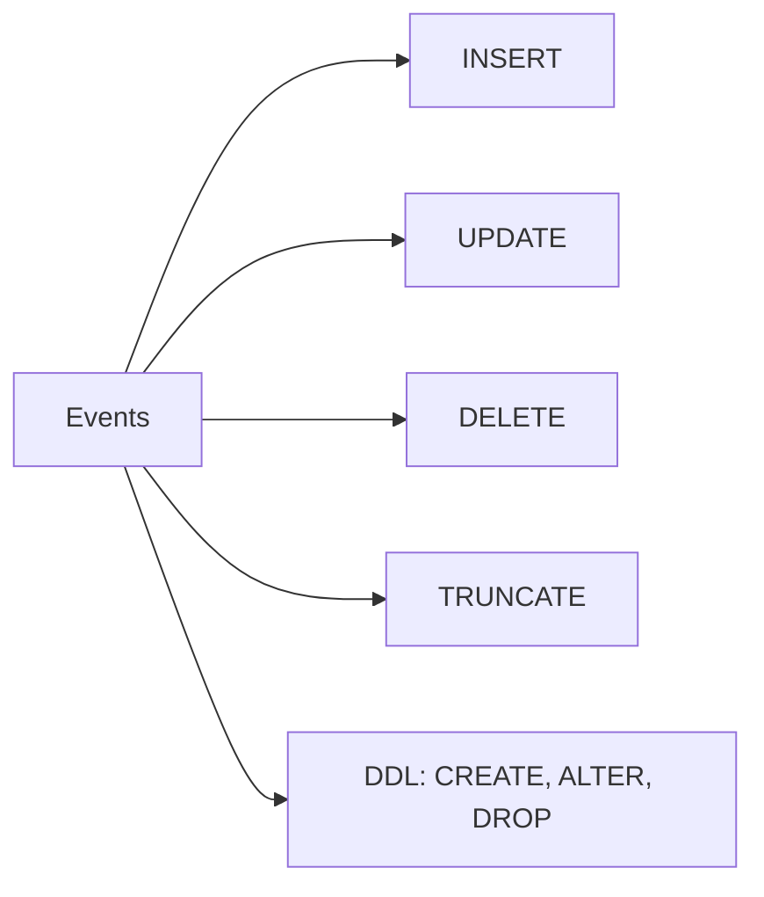
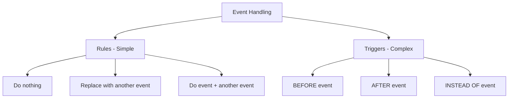
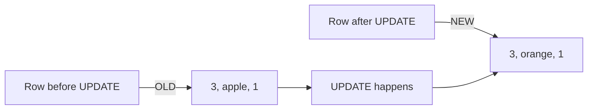
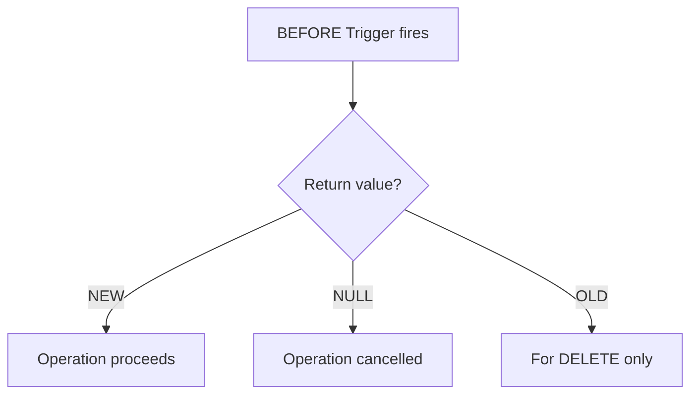
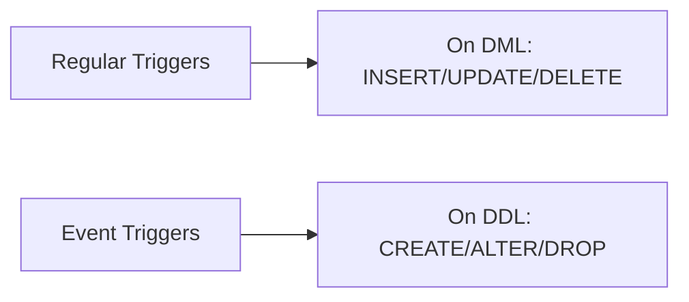
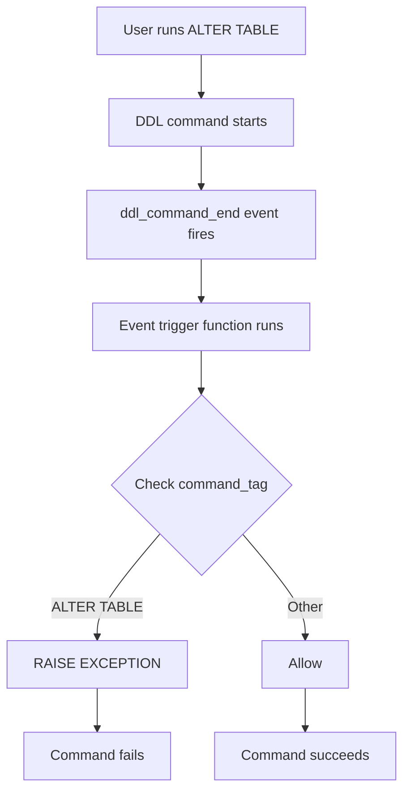
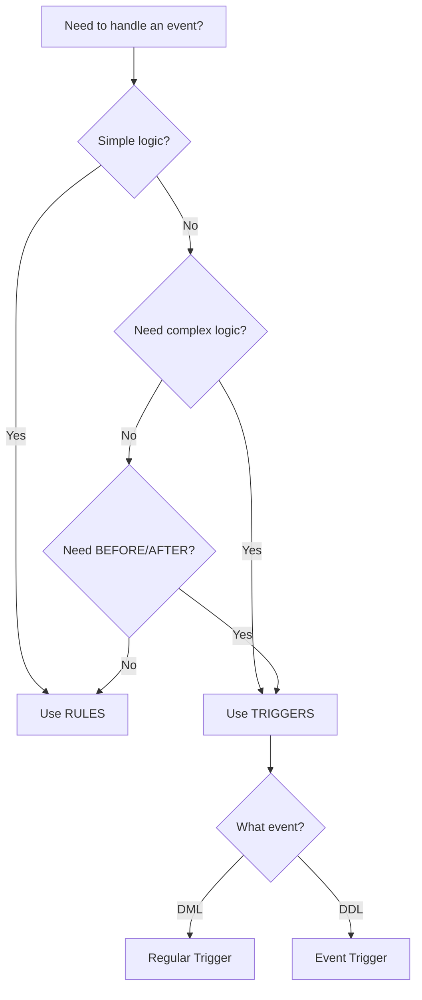
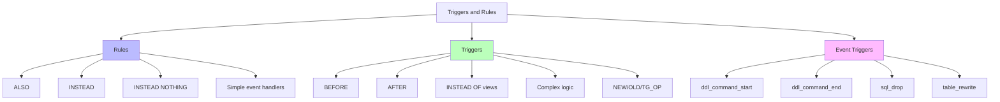
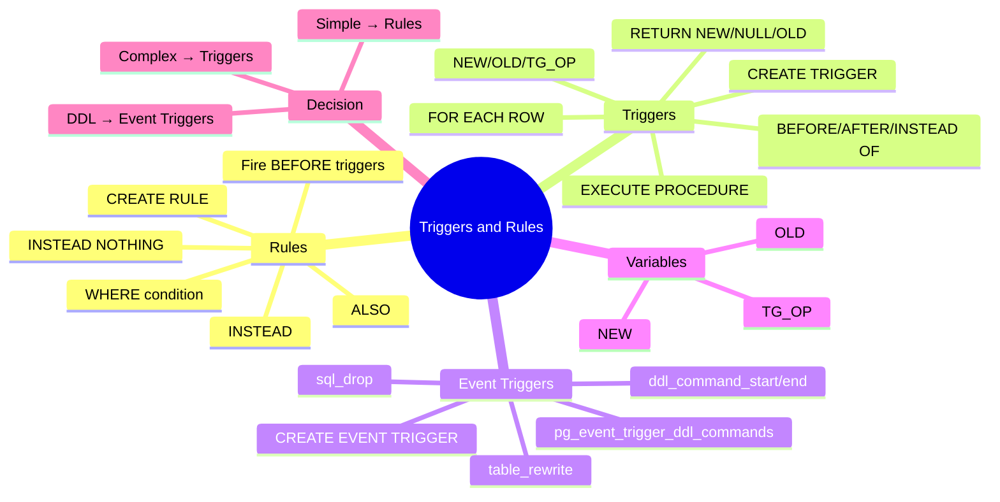

# Simple Explanation of Chapter 8: Triggers and Rules

This chapter teaches you how to make PostgreSQL **automatically react to events** — like when data is inserted, updated, or deleted. Let me break it all down with simple words and diagrams.

---

## Part 1: What Are Events, Rules, and Triggers?

### Events in PostgreSQL

An **event** is something that happens to your data:



### Two Ways to Handle Events

| Method | Complexity | When to Use |
|--------|-----------|-------------|
| **Rules** | Simple event handlers | Basic redirection, simple logic |
| **Triggers** | Complex event handlers | Complex logic, multiple operations |



### Key Rule: Rules Fire BEFORE Triggers

If both rules and triggers exist on the same event, **rules always fire first**.

Multiple triggers on the same event fire in **alphabetical order**.

---

## Part 2: The OLD and NEW Variables

These are **special variables** that represent the state of a row.

### What They Mean

| Operation | NEW | OLD |
|-----------|-----|-----|
| **INSERT** | ✅ Present (new row) | ❌ Absent |
| **DELETE** | ❌ Absent | ✅ Present (old row) |
| **UPDATE** | ✅ Present (new values) | ✅ Present (old values) |

### Visual Example

**Before UPDATE:** `tags` has `(3, 'apple', 1)`

```sql
UPDATE tags SET tag = 'orange' WHERE pk = 3;
```

**What happens:**
```
OLD = (3, 'apple', 1)     ← what was there before
NEW = (3, 'orange', 1)    ← what will be there after
```



---

## Part 3: Rules — Simple Event Handlers

### Rule Syntax

```sql
CREATE [OR REPLACE] RULE name AS ON event
TO table [WHERE condition]
DO [ALSO | INSTEAD] { NOTHING | command | (command; command...) }
```

### Three Options

| Option | What It Does |
|--------|-------------|
| **ALSO** | Do the event **AND** the extra command |
| **INSTEAD** | Do the extra command **INSTEAD OF** the event |
| **INSTEAD NOTHING** | Do **nothing** |

### Rule on INSERT — ALSO

**Goal:** When inserting into `tags`, ALSO insert into `a_tags` if tag starts with 'a'.

```sql
CREATE OR REPLACE RULE r_tags1
AS ON INSERT TO tags
WHERE NEW.tag ILIKE 'a%'
DO ALSO
    INSERT INTO a_tags(pk, tag, parent)
    VALUES (NEW.pk, NEW.tag, NEW.parent);
```

**Visual:**
```
INSERT INTO tags (tag) VALUES ('apple');
         │
         ├──► tags table gets ('apple')
         │
         └──► a_tags table ALSO gets ('apple')
```

### Rule on INSERT — INSTEAD

**Goal:** When inserting into `tags`, put it in `b_tags` INSTEAD.

```sql
CREATE OR REPLACE RULE r_tags2
AS ON INSERT TO tags
WHERE NEW.tag ILIKE 'b%'
DO INSTEAD
    INSERT INTO b_tags(pk, tag, parent)
    VALUES (NEW.pk, NEW.tag, NEW.parent);
```

**Visual:**
```
INSERT INTO tags (tag) VALUES ('banana');
         │
         └──► b_tags gets ('banana')
              (tags does NOT get it!)
```

### Rule on INSERT — INSTEAD NOTHING

**Goal:** Ignore inserts starting with 'c'.

```sql
CREATE OR REPLACE RULE r_tags3
AS ON INSERT TO tags
WHERE NEW.tag ILIKE 'c%'
DO INSTEAD NOTHING;
```

**Result:** `INSERT 0 0` — nothing is inserted anywhere.

### Rules on DELETE

**Goal:** When deleting from `new_tags`, also delete from child tables.

```sql
CREATE OR REPLACE RULE r_new_tags_delete_a
AS ON DELETE TO new_tags
WHERE OLD.tag ILIKE 'a%'
DO ALSO
    DELETE FROM new_a_tags WHERE pk = OLD.pk;

CREATE OR REPLACE RULE r_new_tags_delete_b
AS ON DELETE TO new_tags
WHERE OLD.tag ILIKE 'b%'
DO ALSO
    DELETE FROM new_b_tags WHERE pk = OLD.pk;
```

### Rules on UPDATE

Rules alone can't handle complex UPDATE logic. You need a **function** + a rule:

```sql
-- Function to move records
CREATE OR REPLACE FUNCTION move_record(
    p_pk integer, p_tag text, p_parent integer,
    p_old_pk integer, p_old_tag text
) RETURNS void LANGUAGE plpgsql AS $$
BEGIN
    IF LEFT(LOWER(p_tag), 1) IN ('a', 'b') THEN
        DELETE FROM new_tags WHERE pk = p_old_pk;
        INSERT INTO new_tags VALUES (p_pk, p_tag, p_parent);
    END IF;
END;
$$;

-- Rule that calls the function
CREATE OR REPLACE RULE r_new_tags_update_a
AS ON UPDATE TO new_tags
DO ALSO
    SELECT move_record(NEW.pk, NEW.tag, NEW.parent, OLD.pk, OLD.tag);
```

---

## Part 4: Triggers — Complex Event Handlers

### What Makes Triggers Different

| Feature | Rules | Triggers |
|---------|-------|----------|
| **Complexity** | Simple | Complex |
| **Events** | INSERT, UPDATE, DELETE | INSERT, UPDATE, DELETE, TRUNCATE |
| **When** | Always BEFORE | BEFORE or AFTER |
| **INSTEAD OF** | On tables | On views only |
| **Foreign tables** | ❌ | ✅ |
| **Order** | Rules first | Triggers after rules |

### Trigger Syntax

```sql
CREATE [CONSTRAINT] TRIGGER name
{ BEFORE | AFTER | INSTEAD OF }
{ INSERT | UPDATE | DELETE | TRUNCATE }
ON table_name
[FOR EACH { ROW | STATEMENT }]
[WHEN (condition)]
EXECUTE { FUNCTION | PROCEDURE } function_name(arguments)
```

### The Trigger Function Prototype

```sql
CREATE OR REPLACE FUNCTION function_name()
RETURNS TRIGGER AS $$
DECLARE
    ...
BEGIN
    ...
    RETURN NEW;  -- or RETURN OLD; or RETURN NULL;
END;
$$ LANGUAGE plpgsql;
```

**Important:** Trigger functions:
- Take **no input parameters**
- Return **TRIGGER** type
- Use NEW/OLD variables internally

### The RETURN Values

| RETURN | Effect on BEFORE Trigger |
|--------|-------------------------|
| `NEW` | Proceed with the operation |
| `OLD` | (for DELETE) Proceed |
| `NULL` | **Cancel** the operation |



---

## Part 5: Triggers on INSERT

### Example: Copy Tags Starting with 'a'

**Goal:** When inserting into `new_tags`, if tag starts with 'a', also insert into `a_tags`.

```sql
CREATE OR REPLACE FUNCTION f_tags() RETURNS trigger AS $$
BEGIN
    IF LOWER(SUBSTRING(NEW.tag FROM 1 FOR 1)) = 'a' THEN
        INSERT INTO a_tags(pk, tag, parent)
        VALUES (NEW.pk, NEW.tag, NEW.parent);
    END IF;
    RETURN NEW;
END;
$$ LANGUAGE plpgsql;

CREATE TRIGGER t_tags
BEFORE INSERT ON new_tags
FOR EACH ROW
EXECUTE PROCEDURE f_tags();
```

**How it works:**
```
INSERT INTO new_tags VALUES (2, 'apple', 1);
         │
         ▼
Trigger fires BEFORE INSERT
         │
         ├──► a_tags gets ('apple')
         │
         └──► RETURN NEW
                  │
                  ▼
            new_tags gets ('apple')
```

### Example: Prevent Insert Starting with 'b'

```sql
CREATE OR REPLACE FUNCTION f2_tags() RETURNS trigger AS $$
BEGIN
    IF LOWER(SUBSTRING(NEW.tag FROM 1 FOR 1)) = 'b' THEN
        INSERT INTO b_tags(pk, tag, parent)
        VALUES (NEW.pk, NEW.tag, NEW.parent);
        RETURN NULL;  -- Cancel the INSERT in new_tags!
    END IF;
    RETURN NEW;
END;
$$ LANGUAGE plpgsql;
```

**Visual:**
```
INSERT INTO new_tags VALUES (3, 'banana', 1);
         │
         ▼
Trigger fires BEFORE INSERT
         │
         ├──► b_tags gets ('banana')
         │
         └──► RETURN NULL
                  │
                  ▼
            INSERT CANCELLED!
            (new_tags doesn't get it)
```

### Combining Multiple Triggers Into One

Instead of two functions, use one:

```sql
CREATE OR REPLACE FUNCTION f3_tags() RETURNS trigger AS $$
BEGIN
    IF LOWER(SUBSTRING(NEW.tag FROM 1 FOR 1)) = 'a' THEN
        INSERT INTO a_tags(pk, tag, parent)
        VALUES (NEW.pk, NEW.tag, NEW.parent);
        RETURN NEW;  -- Proceed
    ELSIF LOWER(SUBSTRING(NEW.tag FROM 1 FOR 1)) = 'b' THEN
        INSERT INTO b_tags(pk, tag, parent)
        VALUES (NEW.pk, NEW.tag, NEW.parent);
        RETURN NULL;  -- Cancel
    ELSE
        RETURN NEW;  -- Proceed
    END IF;
END;
$$ LANGUAGE plpgsql;

CREATE TRIGGER t3_tags
BEFORE INSERT ON new_tags
FOR EACH ROW
EXECUTE PROCEDURE f3_tags();
```

---

## Part 6: The TG_OP Variable

**TG_OP** tells the trigger **which event** fired it.

**Values:** `'INSERT'`, `'UPDATE'`, `'DELETE'`, `'TRUNCATE'`

### Master Function Pattern

```sql
CREATE OR REPLACE FUNCTION fcopy_tags() RETURNS trigger AS $$
BEGIN
    IF TG_OP = 'INSERT' THEN
        -- Handle INSERT
        IF LOWER(SUBSTRING(NEW.tag FROM 1 FOR 1)) = 'a' THEN
            INSERT INTO a_tags VALUES (NEW.pk, NEW.tag, NEW.parent);
        ELSIF LOWER(SUBSTRING(NEW.tag FROM 1 FOR 1)) = 'b' THEN
            INSERT INTO b_tags VALUES (NEW.pk, NEW.tag, NEW.parent);
        END IF;
        RETURN NEW;
    END IF;

    IF TG_OP = 'DELETE' THEN
        -- Handle DELETE
        IF LOWER(SUBSTRING(OLD.tag FROM 1 FOR 1)) = 'a' THEN
            DELETE FROM a_tags WHERE pk = OLD.pk;
        ELSIF LOWER(SUBSTRING(OLD.tag FROM 1 FOR 1)) = 'b' THEN
            DELETE FROM b_tags WHERE pk = OLD.pk;
        END IF;
        RETURN OLD;
    END IF;

    IF TG_OP = 'UPDATE' THEN
        -- Handle UPDATE
        IF LOWER(SUBSTRING(OLD.tag FROM 1 FOR 1)) IN ('a', 'b') THEN
            DELETE FROM a_tags WHERE pk = OLD.pk;
            DELETE FROM b_tags WHERE pk = OLD.pk;
            DELETE FROM new_tags WHERE pk = OLD.pk;
            INSERT INTO new_tags VALUES (NEW.pk, NEW.tag, NEW.parent);
        END IF;
        RETURN NEW;
    END IF;
END;
$$ LANGUAGE plpgsql;
```

### Wiring Up Triggers

```sql
CREATE TRIGGER tcopy_tags_ins
BEFORE INSERT ON new_tags
FOR EACH ROW EXECUTE PROCEDURE fcopy_tags();

CREATE TRIGGER tcopy_tags_del
AFTER DELETE ON new_tags
FOR EACH ROW EXECUTE PROCEDURE fcopy_tags();

CREATE TRIGGER tcopy_tags_upd
AFTER UPDATE ON new_tags
FOR EACH ROW EXECUTE PROCEDURE fcopy_tags();
```

**Important:** UPDATE trigger must be **AFTER** UPDATE (not BEFORE) because the function deletes the old row and inserts a new one.

---

## Part 7: Event Triggers (DDL Triggers)

### What Are They?

**Event triggers** fire on **DDL statements** (CREATE, ALTER, DROP) — not data changes.



### Event Trigger Events

| Event | When |
|-------|------|
| `ddl_command_start` | Before DDL command |
| `ddl_command_end` | After DDL command |
| `sql_drop` | When DROP is about to complete |
| `table_rewrite` | Before table rewrite |

### Syntax

```sql
CREATE EVENT TRIGGER name
ON event
[WHEN filter_variable IN (filter_value, ...)]
EXECUTE { FUNCTION | PROCEDURE } function_name();
```

### Helper Functions

| Function | Purpose |
|----------|---------|
| `pg_event_trigger_ddl_commands()` | Returns info about DDL commands |
| `pg_event_trigger_dropped_objects()` | Returns info about dropped objects |

### Example: Prevent ALTER TABLE

```sql
CREATE OR REPLACE FUNCTION f_avoid_alter_table()
RETURNS EVENT_TRIGGER AS $$
DECLARE
    event_tuple RECORD;
BEGIN
    FOR event_tuple IN SELECT * FROM pg_event_trigger_ddl_commands() LOOP
        IF event_tuple.command_tag = 'ALTER TABLE'
           AND event_tuple.object_type = 'table' THEN
            RAISE EXCEPTION 'Cannot execute an ALTER TABLE!';
        END IF;
    END LOOP;
END;
$$ LANGUAGE plpgsql;

CREATE EVENT TRIGGER tr_avoid_alter_table
ON ddl_command_end
EXECUTE FUNCTION f_avoid_alter_table();
```

**Testing:**
```sql
ALTER TABLE tags ADD COLUMN thumbs_up int DEFAULT 0;
-- ERROR: Cannot execute an ALTER TABLE!
```

### Visual Flow



> **Note:** Use event triggers **sparingly**. Permissions are usually a better way to prevent commands.

---

## Part 8: Complete Comparison — Rules vs Triggers

### Feature Comparison

| Feature | Rules | Triggers |
|---------|-------|----------|
| **Complexity** | Simple | Complex |
| **Events** | INSERT, UPDATE, DELETE | INSERT, UPDATE, DELETE, TRUNCATE |
| **Firing Time** | Always BEFORE | BEFORE, AFTER, INSTEAD OF |
| **Table Support** | Regular tables | Regular + foreign tables |
| **View Support** | ❌ | INSTEAD OF only |
| **Multiple Commands** | ✅ (with parentheses) | ❌ |
| **Order** | First | After rules |
| **Conditional Logic** | WHERE clause | IF/THEN in function |
| **Variables** | NEW/OLD | NEW/OLD/TG_OP |

### Decision Flow



---

## Part 9: Complete Summary Diagram



---

## Part 10: Key Takeaways

1. **Rules are simple, triggers are complex** — choose accordingly
2. **Rules always fire BEFORE triggers** on the same event
3. **Multiple triggers fire in alphabetical order**
4. **NEW** = new row (INSERT/UPDATE); **OLD** = old row (DELETE/UPDATE)
5. **Rules:** ALSO (do both), INSTEAD (replace), INSTEAD NOTHING (skip)
6. **Triggers:** BEFORE, AFTER, or INSTEAD OF (views only)
7. **RETURN NEW** = proceed; **RETURN NULL** = cancel
8. **TG_OP** tells the trigger which event fired it
9. **Trigger functions** take no params, return TRIGGER type
10. **UPDATE triggers** are usually AFTER (to avoid conflicts)
11. **Event triggers** fire on DDL (CREATE/ALTER/DROP)
12. **Event trigger events:** ddl_command_start, ddl_command_end, sql_drop, table_rewrite
13. **Use permissions** over event triggers for access control when possible

---

## Quick Reference Card



**The Golden Rules:**
1. **Rules** for simple redirection of events
2. **Triggers** for complex logic with conditions
3. **Event triggers** for DDL-level control
4. Always test with real data before production
5. Remember: **rules fire first**, then triggers
6. **RETURN NULL** cancels the operation (in BEFORE triggers)