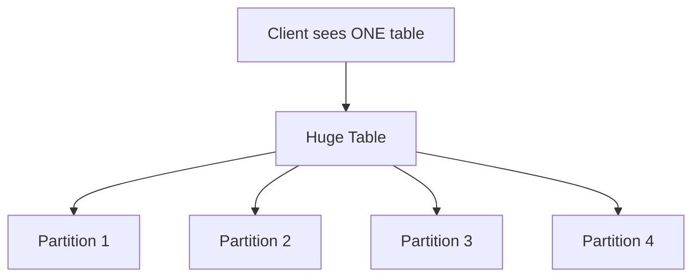
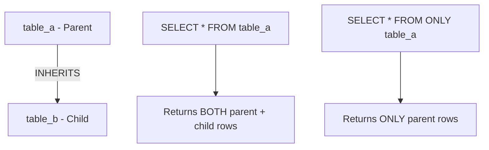
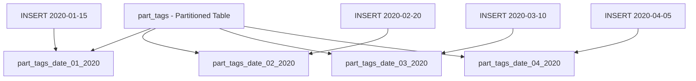
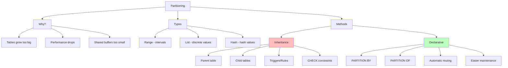
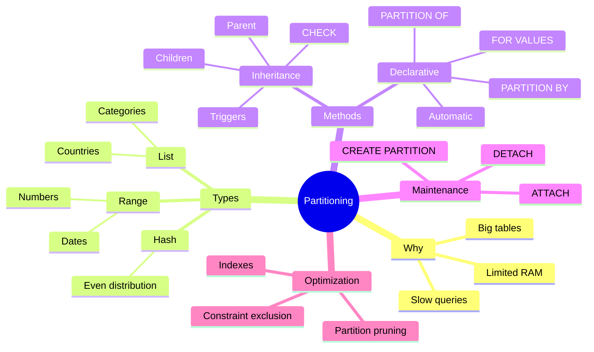

# Simple Explanation of Chapter 9: Partitioning

This chapter teaches you how to **split a huge table into smaller tables** to make queries faster. Let me break it all down with simple words and diagrams.

---

## Part 1: Why Partition Data?

### The Problem

- Databases **always grow** — gigabytes → terabytes → petabytes
- PostgreSQL uses **shared_buffers** (RAM) to process data
- When a table is much larger than shared_buffers, performance drops

### The Solution: Partitioning

**Partitioning** = splitting a huge table into smaller tables **transparently** — the client still sees one table.



### Two Ways to Partition

| Method | Description |
|--------|-------------|
| **Table Inheritance** | Classic way — parent + child tables + triggers/rules |
| **Declarative Partitioning** | Modern way (PostgreSQL 10+) — built-in support |

---

## Part 2: Three Types of Partitioning

### Range Partitioning

Split by **intervals** (e.g., dates, numbers).

**Example: Split by date**
```
+------------+-------------+
| field_date | field_value |
+------------+-------------+
| 2020-03-01 | 1           |
| 2020-03-02 | 10          |
| 2020-04-01 | 12          |
| 2020-04-15 | 1           |
+------------+-------------+

After partitioning:
TABLE A (March):          TABLE B (April):
+------------+-------+    +------------+-------+
| 2020-03-01 | 1     |    | 2020-04-01 | 12    |
| 2020-03-02 | 10    |    | 2020-04-15 | 1     |
+------------+-------+    +------------+-------+
```

### List Partitioning

Split by **a list of values** (e.g., countries, categories).

**Example: Split by state**
```
+---------------+----------------+
| field_state   | field_city     |
+---------------+----------------+
| United States | Washington     |
| United States | San Francisco  |
| Italy         | Rome           |
| Japan         | Tokyo          |
+---------------+----------------+

After partitioning:
TABLE A (US):              TABLE B (Italy):    TABLE C (Japan):
+---------------+----------+  +---------+------+  +---------+-------+
| United States | Washington|  | Italy   | Rome |  | Japan   | Tokyo |
| United States | San Fran. |  +---------+------+  +---------+-------+
+---------------+----------+
```

### Hash Partitioning

Split by **hash value** of a column.

**Example:**
```
hash(2020-03-01) = AAAAAAB
hash(2020-03-02) = AAAAAAC
hash(2020-04-01) = AAAAAAB
hash(2020-04-15) = AAAAAAC

After partitioning:
TABLE A (hash B):         TABLE B (hash C):
+------------+-------+    +------------+-------+
| 2020-03-01 | 1     |    | 2020-03-02 | 10    |
| 2020-04-01 | 12    |    | 2020-04-15 | 1     |
+------------+-------+    +------------+-------+
```

---

## Part 3: Table Inheritance (Classic Way)

### What is Inheritance?

**Parent table** = holds shared structure
**Child table** = inherits fields from parent

```sql
-- Parent table
CREATE TABLE table_a (
    pk INTEGER NOT NULL PRIMARY KEY,
    tag TEXT,
    parent INTEGER
);

-- Child table inherits from parent
CREATE TABLE table_b () INHERITS (table_a);
ALTER TABLE table_b ADD CONSTRAINT table_b_pk PRIMARY KEY (pk);
```

### Visual



### How Inheritance Works

**Insert into parent:**
```sql
INSERT INTO table_a VALUES (1, 'fruits', 0);  -- Goes to table_a
INSERT INTO table_b VALUES (2, 'orange', 0);  -- Goes to table_b
```

**Select from parent returns BOTH:**
```sql
SELECT * FROM table_a;
```
```
+----+--------+--------+
| 1  | fruits | 0      |  ← from table_a
| 2  | orange | 0      |  ← from table_b
+----+--------+--------+
```

**Select ONLY from parent:**
```sql
SELECT * FROM ONLY table_a;
```
```
+----+--------+--------+
| 1  | fruits | 0      |  ← only table_a
+----+--------+--------+
```

**Update/Delete from parent affects children:**
```sql
UPDATE table_a SET tag = 'apple' WHERE pk = 2;
-- This actually updates table_b!
DELETE FROM table_a WHERE pk = 2;
-- This actually deletes from table_b!
```

### Dropping Tables

```sql
-- Drop only child
DROP TABLE table_b;

-- Drop parent AND all children
DROP TABLE table_a CASCADE;
```

---

## Part 4: Partitioning Using Inheritance (Complete Example)

### Goal: List Partitioning

Split `part_tags` by `level` value into separate tables:

```
+----+------------+-------+
| pk | tag        | level |
+----+------------+-------+
| 1  | vegetables | 0     |
| 2  | fruits     | 0     |
| 3  | orange     | 1     |
| 4  | apple      | 1     |
| 5  | red apple  | 2     |
+----+------------+-------+

After partitioning:
part_tags_level_0:      part_tags_level_1:      part_tags_level_2:
+----+------------+---+  +----+--------+---+     +----+-----------+---+
| 1  | vegetables | 0 |  | 3  | orange | 1 |     | 5  | red apple | 2 |
| 2  | fruits     | 0 |  | 4  | apple  | 1 |     +----+-----------+---+
+----+------------+---+  +----+--------+---+
```

### Step 1: Create Parent Table

```sql
CREATE SEQUENCE part_tags_pk_seq;

CREATE TABLE part_tags (
    pk INTEGER NOT NULL DEFAULT nextval('part_tags_pk_seq') PRIMARY KEY,
    tag VARCHAR(255) NOT NULL,
    level INTEGER DEFAULT 0
);
```

### Step 2: Create Child Tables

```sql
CREATE TABLE part_tags_level_0 (CHECK(level = 0)) INHERITS (part_tags);
CREATE TABLE part_tags_level_1 (CHECK(level = 1)) INHERITS (part_tags);
CREATE TABLE part_tags_level_2 (CHECK(level = 2)) INHERITS (part_tags);
CREATE TABLE part_tags_level_3 (CHECK(level = 3)) INHERITS (part_tags);
```

**What CHECK does:**
1. Prevents wrong values in child tables
2. Enables **constraint exclusion** — the optimizer skips tables that can't match

### Step 3: Add Primary Keys

```sql
ALTER TABLE ONLY part_tags_level_0 ADD CONSTRAINT part_tags_level_0_pk PRIMARY KEY (pk);
-- repeat for levels 1, 2, 3
```

### Step 4: Create Indexes

```sql
CREATE EXTENSION pg_trgm;  -- For text search

CREATE INDEX part_tags_level_0_tag ON part_tags_level_0 USING GIN (tag gin_trgm_ops);
-- repeat for levels 1, 2, 3
```

### Step 5: Create Trigger Function

**Goal:** Move inserts from parent to correct child.

```sql
CREATE OR REPLACE FUNCTION insert_part_tags() RETURNS TRIGGER AS $$
BEGIN
    IF NEW.level = 0 THEN
        INSERT INTO part_tags_level_0 VALUES (NEW.*);
    ELSIF NEW.level = 1 THEN
        INSERT INTO part_tags_level_1 VALUES (NEW.*);
    ELSIF NEW.level = 2 THEN
        INSERT INTO part_tags_level_2 VALUES (NEW.*);
    ELSIF NEW.level = 3 THEN
        INSERT INTO part_tags_level_3 VALUES (NEW.*);
    ELSE
        RAISE EXCEPTION 'Error in part_tags, level out of range';
    END IF;
    RETURN NULL;  -- Cancel insert into parent
END;
$$ LANGUAGE plpgsql;

CREATE TRIGGER insert_part_tags_trigger
BEFORE INSERT ON part_tags
FOR EACH ROW EXECUTE PROCEDURE insert_part_tags();
```

**Visual Flow:**
```
INSERT INTO part_tags VALUES ('orange', 1);
         │
         ▼
Trigger fires BEFORE INSERT
         │
         ├──► part_tags_level_1 gets the row
         │
         └──► RETURN NULL
                  │
                  ▼
            INSERT into part_tags CANCELLED
```

### Step 6: Test Inserts

```sql
INSERT INTO part_tags (tag, level) VALUES ('vegetables', 0);  -- INSERT 0 0
INSERT INTO part_tags (tag, level) VALUES ('fruits', 0);      -- INSERT 0 0
INSERT INTO part_tags (tag, level) VALUES ('orange', 1);      -- INSERT 0 0
INSERT INTO part_tags (tag, level) VALUES ('apple', 1);       -- INSERT 0 0
INSERT INTO part_tags (tag, level) VALUES ('red apple', 2);   -- INSERT 0 0
```

**Check parent:**
```sql
SELECT * FROM part_tags;
```
```
+----+------------+-------+
| 6  | vegetables | 0     |
| 7  | fruits     | 0     |
| 8  | orange     | 1     |
| 9  | apple      | 1     |
| 10 | red apple  | 2     |
+----+------------+-------+
```

**Parent itself is empty:**
```sql
SELECT * FROM ONLY part_tags;
-- 0 rows
```

**Data is in children:**
```sql
SELECT * FROM ONLY part_tags_level_0;
-- 6, vegetables, 0
-- 7, fruits, 0
```

### The UPDATE Problem

**Update that stays in same child works:**
```sql
UPDATE part_tags SET tag = 'apple' WHERE pk = 8;  -- Works
```

**Update that moves to another child FAILS:**
```sql
UPDATE part_tags SET level = 1, tag = 'apple' WHERE pk = 10;
-- ERROR: new row for relation "part_tags_level_2" violates check constraint
```

### Solution: Add UPDATE Trigger

```sql
CREATE OR REPLACE FUNCTION update_part_tags() RETURNS TRIGGER AS $$
BEGIN
    IF (NEW.level != OLD.level) THEN
        DELETE FROM part_tags WHERE pk = OLD.pk;
        INSERT INTO part_tags VALUES (NEW.*);
    END IF;
    RETURN NULL;
END;
$$ LANGUAGE plpgsql;

-- Add trigger to each child table
CREATE TRIGGER update_part_tags_trigger BEFORE UPDATE ON part_tags_level_0
FOR EACH ROW EXECUTE PROCEDURE update_part_tags();
-- repeat for levels 1, 2, 3
```

**Now UPDATE works across partitions.**

---

## Part 5: Declarative Partitioning (Modern Way)

### Available Since PostgreSQL 10

Much **simpler** — no triggers needed!

### List Partitioning Example

**Step 1: Create partitioned parent**
```sql
CREATE TABLE part_tags (
    pk INTEGER NOT NULL DEFAULT nextval('part_tags_pk_seq'),
    level INTEGER NOT NULL DEFAULT 0,
    tag VARCHAR(255) NOT NULL,
    PRIMARY KEY (pk, level)
) PARTITION BY LIST (level);
```

**Key rule:** The partition key **must be part of the primary key**.

**Step 2: Create partitions**
```sql
CREATE TABLE part_tags_level_0 PARTITION OF part_tags FOR VALUES IN (0);
CREATE TABLE part_tags_level_1 PARTITION OF part_tags FOR VALUES IN (1);
CREATE TABLE part_tags_level_2 PARTITION OF part_tags FOR VALUES IN (2);
CREATE TABLE part_tags_level_3 PARTITION OF part_tags FOR VALUES IN (3);
```

**Step 3: Create indexes on parent (auto-applied to children)**
```sql
CREATE INDEX part_tags_tag ON part_tags USING GIN (tag gin_trgm_ops);
```

**That's it!** No triggers, no rules.

### Range Partitioning Example

**Goal:** Partition by date into monthly tables.

```sql
CREATE TABLE part_tags (
    pk INTEGER NOT NULL DEFAULT nextval('part_tags_pk_seq'),
    ins_date DATE NOT NULL DEFAULT now()::date,
    tag VARCHAR(255) NOT NULL,
    level INTEGER NOT NULL DEFAULT 0,
    PRIMARY KEY (pk, ins_date)
) PARTITION BY RANGE (ins_date);

CREATE TABLE part_tags_date_01_2020 PARTITION OF part_tags
    FOR VALUES FROM ('2020-01-01') TO ('2020-01-31');
CREATE TABLE part_tags_date_02_2020 PARTITION OF part_tags
    FOR VALUES FROM ('2020-02-01') TO ('2020-02-28');
CREATE TABLE part_tags_date_03_2020 PARTITION OF part_tags
    FOR VALUES FROM ('2020-03-01') TO ('2020-03-31');
CREATE TABLE part_tags_date_04_2020 PARTITION OF part_tags
    FOR VALUES FROM ('2020-04-01') TO ('2020-04-30');
```

**Key difference:** `FOR VALUES FROM ... TO ...` instead of `FOR VALUES IN`.

### Visual



---

## Part 6: Partition Maintenance

### Attach a New Partition

```sql
CREATE TABLE part_tags_date_05_2020 PARTITION OF part_tags
    FOR VALUES FROM ('2020-05-01') TO ('2020-05-30');
```

### Detach a Partition

```sql
ALTER TABLE part_tags DETACH PARTITION part_tags_date_05_2020;
```

**After detach:** The table still exists but is no longer part of the partition set.

### Attach an Existing Table

```sql
ALTER TABLE part_tags ATTACH PARTITION part_tags_already_exists
    FOR VALUES FROM ('1970-01-01') TO ('2019-12-31');
```

**Use case:** Add historical data to a partitioned table.

---

## Part 7: Inheritance vs Declarative Partitioning

| Feature | Inheritance | Declarative |
|---------|-------------|-------------|
| **PostgreSQL Version** | All versions | 10+ |
| **Complexity** | High (triggers, rules) | Low (built-in) |
| **Insert Routing** | Manual (triggers) | Automatic |
| **Update Moving Rows** | Manual (triggers) | Automatic |
| **Constraint Exclusion** | Manual (CHECK) | Automatic |
| **Maintenance** | Harder | Easier |
| **Performance** | Good | Better |
| **Recommended** | Only for old versions | ✅ Modern choice |

---

## Part 8: Complete Summary Diagram



---

## Part 9: Key Takeaways

1. **Partitioning splits huge tables** into smaller ones — transparent to clients
2. **Three types:** Range (intervals), List (values), Hash (hash values)
3. **Inheritance** = classic way; requires triggers/rules to route data
4. **Declarative** = modern way (PostgreSQL 10+); automatic routing
5. **Constraint exclusion** = optimizer skips tables that can't match query
6. **CHECK constraints** on children enable constraint exclusion
7. **Partition key must be part of PRIMARY KEY** in declarative partitioning
8. **Create index on parent** → automatically applied to all children
9. **ATTACH/DETACH** = add/remove partitions easily
10. **Declarative is preferred** for new projects

---

## Quick Reference Card



**The Golden Rules:**
1. Use **declarative partitioning** for new projects
2. Use **range** for time-series data (dates)
3. Use **list** for categorical data (countries, types)
4. Use **hash** for even distribution when no natural key
5. **Always include partition key in PRIMARY KEY**
6. **Create indexes on parent** — they cascade to children
7. **CHECK constraints** enable partition pruning (inheritance method)
8. **Test UPDATE across partitions** — can fail without triggers
9. **Detach old partitions** to archive or move to slow storage
10. **Monitor partition sizes** — rebalance if needed