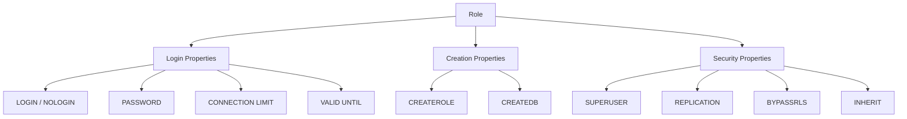
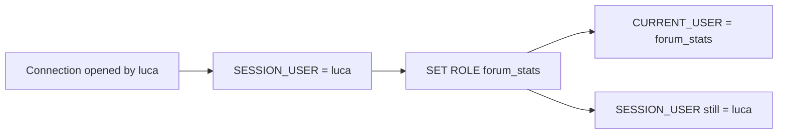
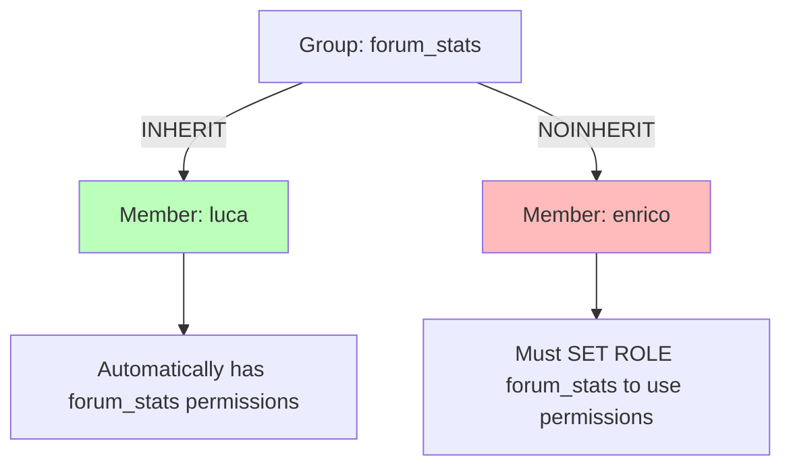
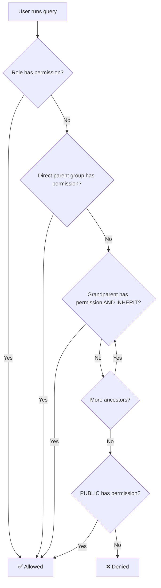
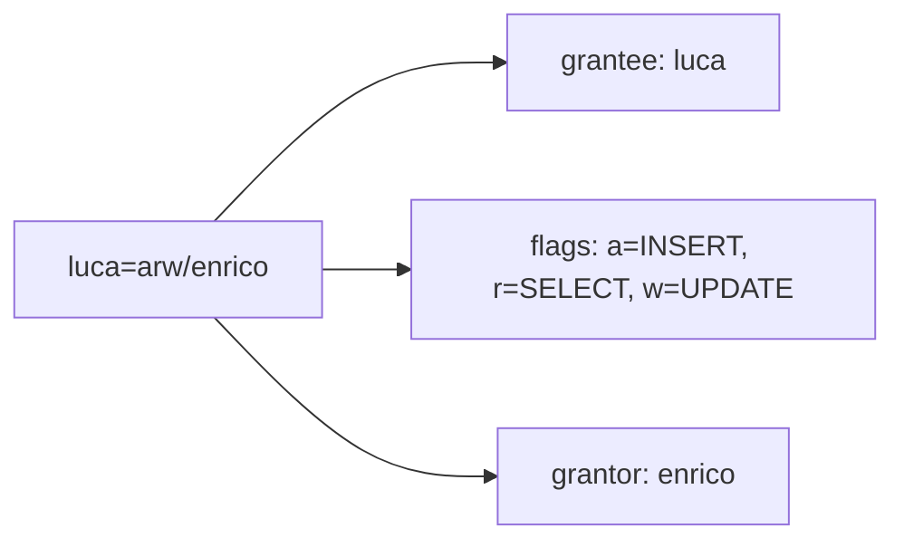
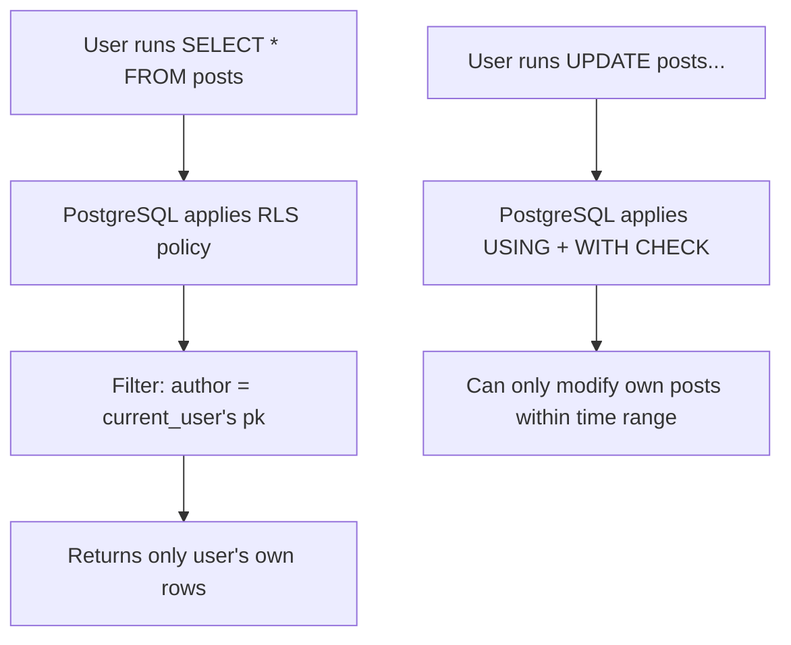
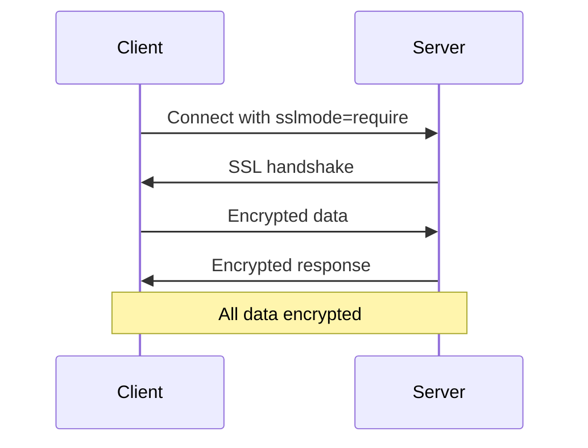
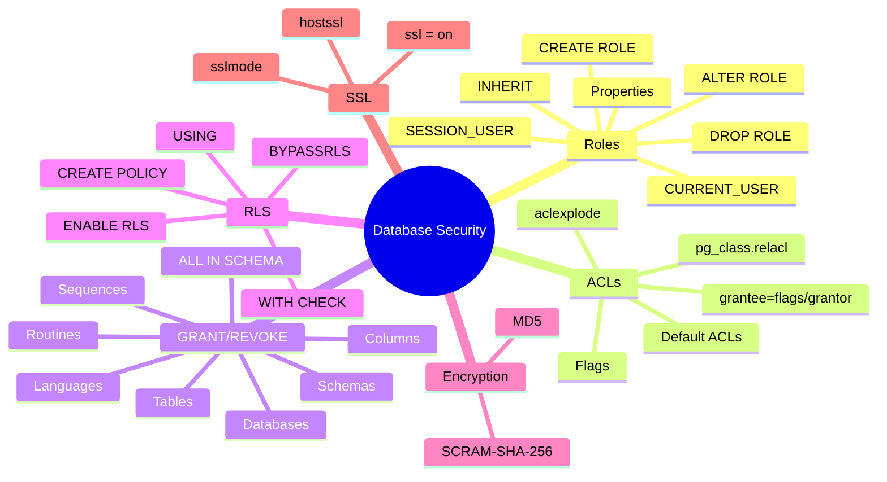

# Simple Explanation of Chapter 10: Users, Roles, and Database Security

This chapter is all about **keeping your database secure** — controlling who can do what, and protecting data. Let me break it all down with simple words and diagrams.

---

## Part 1: Understanding Roles (Recap + Extensions)

### What is a Role?

A **role** can be:
- A **single user** (can log in)
- A **group** (container for other roles)

### Key Role Properties

| Property | What It Does | Default |
|----------|-------------|---------|
| `CREATEROLE` | Can create other roles | `NOCREATEROLE` |
| `CREATEDB` | Can create databases | `NOCREATEDB` |
| `SUPERUSER` | Can do ANYTHING in the cluster | `NOSUPERUSER` |
| `REPLICATION` | Can use replication protocol | `NOREPLICATION` |
| `BYPASSRLS` | Bypasses row-level security | `NOBYPASSRLS` |
| `LOGIN` | Can connect interactively | `NOLOGIN` |
| `INHERIT` | Automatically inherits group permissions | `INHERIT` |

### Visual: Role Properties



### ALTER ROLE — Changing Properties

```sql
-- Add capabilities
ALTER ROLE luca WITH CREATEDB;
ALTER ROLE luca WITH CREATEROLE;

-- Remove capabilities
ALTER ROLE luca NOCREATEROLE, NOCREATEDB;

-- Rename a role
ALTER ROLE enrico RENAME TO enrico_pirozzi;
```

⚠️ **Warning:** If using MD5 passwords, renaming a role clears the password (MD5 uses role name as salt).

### Per-Role Configuration Parameters

You can attach **SET commands** to a role that run automatically on connection:

```sql
ALTER ROLE luca
IN DATABASE forumdb
SET client_min_messages TO 'DEBUG';
```

**Now every time `luca` connects to `forumdb`, the SET is applied automatically.**

**To remove all per-role config:**
```sql
ALTER ROLE luca
IN DATABASE forumdb
RESET ALL;
```

---

## Part 2: SESSION_USER vs CURRENT_USER

### The Difference

| Keyword | Meaning |
|---------|---------|
| `SESSION_USER` | The role that opened the connection |
| `CURRENT_USER` | The role currently active (after SET ROLE) |

### Visual Example

```sql
-- Connect as luca
$ psql -U luca forumdb

-- Both are luca
SELECT current_user, session_user;
```
```
+--------------+--------------+
| current_user | session_user |
+--------------+--------------+
| luca         | luca         |
+--------------+--------------+
```

```sql
-- Switch to group role
SET ROLE forum_stats;

SELECT current_user, session_user;
```
```
+--------------+--------------+
| current_user | session_user |
+--------------+--------------+
| forum_stats  | luca         |  ← current changed!
+--------------+--------------+
```



---

## Part 3: Inspecting Roles

### Using `\du` in psql

```sql
\du
```
```
+--------------+------------------------------------+--------------------+
| Role name    | Attributes                         | Member of          |
+--------------+------------------------------------+--------------------+
| book_authors | Cannot login                       | {}                 |
| enrico       |                                    | {book_authors,     |
|              |                                    |  forum_admins}     |
| luca         | 1 connection                       | {book_authors,     |
|              |                                    |  forum_stats}      |
| postgres     | Superuser, Create role, Create DB, | {}                 |
|              | Replication, Bypass RLS            |                    |
+--------------+------------------------------------+--------------------+
```

### Querying Catalogs

**pg_authid** (superuser only — shows password hash):
```sql
SELECT * FROM pg_authid WHERE rolname = 'luca';
```
```
+----------------+------------------------------------+
| rolname        | luca                               |
| rolsuper       | f                                  |
| rolinherit     | t                                  |
| rolcreaterole  | f                                  |
| rolcreatedb    | f                                  |
| rolcanlogin    | t                                  |
| rolreplication | f                                  |
| rolbypassrls   | f                                  |
| rolconnlimit   | 1                                  |
| rolpassword    | md5bd18b4163ec8a3ad833d867a5933c8ec |
+----------------+------------------------------------+
```

**pg_roles** (everyone can query — password masked):
```sql
SELECT * FROM pg_roles WHERE rolname = 'luca';
```
```
+--------------+---------+
| rolname      | luca    |
| rolsuper     | f       |
| rolpassword  | ********|
+--------------+---------+
```

### Group Membership Catalog

```sql
SELECT r.rolname, g.rolname AS group, m.admin_option AS is_admin
FROM pg_auth_members m
JOIN pg_roles r ON r.oid = m.member
JOIN pg_roles g ON g.oid = m.roleid
ORDER BY r.rolname;
```
```
+----------+----------------------+----------+
| rolname  | group                | is_admin |
+----------+----------------------+----------+
| enrico   | book_authors         | f        |
| enrico   | forum_admins         | f        |
| luca     | forum_stats          | f        |
| luca     | book_authors         | f        |
| test     | forum_stats          | f        |
+----------+----------------------+----------+
```

---

## Part 4: Role Inheritance — The Critical Concept

### INHERIT vs NOINHERIT

| Property | Meaning |
|----------|---------|
| **INHERIT** (default) | Member automatically gets group permissions |
| **NOINHERIT** | Member must explicitly `SET ROLE` to use group permissions |

### Visual: Inheritance



### Example

**Create groups:**
```sql
CREATE ROLE forum_admins WITH NOLOGIN;
CREATE ROLE forum_stats WITH NOLOGIN;

GRANT SELECT (username, gecos) ON users TO forum_stats;
GRANT forum_admins TO enrico;
GRANT forum_stats TO luca;
```

**Result:**
- `enrico` inherits `forum_admins` permissions **automatically**
- `luca` inherits `forum_stats` permissions **automatically** (because INHERIT is default)

### Testing NOINHERIT

```sql
-- Create group with NOINHERIT
CREATE ROLE forum_emails WITH NOLOGIN NOINHERIT;
GRANT SELECT (email) ON users TO forum_emails;
GRANT forum_emails TO forum_stats;

-- luca is member of forum_stats, which is member of forum_emails
-- But luca CANNOT read email!
SELECT username, gecos, email FROM users;
-- ERROR: permission denied
```

**But luca can explicitly SET ROLE:**
```sql
SET ROLE TO forum_emails;
SELECT email FROM users;  -- Works!
```

### Changing INHERIT

```sql
ALTER ROLE forum_emails WITH INHERIT;
-- Now luca automatically has email permission
```

### Permission Resolution Flow



---

## Part 5: Access Control Lists (ACLs)

### What is an ACL?

An **ACL** is how PostgreSQL stores permissions internally.

### ACL Format

```
grantee=flags/grantor
```

| Part | Meaning |
|------|---------|
| **grantee** | Who gets the permission |
| **flags** | What permissions (letters) |
| **grantor** | Who granted it |

### ACL Flags

| Flag | Permission | Applies To |
|------|-----------|-----------|
| `a` | INSERT (append) | Tables, columns |
| `r` | SELECT (read) | Tables, columns, sequences |
| `w` | UPDATE (write) | Tables |
| `d` | DELETE | Tables |
| `D` | TRUNCATE | Tables |
| `C` | CREATE | Databases, schemas, tablespaces |
| `c` | CONNECT | Databases |
| `t` | TRIGGER | Tables |
| `T` | CREATE TEMP | Databases |
| `x` | REFERENCES (foreign key) | Tables |
| `X` | EXECUTE | Functions, routines |
| `U` | USAGE | Sequences, schemas, languages |

### Decoding an ACL

```
luca=arw/enrico
```

**Translation:** "enrico granted luca INSERT, SELECT, and UPDATE permissions."

### Visual ACL Breakdown



### Viewing ACLs with `\dp`

```sql
\dp categories
```

| Schema | Name       | Type  | Access privileges                                         | Column privileges | Policies |
| ------ | ---------- | ----- | --------------------------------------------------------- | ----------------- | -------- |
| public | categories | table | enrico=arwdDxt/enrico  <br>luca=arw/enrico  <br>=d/enrico |                   |          |
**Reading this:**
- Line 1: `enrico` owns the table (grantee=grantor) — can do **everything**
- Line 2: `luca` can INSERT, SELECT, UPDATE
- Line 3: `=d/enrico` — **PUBLIC** (everyone) can DELETE

### Default ACLs

**When an object is created, no ACL is stored.** PostgreSQL falls back to:
- **Owner** has ALL permissions
- **PUBLIC** has limited defaults:
  - `X` on routines
  - `cT` on databases
  - `U` on languages/types

**The first GRANT creates the explicit owner ACL.**

### Inspecting Default ACLs

```sql
SELECT acldefault('r', r.oid)
FROM pg_roles r
WHERE r.rolname = CURRENT_ROLE;
```
```
{luca=arwdDxt/luca}
```

For functions:
```sql
SELECT acldefault('f', r.oid)
FROM pg_roles r
WHERE r.rolname = CURRENT_ROLE;
```
```
{=X/luca,luca=X/luca}
```

---

## Part 6: Granting and Revoking Permissions

### GRANT and REVOKE Syntax

```sql
GRANT <permission> ON <object> TO <role>;
REVOKE <permission> ON <object> FROM <role>;
```

### The PUBLIC Role

**PUBLIC** is not a real role — it means **every role** (current and future).

> **Rule of thumb:** Always REVOKE ALL from PUBLIC, then GRANT selectively.

### Permissions by Object Type

#### Tables

```sql
REVOKE ALL ON categories FROM forum_stats;
GRANT SELECT, INSERT, UPDATE ON categories TO forum_stats;
```

**Result ACL:**
```
postgres=arwdDxt/postgres
forum_stats=arw/postgres
```

#### Column-Based Permissions

```sql
REVOKE ALL ON users FROM forum_stats;
GRANT SELECT (username, gecos), UPDATE (gecos) ON users TO forum_stats;
```

**Result:**
- `forum_stats` can read `username` and `gecos`
- `forum_stats` can update only `gecos`
- Cannot do `SELECT *` (must specify columns)

**View with `\dp`:**
```
Access privileges: postgres=arwdDxt/postgres
Column privileges:
  username: forum_stats=r/postgres
  gecos: forum_stats=rw/postgres
```

#### Sequences

| Permission | What It Does |
|-----------|-------------|
| `USAGE` | Get new values (nextval, setval) |
| `SELECT` | Read current value (currval) |
| `UPDATE` | Set value (setval) |

```sql
GRANT USAGE ON SEQUENCE categories_pk_seq TO luca;
```

#### Schemas

| Permission | What It Does |
|-----------|-------------|
| `CREATE` | Create objects in schema |
| `USAGE` | Access objects in schema |

**Important:** `USAGE` on schema is required even if you own the object!

```sql
CREATE SCHEMA configuration;
GRANT CREATE ON SCHEMA configuration TO luca;
GRANT USAGE ON SCHEMA configuration TO luca;
```

#### Languages

```sql
GRANT USAGE ON LANGUAGE plperl TO luca;
REVOKE USAGE ON LANGUAGE plperl FROM PUBLIC;
```

#### Routines (Functions/Procedures)

```sql
GRANT EXECUTE ON ROUTINE get_max TO luca;
REVOKE EXECUTE ON ROUTINE get_max FROM PUBLIC;
```

#### Databases

| Permission | What It Does |
|-----------|-------------|
| `CONNECT` | Can connect |
| `CREATE` | Can create objects |
| `TEMP` | Can create temporary objects |

```sql
REVOKE CONNECT ON DATABASE forumdb FROM PUBLIC;
GRANT CONNECT, CREATE ON DATABASE forumdb TO luca;
```

### ALL <objects> IN SCHEMA Shortcut

```sql
GRANT SELECT, INSERT, UPDATE ON ALL TABLES IN SCHEMA configuration TO luca;
GRANT USAGE ON ALL SEQUENCES IN SCHEMA configuration TO luca;
GRANT EXECUTE ON ALL ROUTINES IN SCHEMA my_schema TO luca;
```

### Changing Object Owner

```sql
ALTER TABLE categories OWNER TO luca;
ALTER ROUTINE get_max OWNER TO luca;
```

---

## Part 7: Row-Level Security (RLS)

### What is RLS?

**Row-Level Security** restricts **which rows** a role can see or modify.

- **Column permissions** = vertical restriction (which columns)
- **RLS** = horizontal restriction (which rows)

### Visual

```
Table: posts
+----+---------------+--------+
| pk | title         | author |
+----+---------------+--------+
| 1  | my orange     | 1      |
| 2  | my apple      | 2      |
| 3  | Re:my orange  | 2      |
| 4  | my tomato     | 1      |
+----+---------------+--------+

With RLS: user 1 sees ONLY:
+----+---------------+--------+
| 1  | my orange     | 1      |
| 4  | my tomato     | 1      |
+----+---------------+--------+
```

### Two-Step Process

1. **Create a policy**
2. **Enable RLS on the table**

### Policy Syntax

```sql
CREATE POLICY <name>
ON <table>
FOR <statement>          -- SELECT, INSERT, UPDATE, DELETE, ALL
TO <role>
USING <filtering condition>       -- Which rows can be seen
WITH CHECK <writing condition>    -- Which rows can be written
```

### Example 1: See Only Your Own Posts

```sql
CREATE POLICY show_only_my_posts
ON posts
FOR SELECT
USING (author = (SELECT pk FROM users WHERE username = CURRENT_ROLE));

ALTER TABLE posts ENABLE ROW LEVEL SECURITY;
```

**What happens:**
```sql
-- User luca runs:
SELECT * FROM posts;

-- PostgreSQL silently applies:
SELECT * FROM posts
WHERE author = (SELECT pk FROM users WHERE username = CURRENT_ROLE);
```

### Example 2: Modify Only Your Own Posts Within 1 Day

```sql
CREATE POLICY manage_only_my_posts
ON posts
FOR ALL
USING (author = (SELECT pk FROM users WHERE username = CURRENT_ROLE))
WITH CHECK (
    author = (SELECT pk FROM users WHERE username = CURRENT_ROLE)
    AND
    last_edited_on + '1 day'::interval >= CURRENT_TIMESTAMP
);
```

**Result:**
- Can only see own posts
- Can only modify own posts edited within 1 day
- Older posts cannot be modified

### Visual: RLS in Action



### Important Notes

⚠️ **Superusers, table owners, and BYPASSRLS roles** are NOT subject to RLS.

⚠️ **Backups (pg_dump)** must use a role with BYPASSRLS, or the backup will fail!

### Disabling/Enabling RLS

```sql
ALTER TABLE posts DISABLE ROW LEVEL SECURITY;
ALTER TABLE posts ENABLE ROW LEVEL SECURITY;
```

### Viewing Policies

```sql
\dp posts
```
Shows all policies in the **Policies** column.

---

## Part 8: Password Encryption

### Two Algorithms

| Algorithm | Security | Since |
|-----------|----------|-------|
| **MD5** | Older, less secure | All versions |
| **SCRAM-SHA-256** | Modern, more secure | PostgreSQL 10+ |

### Configuration

```bash
# In postgresql.conf
password_encryption = scram-sha-256
```

Or check:
```sql
SELECT name, setting, enumvals FROM pg_settings WHERE name = 'password_encryption';
```
```
+---------------------+---------------+---------------------+
| name                | setting       | enumvals            |
+---------------------+---------------+---------------------+
| password_encryption | scram-sha-256 | {md5,scram-sha-256} |
+---------------------+---------------+---------------------+
```

### Identifying the Algorithm

Check the `rolpassword` field in `pg_authid`:
- Starts with `md5...` → MD5
- Starts with `SCRAM-SHA-256...` → SCRAM

### Migrating from MD5 to SCRAM

⚠️ **Cannot change without resetting passwords!**

```sql
-- For each role:
ALTER ROLE luca WITH PASSWORD 'new_password';
-- Now stored with SCRAM-SHA-256
```

---

## Part 9: SSL Connections

### What is SSL?

**SSL** encrypts network traffic between client and server.

### Server Configuration

**In `postgresql.conf`:**
```
ssl = on
ssl_key_file = '/postgres/pgdata/ssl/server.key'
ssl_cert_file = '/postgres/pgdata/ssl/server.crt'
```

### HBA Configuration

**In `pg_hba.conf`:**
```
# Only accept SSL connections
hostssl all luca carmensita scram-sha-256
hostssl all test 192.168.222.1/32 scram-sha-256

# Accept both SSL and plain
host all luca carmensita scram-sha-256
```

### Client Connection

**Force SSL:**
```bash
$ psql "postgresql://luca@localhost:5432/forumdb?sslmode=require"
psql (12.1)
SSL connection (protocol: TLSv1.3, cipher: TLS_AES_256_GCM_SHA384, bits: 256)
```

**Disable SSL:**
```bash
$ psql "postgresql://luca@localhost:5432/forumdb?sslmode=disable"
```

### SSL Mode Options

| Mode | Meaning |
|------|---------|
| `require` | Force SSL connection |
| `disable` | Force non-SSL connection |
| `prefer` (default) | Try SSL, fall back to plain |

### Visual: SSL Flow



---

## Part 10: Complete Summary Diagram

```mermaid
graph TD
    A[Database Security] --> B[Roles]
    A --> C[Permissions]
    A --> D[RLS]
    A --> E[Password Encryption]
    A --> F[SSL]
    
    B --> B1[CREATE/ALTER/DROP ROLE]
    B --> B2[Properties: CREATEROLE, CREATEDB, SUPERUSER, etc.]
    B --> B3[INHERIT/NOINHERIT]
    B --> B4[SESSION_USER vs CURRENT_USER]
    B --> B5[Per-role config]
    
    C --> C1[ACLs]
    C --> C2[GRANT/REVOKE]
    C --> C3[Table/Column/Sequence/Schema/Database]
    C --> C4[PUBLIC role]
    C --> C5[ALL IN SCHEMA shortcut]
    
    D --> D1[CREATE POLICY]
    D --> D2[ENABLE ROW LEVEL SECURITY]
    D --> D3[USING / WITH CHECK]
    D --> D4[BYPASSRLS]
    
    E --> E1[MD5 - older]
    E --> E2[SCRAM-SHA-256 - modern]
    
    F --> F1[ssl = on]
    F --> F2[hostssl in pg_hba.conf]
    F --> F3[sslmode=require]
```



---

## Part 11: Key Takeaways

### Roles
1. **Roles = users + groups** — keep them separate for clarity
2. **SUPERUSER, REPLICATION, BYPASSRLS** are dangerous — grant carefully
3. **ALTER ROLE** changes properties; **RENAME** renames (MD5 passwords reset!)
4. **SESSION_USER** = connection opener; **CURRENT_USER** = current role
5. **Per-role SET commands** run automatically on connection

### Inheritance
6. **INHERIT** (default) = auto-inherit group permissions
7. **NOINHERIT** = must `SET ROLE` explicitly
8. Permission resolution goes up the hierarchy

### ACLs
9. **ACLs** are PostgreSQL's internal permission storage
10. Format: `grantee=flags/grantor`
11. **Flags**: a=INSERT, r=SELECT, w=UPDATE, d=DELETE, D=TRUNCATE, etc.
12. **First GRANT** creates explicit owner ACL
13. **PUBLIC** = everyone; default has limited permissions

### Permissions
14. **REVOKE ALL first**, then **GRANT selectively**
15. **Column permissions**: `GRANT SELECT (col1, col2) ON table TO role`
16. **Schema USAGE** is required even for owned objects
17. **ALL IN SCHEMA** shortcut for bulk grants

### Row-Level Security
18. **RLS restricts rows** (horizontal), column perms restrict columns (vertical)
19. **Two steps**: CREATE POLICY + ENABLE ROW LEVEL SECURITY
20. **USING** = read filter; **WITH CHECK** = write filter
21. **Superusers/owners/BYPASSRLS** skip RLS
22. **Backups need BYPASSRLS**

### Encryption & SSL
23. **MD5** older; **SCRAM-SHA-256** modern
24. **Cannot change algorithm without resetting passwords**
25. **SSL** encrypts network traffic
26. **sslmode=require** forces SSL; **disable** refuses it

---

## Quick Reference Card



**The Golden Rules:**
1. **Separate users and groups** — don't mix
2. **REVOKE ALL from PUBLIC**, then GRANT selectively
3. **Column permissions** for vertical restriction
4. **RLS** for horizontal restriction (rows)
5. **Always use INHERIT** unless you need explicit SET ROLE
6. **Use SCRAM-SHA-256** for new systems
7. **Enable SSL** for network connections
8. **BYPASSRLS for backup roles**
9. **Test permissions** with real users before production
10. **Audit ACLs regularly** with `\dp` and catalog queries