# Simple Explanation of Chapter 11: Transactions, MVCC, WALs, and Checkpoints

This chapter is about **how PostgreSQL keeps your data safe and consistent** when many users are working at the same time. Let me break it all down with simple words and diagrams.

---

## Part 1: What Are Transactions?

### The Core Idea

A **transaction** is a group of statements that either **all succeed** or **all fail**. It's the foundation of the ACID properties.

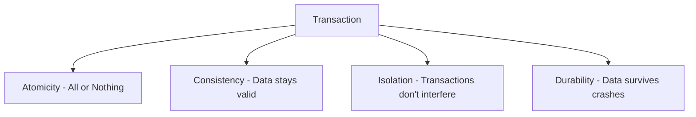

### Implicit vs Explicit Transactions

| Type | Description | Example |
|------|-------------|---------|
| **Implicit** | PostgreSQL wraps every single statement automatically | `INSERT INTO tags VALUES ('Java');` |
| **Explicit** | You define the boundaries yourself | `BEGIN; ... COMMIT;` |

### Visual: Implicit vs Explicit

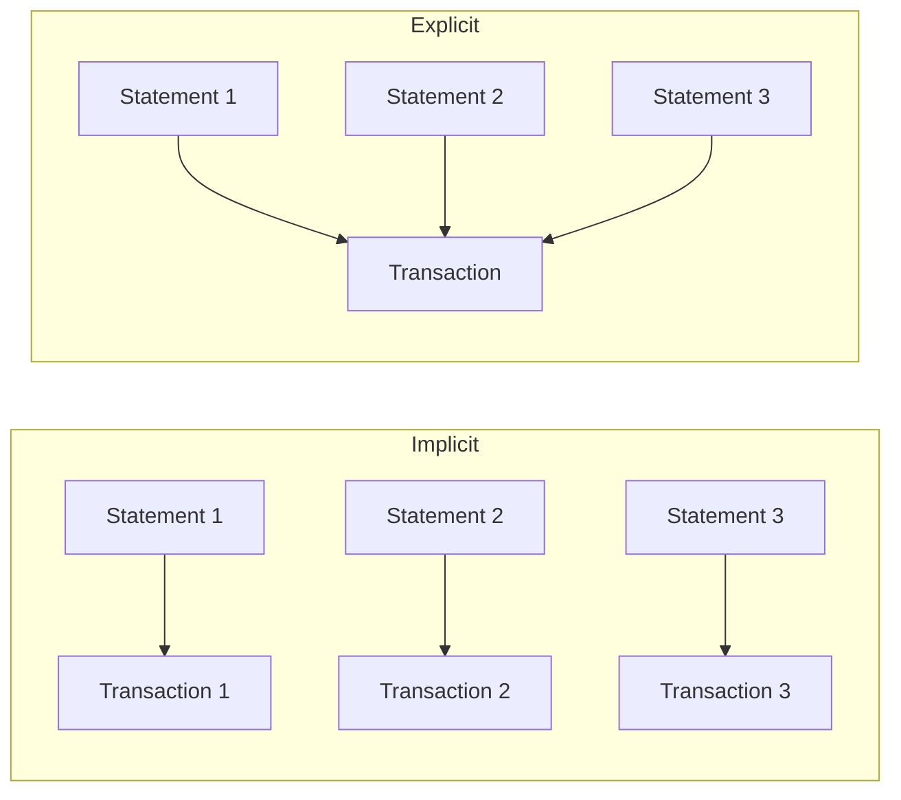

### Transaction Identifiers (XID)

Every transaction gets a unique number called **xid**.

```sql
SELECT txid_current();
-- Result: 4813
```

Every tuple stores the **xmin** (transaction that created it):

```sql
SELECT xmin, * FROM categories;
```
```
+------+----+----------------------+
| xmin | pk | title                |
+------+----+----------------------+
| 561  | 1  | DATABASE             |
| 561  | 2  | UNIX                 |
| 561  | 3  | PROGRAMMING LANGUAGES|
+------+----+----------------------+
```

### Explicit Transaction Example

```sql
BEGIN;
INSERT INTO tags(tag) VALUES ('PHP');
INSERT INTO tags(tag) VALUES ('C#');
COMMIT;
```

**Both rows get the SAME xmin** — they're part of one transaction.

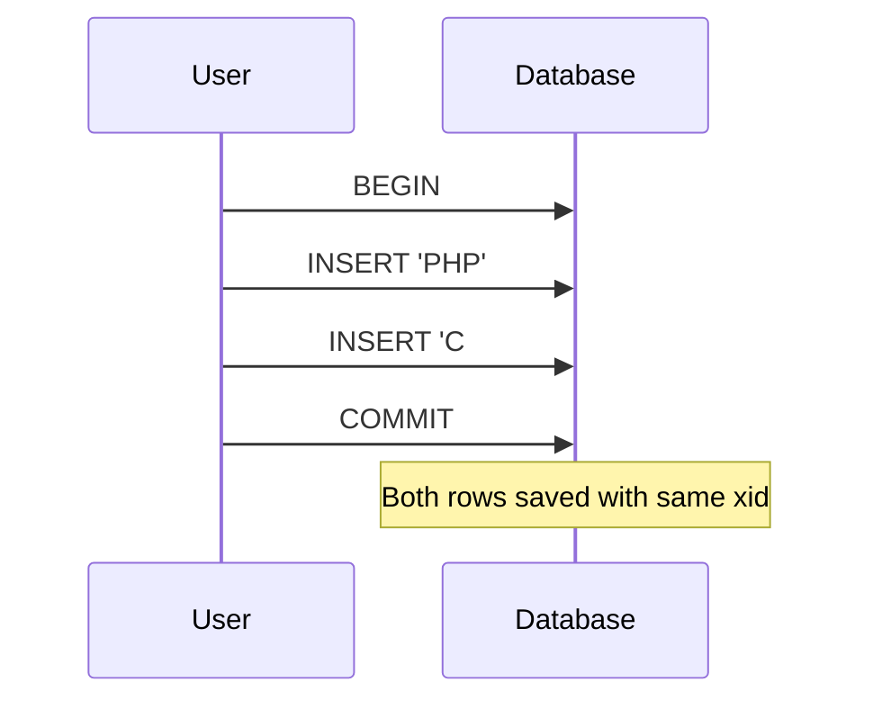

### ROLLBACK Example

```sql
BEGIN;
UPDATE tags SET tag = UPPER(tag);
-- Data looks changed here...
ROLLBACK;
-- ...but changes are gone!
```

### Error Handling in Transactions

**When an error occurs, the transaction is aborted:**

```sql
BEGIN;
INSERT INTO tags(tag) VALUES ('C#');  -- OK
INSERT INTO tags(tag) VALUES (PHP);   -- ERROR!
INSERT INTO tags(tag) VALUES ('Ocaml');
-- ERROR: current transaction is aborted
COMMIT;  -- Actually does ROLLBACK
```

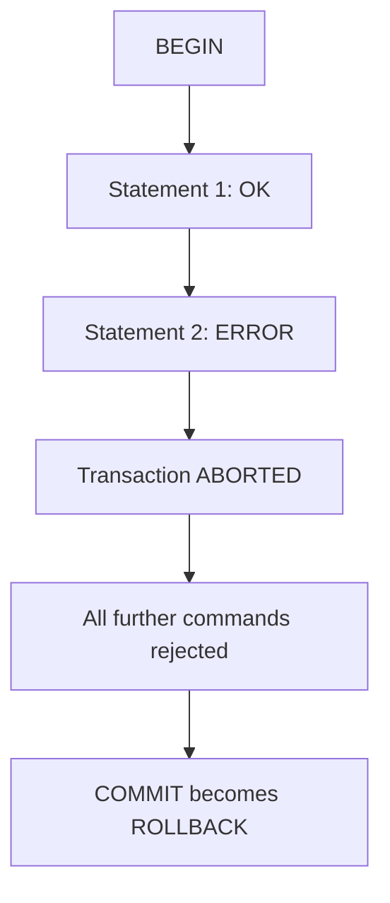

### Time Within Transactions

**Time is frozen during a transaction:**

```sql
BEGIN;
SELECT CURRENT_TIME;        -- 14:51:50
SELECT pg_sleep_for('5 seconds');
SELECT CURRENT_TIME;        -- 14:51:50 (SAME!)
ROLLBACK;
```

**For real time, use `clock_timestamp()`:**

```sql
BEGIN;
SELECT CURRENT_TIME, clock_timestamp()::time;
-- 14:53:17 | 14:53:22
SELECT pg_sleep_for('5 seconds');
SELECT CURRENT_TIME, clock_timestamp()::time;
-- 14:53:17 | 14:53:33 (clock_timestamp changed!)
ROLLBACK;
```

---

## Part 2: Transaction Isolation Levels

### The Four Levels

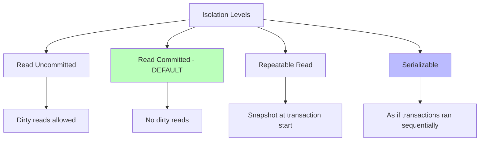

### Problem Comparison

| Level | Dirty Reads | Nonrepeatable Reads | Phantom Reads |
|-------|-------------|---------------------|---------------|
| Read Uncommitted | ✅ Allowed | ✅ Allowed | ✅ Allowed |
| Read Committed | ❌ Prevented | ✅ Allowed | ✅ Allowed |
| Repeatable Read | ❌ Prevented | ❌ Prevented | ❌ Prevented |
| Serializable | ❌ Prevented | ❌ Prevented | ❌ Prevented |

### Setting Isolation Level

```sql
-- At transaction start
BEGIN TRANSACTION ISOLATION LEVEL REPEATABLE READ;

-- Or with SET TRANSACTION (must be first statement!)
BEGIN;
SET TRANSACTION ISOLATION LEVEL SERIALIZABLE;
```

⚠️ **Cannot change isolation level after first query!**

### Serializable Example

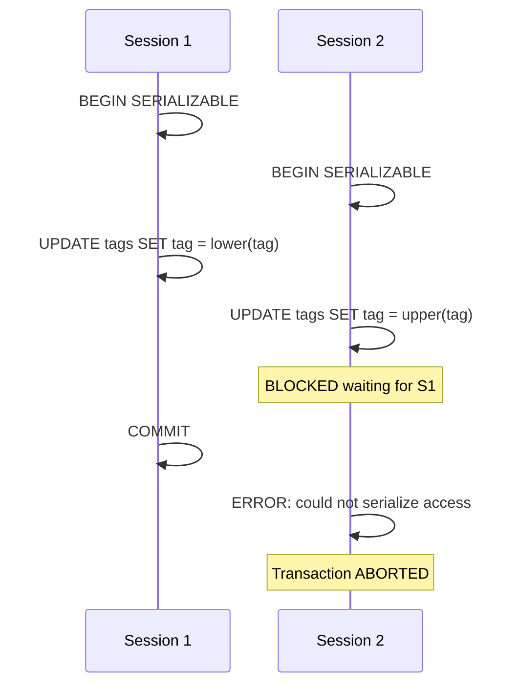

---

## Part 3: MVCC (Multi-Version Concurrency Control)

### The Core Idea

Instead of modifying a tuple in place, PostgreSQL:
1. **Creates a new version** of the tuple
2. **Marks the old version as invalid**

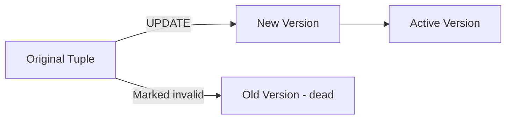

### Visual: MVCC in Action

**Before UPDATE:**
```
+----+-------+-------------+
| pk | title | description |
+----+-------+-------------+
| 1  | apple | fruits      |
+----+-------+-------------+
```

**After UPDATE:**
```
+----+-------+-------------+
| 1  | apple | red fruit   |  ← New version
+----+-------+-------------+
| 1  | apple | fruits      |  ← Old version (dead)
+----+-------+-------------+
```

### Hidden Columns

Every table has hidden columns:

| Column | Meaning |
|--------|---------|
| **xmin** | Transaction that created the tuple |
| **xmax** | Transaction that deleted/invalidated the tuple |
| **cmin** | Command number that created it |
| **cmax** | Command number that deleted it |

```sql
SELECT xmin, xmax, cmin, cmax, * FROM tags;
```
```
+------+------+------+------+----+------+
| xmin | xmax | cmin | cmax | pk | tag  |
+------+------+------+------+----+------+
| 4854 | 0    | 0    | 0    | 24 | c++  |
| 4853 | 0    | 0    | 0    | 23 | java |
+------+------+------+------+----+------+
```

- **xmin** = 4854 means transaction 4854 created this row
- **xmax** = 0 means no transaction has deleted it yet

### Snapshots

A **snapshot** defines which transactions a query can see:

```sql
SELECT txid_current_snapshot();
-- Result: 4928:4930:
```

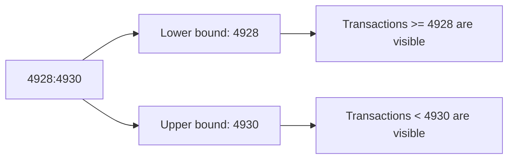

**Between 4928 and 4930** = visible
**Below 4928** = visible (already committed)
**Above 4930** = not visible (not yet committed)

### MVCC and Locks

**MVCC doesn't eliminate locks entirely** — conflicting writes still block:

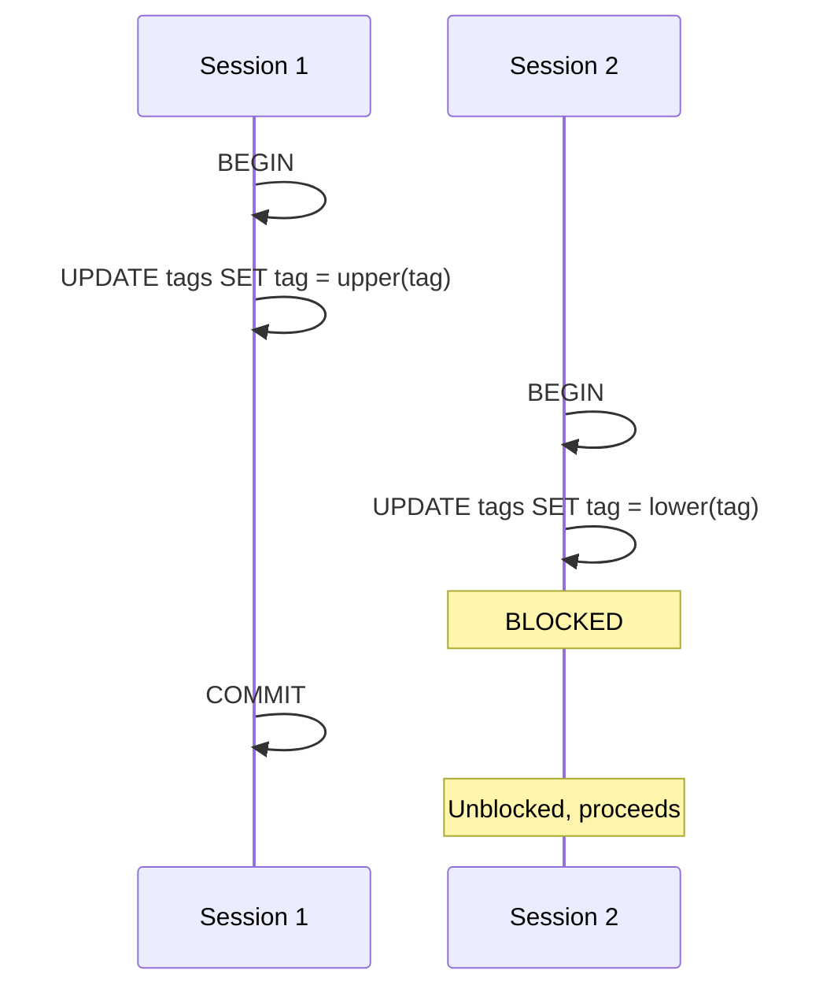

### The XID Wraparound Problem

**The problem:** Transaction IDs are finite and eventually wrap around.

```mermaid
graph LR
    A[XID 1] --> B[XID 2] --> C[...] --> D[XID 4294967295]
    D --> E[Wraps to XID 3]
    E --> F[Problem! Old transactions appear "newer"]
```

**The solution:** VACUUM FREEZE marks old tuples as "frozen" (always in the past).

**Warning message:**
```
WARNING: database "forumdb" must be vacuumed within 177009986 transactions
HINT: To avoid a database shutdown, execute a database-wide VACUUM in "forumdb".
```

### Virtual vs Real XID

- **Virtual XID** = used initially, doesn't consume counter
- **Real XID** = assigned when data is modified

```sql
BEGIN;
SELECT txid_current_if_assigned();  -- NULL (still virtual)
SELECT count(*) FROM tags;           -- Read only, still virtual
SELECT txid_current_if_assigned();  -- NULL (still virtual)
UPDATE tags SET tag = upper(tag);   -- Now needs real XID
SELECT txid_current_if_assigned();  -- 4837 (real XID assigned!)
ROLLBACK;
```

---

## Part 4: Savepoints

### What Are Savepoints?

**Savepoints** split a transaction into smaller blocks that can be rolled back independently.

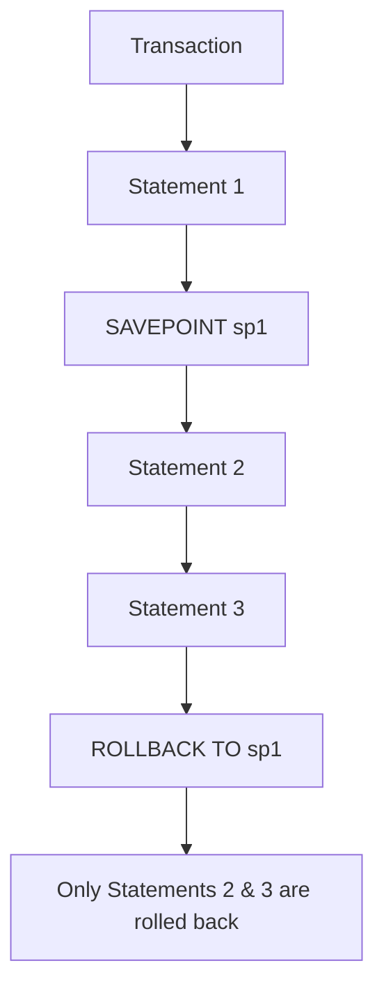

### Example

```sql
BEGIN;
INSERT INTO tags(tag) VALUES ('Eclipse IDE');
SAVEPOINT other_tags;
INSERT INTO tags(tag) VALUES ('Netbeans IDE');
INSERT INTO tags(tag) VALUES ('Comma IDE');
ROLLBACK TO SAVEPOINT other_tags;  -- Undo Netbeans & Comma
INSERT INTO tags(tag) VALUES ('IntelliJIdea IDE');
COMMIT;
```

**Result:** Only `Eclipse IDE` and `IntelliJIdea IDE` are saved.

### RELEASE SAVEPOINT

Makes the savepoint disappear — statements follow the main transaction:

```sql
BEGIN;
SAVEPOINT editors;
INSERT INTO tags(tag) VALUES ('Emacs Editor');
INSERT INTO tags(tag) VALUES ('Vi Editor');
RELEASE SAVEPOINT editors;  -- Savepoint gone
INSERT INTO tags(tag) VALUES ('Atom Editor');
COMMIT;
-- All 3 rows are saved
```

### Rolling Back to a Savepoint Rolls Back All Later Savepoints

```sql
BEGIN;
SAVEPOINT perl;
INSERT INTO tags(tag) VALUES ('Rakudo Compiler');
SAVEPOINT gcc;
INSERT INTO tags(tag) VALUES ('Gnu C Compiler');
ROLLBACK TO SAVEPOINT perl;
COMMIT;
-- Both 'Rakudo' and 'Gnu C' are rolled back
```

---

## Part 5: Deadlocks

### What is a Deadlock?

A **deadlock** happens when two transactions wait for each other in a circular way.

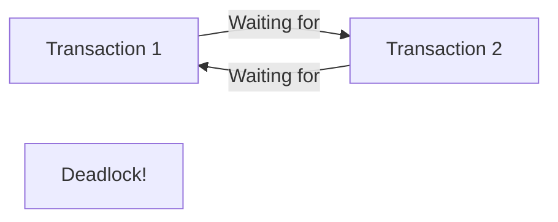

### Example

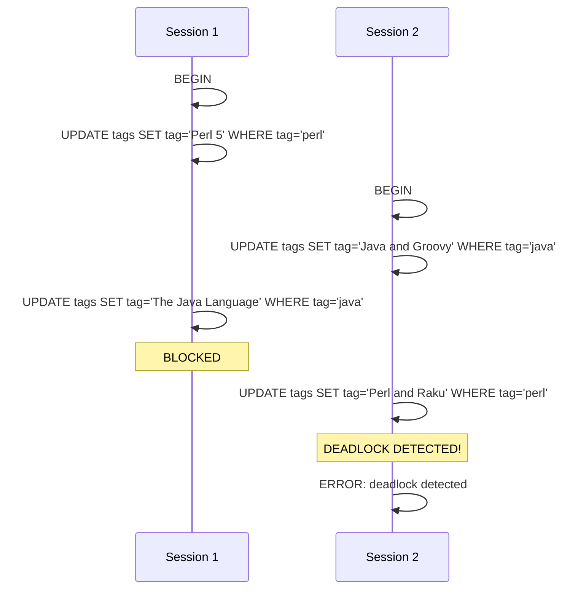

### Deadlock Detection

**Parameter:** `deadlock_timeout` (default 1000ms = 1 second)

```sql
SELECT name, setting FROM pg_settings WHERE name LIKE '%deadlock%';
```
```
+------------------+---------+
| name             | setting |
+------------------+---------+
| deadlock_timeout | 1000    |
+------------------+---------+
```

**PostgreSQL kills one transaction** to let the other proceed.

---

## Part 6: WALs (Write-Ahead Logs)

### The Core Idea

Before modifying data on disk, PostgreSQL writes the change to a **sequential log** (WAL).

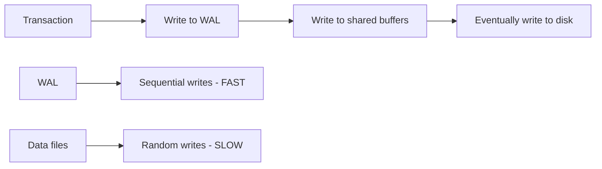

### Why WALs?

| Operation | Speed | Reason |
|-----------|-------|--------|
| **WAL write** | Fast | Sequential (no seek) |
| **Data file write** | Slow | Random seek required |

### WAL Segments

WALs are split into **16 MB segments** stored in `pg_wal`:

```bash
$ ls $PGDATA/pg_wal
0000000700000247000000A8
0000000700000247000000A9
0000000700000247000000AA
...
```

**Format:** `TTTTTTTT LLLLLLLL OOOOOOOO`
- T = Timeline
- L = Log Sequence Number (LSN)
- O = Offset

### WAL as Crash Recovery

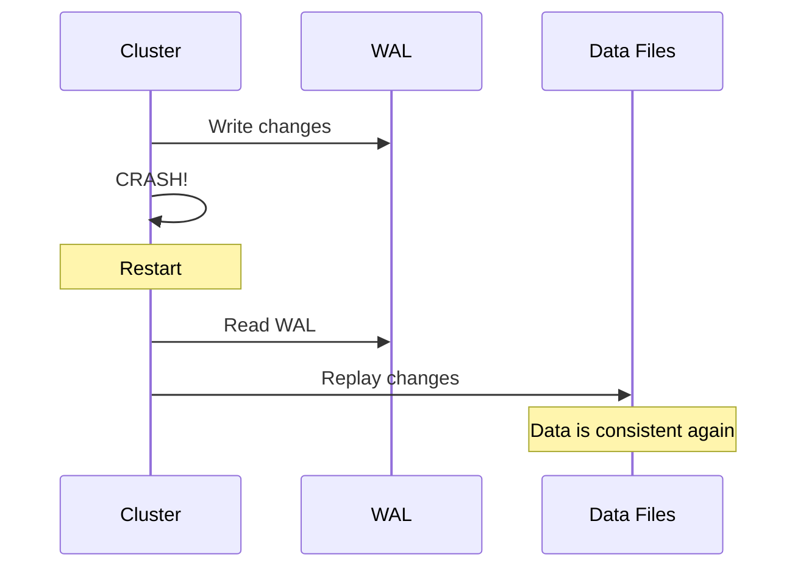

### COMMIT = WAL Write

When you COMMIT, PostgreSQL:
1. Writes to WAL
2. Issues `fsync()` to force to disk
3. Only then reports success

**If COMMIT succeeds, data is safe.**

---

## Part 7: Checkpoints

### What is a Checkpoint?

A **checkpoint** is when PostgreSQL flushes all dirty buffers from memory to disk.

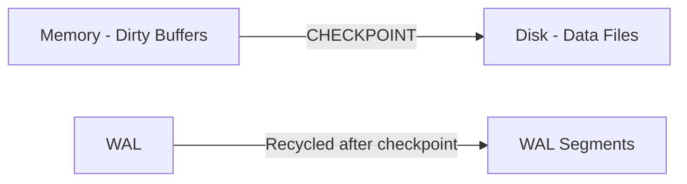

### Why Checkpoints?

1. **Prevent WAL from growing forever** — recycle old segments
2. **Speed up crash recovery** — only replay WAL after last checkpoint
3. **Consolidate data** — ensure disk matches committed state

### Checkpoint Triggering

| Parameter | Meaning | Default |
|-----------|---------|---------|
| `checkpoint_timeout` | Max time between checkpoints | 300s (5 min) |
| `max_wal_size` | Max WAL size before checkpoint | 1024 MB |

**First one to happen triggers the checkpoint.**

### Checkpoint Throttling

| Parameter | Meaning |
|-----------|---------|
| `checkpoint_completion_target` | Time to spread checkpoint writes (0 to 1) |

**Formula:** `checkpoint_timeout × checkpoint_completion_target`

- **0** = I/O spikes
- **1** = continuous I/O

### Manual Checkpoint

```sql
CHECKPOINT;
```

**Use cases:**
- Before streaming replication
- Before file-level backup
- Force synchronization

---

## Part 8: VACUUM

### Why VACUUM?

MVCC leaves **dead tuples** (old versions) on disk. VACUUM reclaims that space.

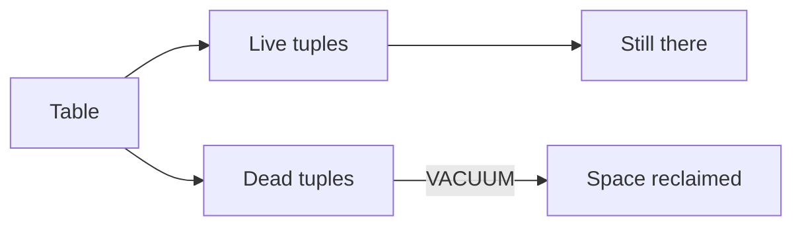

### Three Types of VACUUM

| Type | What It Does | Space Reclaimed? |
|------|-------------|-----------------|
| **VACUUM** (plain) | Removes dead tuples, marks space as reusable | ❌ No (space stays in table) |
| **VACUUM FULL** | Rewrites entire table, removes fragmentation | ✅ Yes |
| **VACUUM FREEZE** | Marks old tuples as frozen (for xid wraparound) | N/A |

### Visual Comparison

**Before VACUUM:**
```
+---------------------------------------+
| Page 1                                 |
| [Live] [Dead] [Live] [Dead] [Dead]    |
+---------------------------------------+
| Page 2                                 |
| [Live] [Live] [Dead] [Live]           |
+---------------------------------------+
```

**After plain VACUUM:**
```
+---------------------------------------+
| Page 1                                 |
| [Live] [Live] [Free] [Free] [Free]    |
+---------------------------------------+
| Page 2                                 |
| [Live] [Live] [Live] [Free]           |
+---------------------------------------+
```
(Space is reusable but table size is the same)

**After VACUUM FULL:**
```
+---------------------------------------+
| Page 1                                 |
| [Live] [Live] [Live] [Live] [Live]    |
+---------------------------------------+
| Page 2 is discarded entirely           |
+---------------------------------------+
```

### VACUUM Examples

```sql
-- Plain vacuum
VACUUM VERBOSE tags;

-- Full vacuum (rewrites table)
VACUUM FULL VERBOSE tags;

-- Freeze old tuples
VACUUM FREEZE tags;

-- Vacuum + update statistics
VACUUM ANALYZE tags;
```

### VACUUM Cannot Run Inside Transaction

```sql
BEGIN;
VACUUM tags;  -- ERROR!
```

### Autovacuum

PostgreSQL has a **background process** that runs VACUUM automatically.

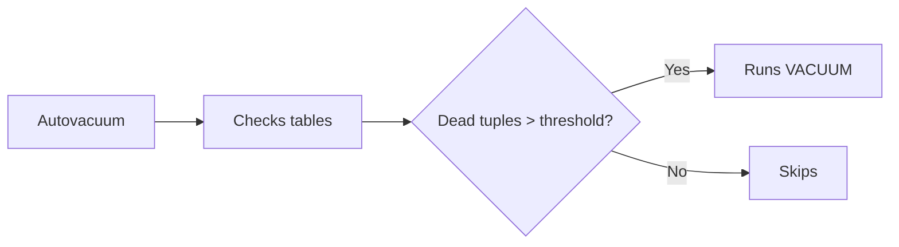

### Autovacuum Parameters

| Parameter | Meaning | Default |
|-----------|---------|---------|
| `autovacuum` | Enable/disable | on |
| `autovacuum_vacuum_threshold` | Min dead tuples | 50 |
| `autovacuum_vacuum_scale_factor` | % of table | 0.2 |
| `autovacuum_max_workers` | Parallel workers | 3 |
| `autovacuum_cost_limit` | Cost limit | 200 |
| `autovacuum_cost_delay` | Pause duration | 10ms |

### Formula

```
Autovacuum triggers when:
dead_tuples > autovacuum_vacuum_threshold
            + (table_tuples × autovacuum_vacuum_scale_factor)
```

### Cost-Based Throttling

| Parameter | Meaning | Default |
|-----------|---------|---------|
| `vacuum_cost_page_hit` | Cost for page in cache | 1 |
| `vacuum_cost_page_miss` | Cost for page on disk | 10 |
| `vacuum_cost_page_dirty` | Cost for dirty page | 20 |
| `vacuum_cost_limit` | Pause threshold | 10000 |
| `vacuum_cost_delay` | Pause duration | 10ms |

---

## Part 9: Complete Summary

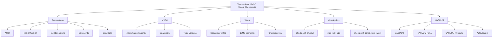

---

## Part 10: Key Takeaways

### Transactions
1. **Every statement runs in a transaction** (implicit)
2. **BEGIN/COMMIT/ROLLBACK** control explicit transactions
3. **Errors abort transactions** — cannot COMMIT
4. **Time is frozen** within a transaction

### Isolation Levels
5. **Default: READ COMMITTED**
6. **SERIALIZABLE** is safest but may cause retries
7. **Cannot change level after first query**

### MVCC
8. **UPDATE creates new version**, marks old as dead
9. **Hidden columns:** xmin, xmax, cmin, cmax
10. **Snapshots** control what each transaction sees
11. **MVCC doesn't eliminate locks** — conflicting writes still block

### Savepoints
12. **Split transactions** into smaller rollback units
13. **ROLLBACK TO SAVEPOINT** undoes that savepoint and later ones
14. **RELEASE SAVEPOINT** makes it disappear

### Deadlocks
15. **Circular wait** between transactions
16. **PostgreSQL detects and kills one** transaction
17. **deadlock_timeout** (default 1s) controls detection frequency

### WALs
18. **Sequential log** of changes
19. **Written before data files** — that's the "write-ahead"
20. **16 MB segments** stored in `pg_wal`
21. **Enables crash recovery** by replaying WALs

### Checkpoints
22. **Flush dirty buffers** to disk
23. **Recycle WAL segments**
24. **Reduce crash recovery time**
25. Triggered by **checkpoint_timeout** OR **max_wal_size**

### VACUUM
26. **Reclaims dead tuple space**
27. **Plain VACUUM** = space reusable, table size same
28. **VACUUM FULL** = rewrites table, reclaims space
29. **VACUUM FREEZE** = prevents xid wraparound
30. **Autovacuum** = background process for automatic cleanup

---

## Quick Reference Card

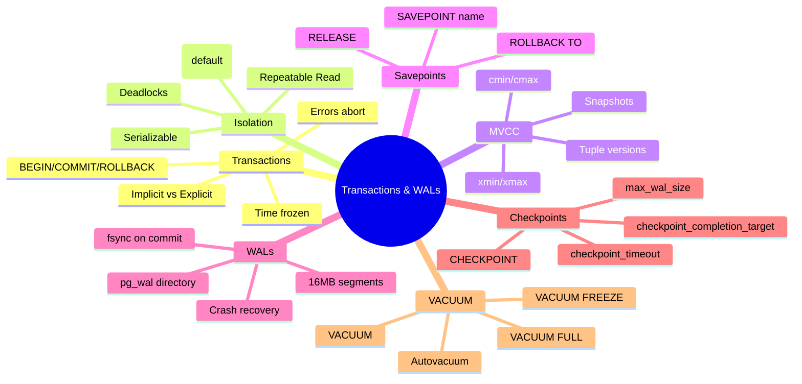

**The Golden Rules:**
1. **Wrap related statements** in explicit transactions
2. **Use SERIALIZABLE** when correctness is critical
3. **Expect retries** with SERIALIZABLE
4. **VACUUM regularly** — don't let dead tuples pile up
5. **Monitor xid wraparound** — VACUUM FREEZE prevents shutdown
6. **Checkpoints balance** recovery time vs I/O performance
7. **Never disable autovacuum** in production
8. **Deadlocks are normal** — your app must handle them
9. **Savepoints let you** partially roll back
10. **WALs make crash recovery** possible — trust the process