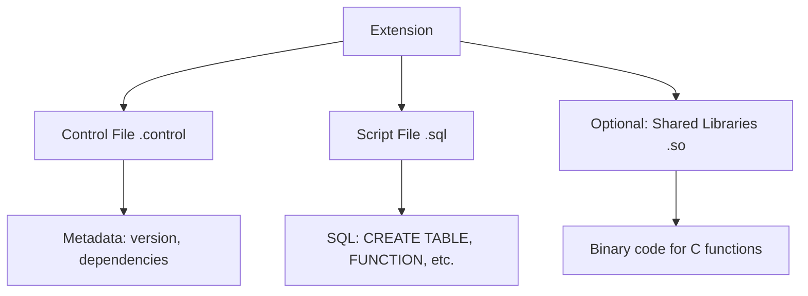
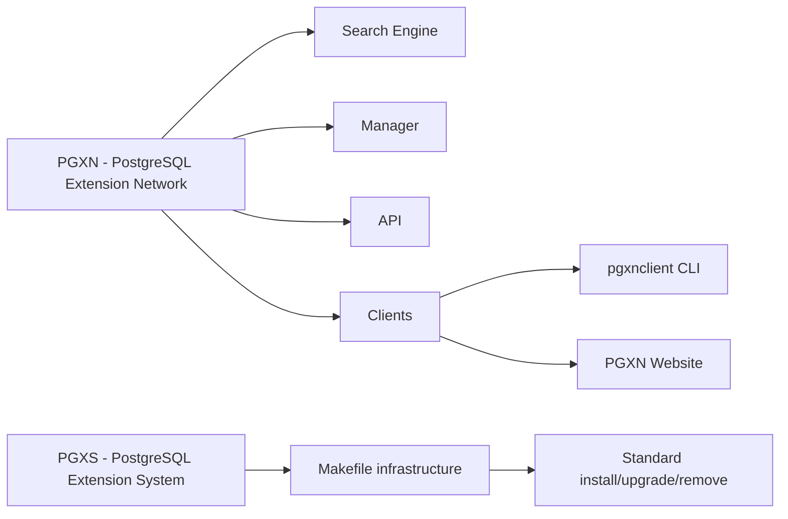
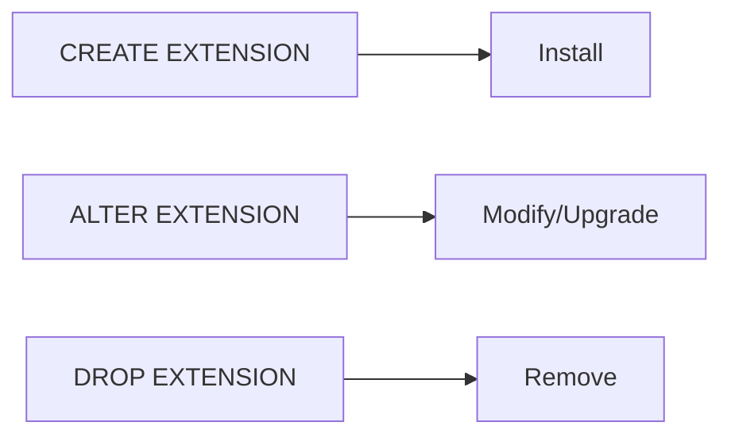
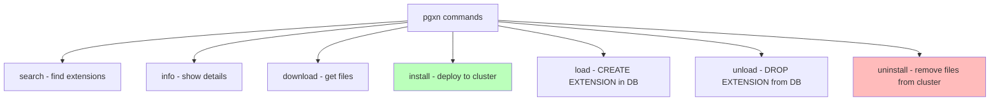
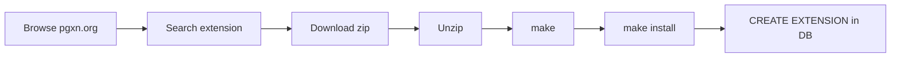
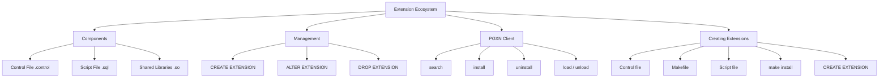
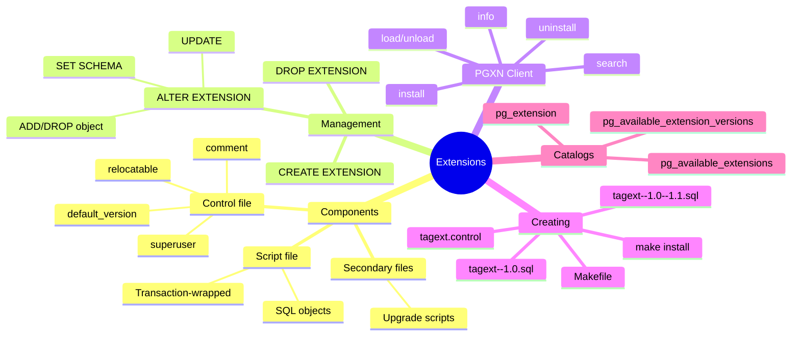

# Simple Explanation of Chapter 12: Extending the Database — The Extension Ecosystem

This chapter teaches you how to **add new features to PostgreSQL** using **extensions** — packaged sets of database objects. Let me break it all down with simple words and diagrams.

---

## Part 1: What Are Extensions?

### The Core Idea

An **extension** is a **packaged set of files** that adds new functionality to PostgreSQL. Think of it like:
- **Libraries** in programming languages
- **Gems** in Ruby
- **JARs** in Java
- **Modules** in Perl (CPAN)



### Why Extensions?

| Problem | Solution |
|---------|----------|
| Related objects scattered | Package them together |
| Manual installation steps | One command installs all |
| Hard to upgrade | Built-in upgrade path |
| No clean removal | DROP EXTENSION removes everything |

### The Ecosystem



**PGXN** = like CPAN for Perl, pip for Python
**PGXS** = build infrastructure (Makefile rules)

---

## Part 2: Extension Components

### Two Main Files

| File | Purpose | Example Name |
|------|---------|-------------|
| **Control File** | Metadata about the extension | `tagext.control` |
| **Script File** | SQL to create objects | `tagext--1.0.sql` |

### The Control File Directives

```
comment = 'Tag Programming Example Extension'
default_version = '1.0'
superuser = false
relocatable = true
directory = '...'
requires = 'other_extension'
schema = 'my_schema'
```

| Directive | Meaning |
|-----------|---------|
| `comment` | Description |
| `default_version` | Version to install if none specified |
| `superuser` | Can non-superuser install? |
| `relocatable` | Can move to other schemas? |
| `requires` | Dependencies |
| `schema` | Target schema |

### The Script File

Contains **plain SQL** that creates the extension's objects:

```sql
CREATE OR REPLACE FUNCTION tag_path(tag_to_search text)
RETURNS TEXT AS $$
DECLARE
    tag_path text;
    current_parent_pk int;
BEGIN
    -- function logic
END;
$$ LANGUAGE plpgsql;
```

**Rules:**
- Executed in a **transaction** (no COMMIT/ROLLBACK inside)
- Cannot run VACUUM or other non-transactional commands
- Name format: `extension_name--version.sql`

### Secondary Control Files (for upgrades)

```
tagext.control              → Main control file
tagext--1.0.sql             → Version 1.0
tagext--1.0--1.1.sql        → Upgrade 1.0 → 1.1
```

---

## Part 3: Managing Extensions

### Three SQL Statements



### CREATE EXTENSION

```sql
CREATE EXTENSION [IF NOT EXISTS] extension_name
[WITH] [SCHEMA schema_name]
       [VERSION version]
       [CASCADE];
```

**Examples:**
```sql
-- Install latest version
CREATE EXTENSION plperl;

-- Install specific version
CREATE EXTENSION pg_stat_statements VERSION '1.4';

-- Install if not exists
CREATE EXTENSION IF NOT EXISTS plperl;
-- NOTICE: extension "plperl" already exists, skipping
```

### Viewing Installed Extensions

```sql
\dx
```
```
+--------------------+---------+------------+-------------------------------------------+
| Name               | Version | Schema     | Description                               |
+--------------------+---------+------------+-------------------------------------------+
| pg_stat_statements | 1.4     | public     | track execution statistics of all SQL...  |
| plperl             | 1.0     | pg_catalog | PL/Perl procedural language               |
| plpgsql            | 1.0     | pg_catalog | PL/pgSQL procedural language              |
+--------------------+---------+------------+-------------------------------------------+
```

**Via catalog query:**
```sql
SELECT x.extname, x.extversion, n.nspname
FROM pg_extension x
JOIN pg_namespace n ON n.oid = x.extnamespace;
```

### Finding Available Versions

```sql
SELECT name, version
FROM pg_available_extension_versions
WHERE name = 'pg_stat_statements';
```
```
+--------------------+---------+
| name               | version |
+--------------------+---------+
| pg_stat_statements | 1.4     |
| pg_stat_statements | 1.5     |
| pg_stat_statements | 1.6     |
+--------------------+---------+
```

### ALTER EXTENSION

Four main operations:

| Operation | Syntax | Purpose |
|-----------|--------|---------|
| **Upgrade** | `ALTER EXTENSION name UPDATE TO 'version'` | Upgrade to new version |
| **Move schema** | `ALTER EXTENSION name SET SCHEMA schema` | Relocate extension |
| **Add object** | `ALTER EXTENSION name ADD TYPE obj` | Add object to extension |
| **Remove object** | `ALTER EXTENSION name DROP TYPE obj` | Remove object from extension |

**Examples:**
```sql
-- Upgrade
ALTER EXTENSION pg_stat_statements UPDATE TO '1.6';

-- Move to another schema
ALTER EXTENSION pg_stat_statements SET SCHEMA my_schema;

-- Add a table to the extension
ALTER EXTENSION pg_stat_statements ADD TABLE my_schema.foo;

-- Now the table cannot be dropped independently
DROP TABLE my_schema.foo;
-- ERROR: cannot drop table my_schema.foo because extension
-- pg_stat_statements requires it
-- HINT: You can drop extension pg_stat_statements instead.
```

### DROP EXTENSION

```sql
DROP EXTENSION [IF EXISTS] name [, ...] [CASCADE | RESTRICT];
```

- **CASCADE** = remove dependent objects too
- **RESTRICT** = fail if dependent objects exist (default)

**Example:**
```sql
DROP EXTENSION plperl, plpgsql CASCADE;
-- NOTICE: drop cascades to function get_max(integer,integer)
-- DROP EXTENSION
```

---

## Part 4: The PGXN Client

### What is pgxnclient?

A **command-line tool** (written in Python) to interact with PGXN.

**Similar to:** `cpan` (Perl), `pip` (Python), `gem` (Ruby)

### Installation

**Debian/Ubuntu:**
```bash
sudo apt install pgxnclient
```

**Fedora:**
```bash
sudo dnf install -y pgxnclient
```

**FreeBSD:**
```bash
sudo pkg install --yes pgxnclient
```

**From source:**
```bash
wget https://github.com/pgxn/pgxnclient/archive/v1.3.zip
unzip v1.3.zip
cd pgxnclient-1.3
sudo python setup.py install
```

### Main Commands



### Search Example

```bash
$ pgxn search --ext orafce
orafce 3.9.0
Oracle's compatibility functions and packages
```

### Install Example

```bash
$ pgxn install orafce --verbose --sudo
DEBUG: running pg_config --libdir
INFO: best version: orafce 3.9.0
...
/usr/bin/install -c -m 755 orafce.so '/usr/local/lib/postgresql/orafce.so'
/usr/bin/install -c -m 644 .//orafce.control '/usr/local/share/postgresql/extension/'
/usr/bin/install -c -m 644 .//orafce--3.9.sql ... '/usr/local/share/postgresql/extension/'
```

**What install does:**
1. Downloads source
2. Compiles (if needed)
3. Copies files to cluster's shared directory

### After Install: Create in Database

```sql
CREATE EXTENSION orafce;
```

Then check:
```sql
\dx
```
```
+---------+---------+------------+-------------------------------------------+
| Name    | Version | Schema     | Description                               |
+---------+---------+------------+-------------------------------------------+
| orafce  | 3.9     | public     | Functions and operators that emulate...   |
| plpgsql | 1.0     | pg_catalog | PL/pgSQL procedural language              |
+---------+---------+------------+-------------------------------------------+
```

### Uninstall

```bash
$ pgxn uninstall orafce --sudo --verbose
rm -f '/usr/local/lib/postgresql/orafce.so'
rm -f '/usr/local/share/postgresql/extension'/orafce.control
rm -f '/usr/local/share/postgresql/extension'/orafce--3.9.sql
...
```

---

## Part 5: Manual Installation

### From the PGXN Website



**Steps:**
1. **Search** on pgxn.org
2. **Download** the zip file
3. **Unzip**: `unzip orafce-3.9.0.zip`
4. **Compile**: `make`
5. **Install**: `sudo make install`
6. **Create in DB**: `CREATE EXTENSION orafce;`

### Uninstall Manually

```bash
$ cd orafce-3.9.0
$ sudo make uninstall
rm -f '/usr/local/lib/postgresql/orafce.so'
rm -f '/usr/local/share/postgresql/extension'/orafce.control
...
```

---

## Part 6: Creating Your Own Extension

### The Goal

Build `tagext` — an extension that provides a function `tag_path()` to show the full path of a tag.

```sql
SELECT tag_path('Kubuntu');
-- Result: Operating Systems > Linux > Ubuntu > Kubuntu
```

### Step 1: Create the Control File

**`tagext.control`:**
```
comment = 'Tag Programming Example Extension'
default_version = '1.0'
superuser = false
relocatable = true
```

### Step 2: Create the Makefile

**`Makefile`:**
```makefile
EXTENSION = tagext
DATA = tagext--1.0.sql
PG_CONFIG = pg_config
PGXS := $(shell $(PG_CONFIG) --pgxs)
include $(PGXS)
```

### Step 3: Create the Script File

**`tagext--1.0.sql`:**
```sql
CREATE OR REPLACE FUNCTION tag_path(tag_to_search text)
RETURNS TEXT AS $$
DECLARE
    tag_path text;
    current_parent_pk int;
BEGIN
    tag_path = tag_to_search;
    SELECT parent INTO current_parent_pk FROM tags WHERE tag = tag_to_search;
    WHILE current_parent_pk IS NOT NULL LOOP
        SELECT parent, tag || ' > ' || tag_path
        INTO current_parent_pk, tag_path
        FROM tags WHERE pk = current_parent_pk;
    END LOOP;
    RETURN tag_path;
END;
$$ LANGUAGE plpgsql;
```

### Step 4: Install

```bash
$ sudo make install
/bin/mkdir -p '/usr/local/share/postgresql/extension'
/usr/bin/install -c -m 644 .//tagext.control '/usr/local/share/postgresql/extension/'
/usr/bin/install -c -m 644 .//tagext--1.0.sql '/usr/local/share/postgresql/extension/'
```

### Step 5: Create in Database

```sql
CREATE EXTENSION tagext;
\dx tagext
```
```
+--------+---------+--------+-----------------------------------+
| Name   | Version | Schema | Description                       |
+--------+---------+--------+-----------------------------------+
| tagext | 1.0     | public | Tag Programming Example Extension |
+--------+---------+--------+-----------------------------------+
```

```sql
SELECT tag_path('Kubuntu');
```
```
+----------------------------------------------+
| Operating Systems > Linux > Ubuntu > Kubuntu |
+----------------------------------------------+
```

### Creating an Upgrade

**`tagext--1.0--1.1.sql`:**
```sql
DROP FUNCTION IF EXISTS tag_path(text);

CREATE OR REPLACE FUNCTION tag_path(tag_to_search text, delimiter text DEFAULT ' > ')
RETURNS TEXT AS $$
DECLARE
    tag_path text;
    current_parent_pk int;
BEGIN
    tag_path = tag_to_search;
    SELECT parent INTO current_parent_pk FROM tags WHERE tag = tag_to_search;
    WHILE current_parent_pk IS NOT NULL LOOP
        SELECT parent, tag || delimiter || tag_path
        INTO current_parent_pk, tag_path
        FROM tags WHERE pk = current_parent_pk;
    END LOOP;
    RETURN tag_path;
END;
$$ LANGUAGE plpgsql;
```

**Updated Makefile:**
```makefile
EXTENSION = tagext
DATA = tagext--1.0.sql tagext--1.0--1.1.sql
PG_CONFIG = pg_config
PGXS := $(shell $(PG_CONFIG) --pgxs)
include $(PGXS)
```

**Install and upgrade:**
```bash
$ sudo make install
$ psql -U postgres forumdb
forumdb=> ALTER EXTENSION tagext UPDATE TO '1.1';
ALTER EXTENSION
forumdb=> \dx tagext
```
```
+--------+---------+--------+-----------------------------------+
| Name   | Version | Schema | Description                       |
+--------+---------+--------+-----------------------------------+
| tagext | 1.1     | public | Tag Programming Example Extension |
+--------+---------+--------+-----------------------------------+
```

**Test new functionality:**
```sql
SELECT tag_path('Kubuntu', ' --> ');
```
```
+----------------------------------------------------+
| Operating Systems --> Linux --> Ubuntu --> Kubuntu |
+----------------------------------------------------+
```

---

## Part 7: Complete Summary



---

## Part 8: Key Takeaways

### Extensions Basics
1. **Extensions package related objects** into one manageable unit
2. **Two main files:** `.control` (metadata) + `.sql` (content)
3. **Script runs in a transaction** — no COMMIT/ROLLBACK inside
4. **Installed per-database**, not per-cluster
5. **Template databases** can spread extensions to new databases

### Management
6. **CREATE EXTENSION** installs in a database
7. **ALTER EXTENSION UPDATE** upgrades to new version
8. **ALTER EXTENSION SET SCHEMA** moves relocatable extensions
9. **DROP EXTENSION CASCADE** removes everything
10. **pg_extension** catalog shows installed extensions

### PGXN
11. **PGXN** = global extension repository
12. **pgxnclient** = command-line tool for PGXN
13. **pgxn install** = download + compile + deploy
14. **pgxn uninstall** = remove files from cluster
15. **CREATE EXTENSION** still needed after install

### Creating Extensions
16. **Control file** describes the extension
17. **Makefile** uses PGXS for standard build
18. **Script file** contains the SQL objects
19. **`make install`** deploys to cluster's shared directory
20. **Upgrade files** named `extname--oldversion--newversion.sql`

---

## Quick Reference Card



**The Golden Rules:**
1. **Use extensions** to package related objects
2. **Always have a control file** and at least one SQL file
3. **Scripts run in transactions** — no VACUUM, no COMMIT
4. **Install per-database** — not cluster-wide
5. **Use PGXN** for community extensions
6. **Upgrades need bridge files** (`ext--old--new.sql`)
7. **CASCADE carefully** — it removes dependent objects
8. **Superuser may be required** — check the control file
9. **Relocatable** = can move between schemas
10. **Test upgrades** before production