# Simple Explanation of Chapter 13: Indexes and Performance Optimization

This chapter is about **making your database queries run faster**. Let me break it all down with simple words and diagrams.

---

## Part 1: How PostgreSQL Executes a Statement

### The Four Stages

Every SQL statement goes through **four stages**:

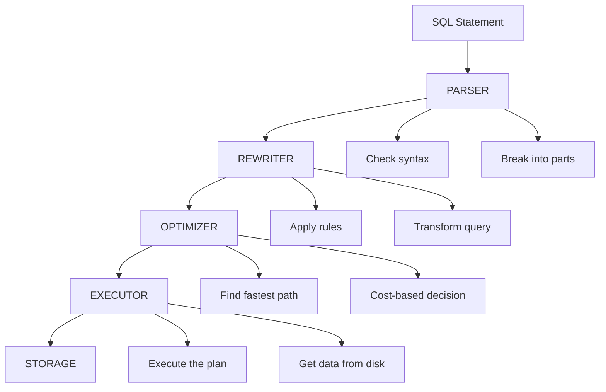

### Stage Details

| Stage | Component | What It Does |
|-------|-----------|-------------|
| **1. Parsing** | Parser | Checks syntax, breaks SQL into parts |
| **2. Rewriting** | Rewriter | Applies rules, transforms query |
| **3. Optimization** | Optimizer | Finds fastest path to data |
| **4. Execution** | Executor | Actually gets the data |

### Where Can the DBA Help?

**Only at the optimization phase** — by creating indexes, updating statistics, or rewriting queries.

---

## Part 2: The Optimizer

### Cost-Based Optimizer

PostgreSQL uses a **cost-based optimizer** — it assigns a cost to every possible way of accessing data and picks the cheapest one.

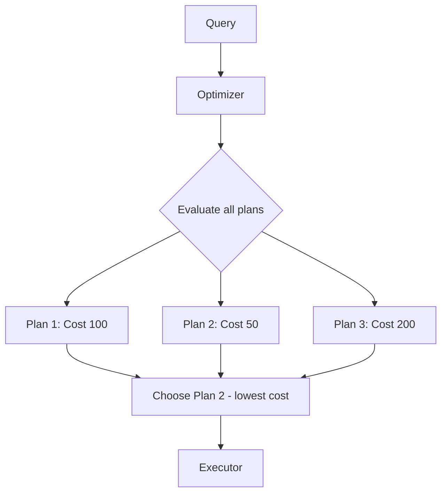

### Cost Parameters

| Parameter | Default | Meaning |
|-----------|---------|---------|
| `seq_page_cost` | 1 | Sequential disk read |
| `random_page_cost` | 4 | Random disk read |
| `cpu_tuple_cost` | 0.01 | Processing a tuple |
| `cpu_index_tuple_cost` | 0.005 | Processing an index tuple |
| `cpu_operator_cost` | 0.0025 | Performing an operator |

### When the Optimizer Gives Up

If a query involves **more than 12 table joins**, the optimizer uses a **genetic algorithm** instead of checking all possibilities — a compromise between perfect and fast.

---

## Part 3: Execution Nodes

Nodes are **actions** the executor performs. They can be **stacked** (output of one = input of another).

### Sequential Scan (Seq Scan)

Reads the **entire table** from beginning to end.


**When used:**
- No filtering clause
- Filtering doesn't eliminate many rows
- No useful index exists

### Index Scans

Three types:

| Type | Description | Storage Accesses |
|------|-------------|-----------------|
| **Index Scan** | Read index, then fetch tuples from table | 2 |
| **Index Only Scan** | Read index, all data is in index | 1 |
| **Bitmap Index Scan** | Build bitmap in memory, then fetch | 2 (but batched) |

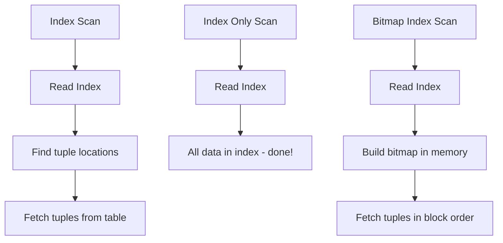

### Join Nodes

Three types:

#### Nested Loop

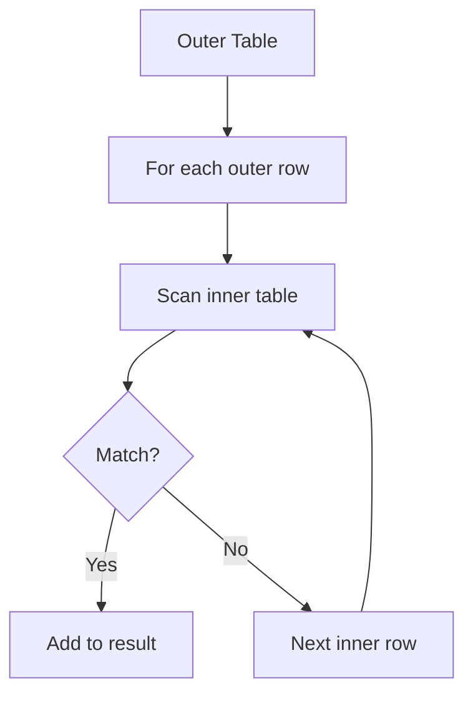

**Pseudo-code:**
```
for (Tuple o : outerTable)
    for (Tuple i : innerTable)
        if (o.matches(i))
            appendTupleToResult(o, i);
```

**When used:** Inner table is small.

#### Hash Join

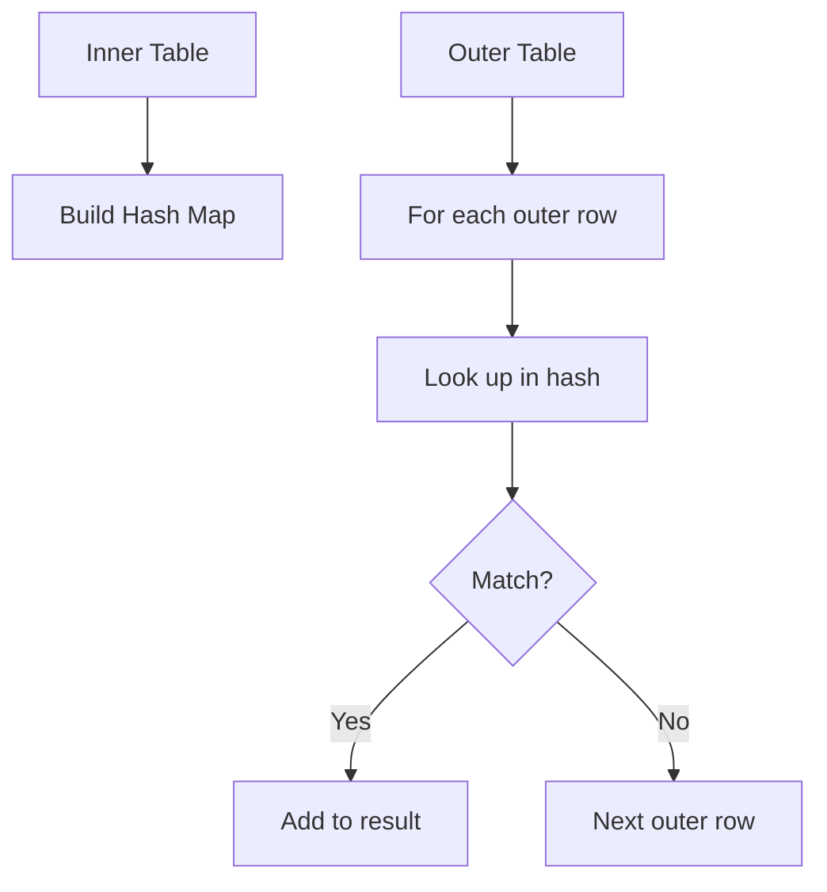

**Pseudo-code:**
```
Hash innerHash = buildHash(innerTable);
for (Tuple o : outerTable)
    if (innerHash.containsKey(buildHash(o)))
        appendTupleToResult(o, i);
```

**When used:** Large tables, no useful sort order.

#### Merge Join

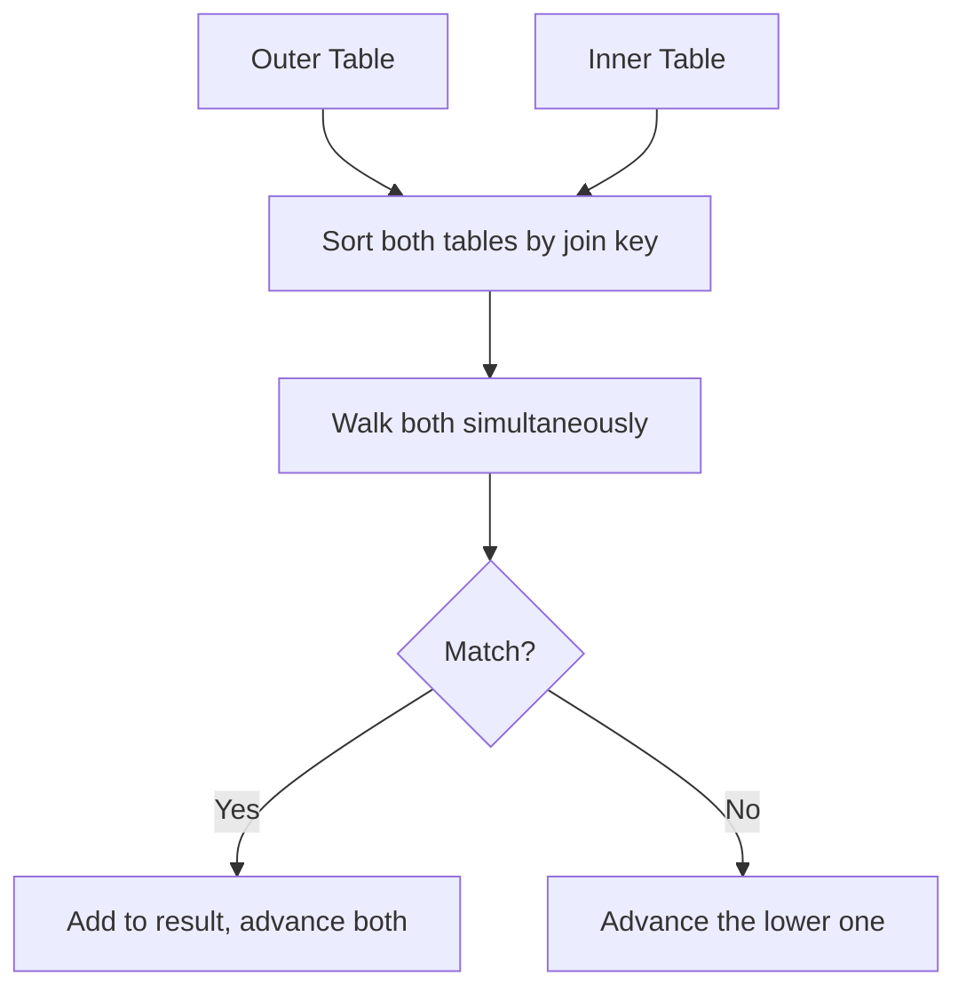

**Pseudo-code:**
```
outerTable = sort(outerTable);
innerTable = sort(innerTable);
for (Tuple o : outerTable)
    for (; innerIdx < innerTable.length(); innerIdx++) {
        Tuple i = innerTable[innerIdx];
        if (o == i) appendTupleToResult(o, i);
        else break;
    }
```

**When used:** Both tables can be sorted efficiently.

### Utility Nodes

| Node | Purpose |
|------|---------|
| **Sort** | ORDER BY |
| **Limit** | LIMIT clause |
| **Append** | UNION ALL |
| **Distinct** | UNION, DISTINCT |
| **GroupAggregate** | GROUP BY |
| **WindowAgg** | Window functions |
| **CTEScan** | Common Table Expressions |
| **Materialize** | Store intermediate results |

### Parallel Nodes

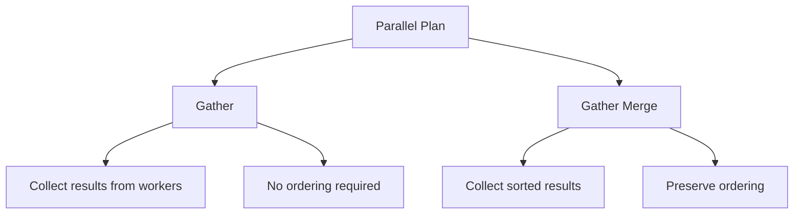

**Parallel scans:**
- Parallel Seq Scan
- Parallel Index Scan
- Parallel Index Only Scan
- Parallel Bitmap Heap Scan

**Parallel joins:**
- Parallel Hash Join

**Parallel aggregations:**
- Partial Aggregate → Gather → Finalize Aggregate

### When Does PostgreSQL Use Parallel Plans?

**Requirements:**
1. Table > `min_parallel_table_scan_size` (default 8 MB)
2. Index > `min_parallel_index_scan_size` (default 512 kB)
3. Not too many parallel processes already running
4. Query must be read-only (no writes)
5. No `PARALLEL UNSAFE` functions

---

## Part 4: Indexes

### What is an Index?

A data structure that speeds up data retrieval — like a book's index.

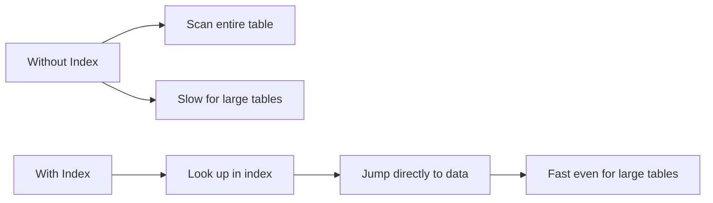

### Index Types

| Type | Best For | Operators | Size |
|------|----------|-----------|------|
| **B-Tree** | Most cases, ranges, sorting | `=`, `<`, `>`, `LIKE` (prefix) | Medium |
| **Hash** | Equality only | `=` | Small |
| **BRIN** | Large tables, naturally ordered | Range operators | Very small |
| **GIN** | Full-text, arrays, JSON | `@>`, `<@`, `@@` | Large |
| **GiST** | Geometric, custom types | Various | Medium |
| **SP-GiST** | Spatial data | Various | Medium |

### B-Tree Index (Default)

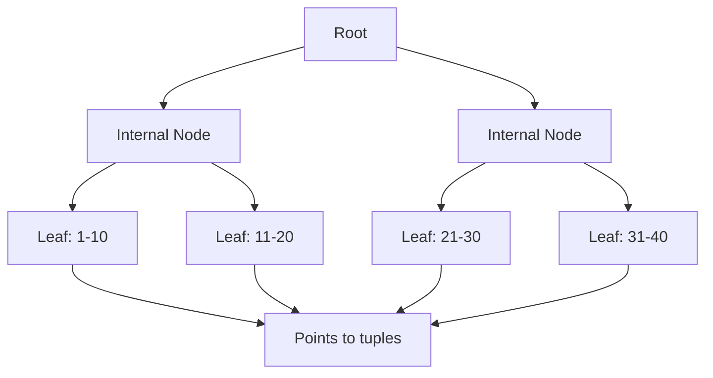

**Characteristics:**
- Balanced tree (always same depth)
- Supports UNIQUE
- Used for PRIMARY KEY
- Supports range queries
- `LIKE 'abc%'` works; `LIKE '%abc'` doesn't

### Creating an Index

```sql
CREATE [UNIQUE] INDEX [CONCURRENTLY] [IF NOT EXISTS] name
ON table_name [USING method]
(column_name | (expression)) [ASC | DESC] [NULLS {FIRST | LAST}]
[INCLUDE (column_name, ...)]
[WITH (storage_parameter = value)]
[TABLESPACE tablespace_name]
[WHERE predicate];
```

**Examples:**
```sql
-- Simple single-column index
CREATE INDEX idx_post_category ON posts(category);

-- Multi-column index (most selective first!)
CREATE INDEX idx_author_created_on ON posts(author, created_on);

-- Hash index (equality only)
CREATE INDEX idx_post_created_on ON posts USING hash (created_on);

-- Partial index (only some rows)
CREATE INDEX idx_active_posts ON posts(category) WHERE editable = true;

-- Covering index (extra columns in index)
CREATE INDEX idx_author_created ON posts(author, created_on)
INCLUDE (title, content);

-- Concurrent creation (no table lock)
CREATE INDEX CONCURRENTLY idx_new ON posts(category);
```

### Multi-Column Index Rule

**Most selective column first!**

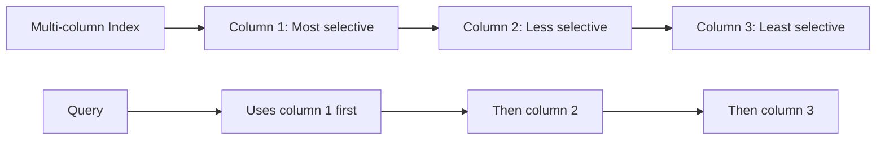

### Inspecting Indexes

```sql
\d posts
```
```
Indexes:
    "posts_pkey" PRIMARY KEY, btree (pk)
    "idx_author_created_on" btree (author, created_on)
    "idx_post_category" btree (category)
    "idx_post_created_on" hash (created_on)
```

**Via catalog:**
```sql
SELECT relname, relpages, reltuples,
       i.indisunique, i.indisclustered, i.indisvalid,
       pg_get_indexdef(i.indexrelid, 0, true)
FROM pg_class c
JOIN pg_index i ON c.oid = i.indrelid
WHERE c.relname = 'posts';
```

### Invalidating an Index

```sql
UPDATE pg_index
SET indisvalid = false
WHERE indexrelid = (SELECT oid FROM pg_class
                    WHERE relkind = 'i'
                    AND relname = 'idx_author_created_on');
```

**Result:**
```
"idx_author_created_on" btree (author, created_on) INVALID
```

**Use case:** Study how the optimizer behaves without the index.

### Rebuilding an Index

```sql
REINDEX [ (VERBOSE) ] { INDEX | TABLE | SCHEMA | DATABASE | SYSTEM }
        [CONCURRENTLY] name;
```

**Examples:**
```sql
REINDEX INDEX idx_posts_author;
REINDEX TABLE posts;
REINDEX SCHEMA public;
REINDEX DATABASE forumdb;
REINDEX SYSTEM forumdb;
```

### Dropping an Index

```sql
DROP INDEX [CONCURRENTLY] [IF EXISTS] name [, ...] [CASCADE | RESTRICT];
```

---

## Part 5: The EXPLAIN Statement

### Basic Usage

```sql
EXPLAIN SELECT * FROM categories;
```
```
QUERY PLAN
-----------------------------------------------------------
Seq Scan on categories (cost=0.00..1.01 rows=1 width=68)
(1 row)
```

### Understanding the Output

| Field | Meaning |
|-------|---------|
| **Node Type** | What operation (Seq Scan, Sort, etc.) |
| **cost=X..Y** | Startup cost (X) and total cost (Y) |
| **rows=N** | Estimated number of rows |
| **width=N** | Average row width in bytes |

### Reading the Plan

```sql
EXPLAIN SELECT title FROM categories ORDER BY description DESC;
```
```
QUERY PLAN
-----------------------------------------------------------------
Sort (cost=1.02..1.02 rows=1 width=64)
  Sort Key: description DESC
  -> Seq Scan on categories (cost=0.00..1.01 rows=1 width=64)
```

**Reading rules:**
1. **Top node** is the final output
2. **Indented with ->** are child nodes
3. **Most indented** = executed first
4. **Pipeline** = parent starts after child finishes

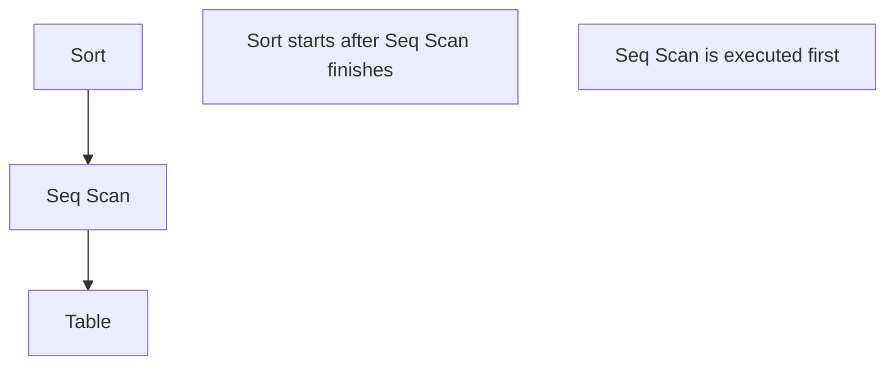

### EXPLAIN Output Formats

```sql
EXPLAIN (FORMAT JSON) SELECT * FROM categories;
EXPLAIN (FORMAT XML) SELECT * FROM categories;
EXPLAIN (FORMAT YAML) SELECT * FROM categories;
```

**JSON example:**
```json
[
  {
    "Plan": {
      "Node Type": "Seq Scan",
      "Parallel Aware": false,
      "Relation Name": "categories",
      "Startup Cost": 0.00,
      "Total Cost": 1.01,
      "Plan Rows": 1,
      "Plan Width": 68
    }
  }
]
```

### EXPLAIN ANALYZE

**Actually runs the query** and reports actual times.

```sql
EXPLAIN ANALYZE SELECT * FROM categories;
```
```
QUERY PLAN
---------------------------------------------------------------------------
Seq Scan on categories (cost=0.00..1.01 rows=1 width=68)
  (actual time=0.023..0.025 rows=1 loops=1)
Planning Time: 0.102 ms
Execution Time: 0.062 ms
```

**New fields:**
- `actual time=X..Y` = real startup and total time
- `rows=N` = actual rows
- `loops=N` = how many times the node executed

### EXPLAIN Options

| Option | Default | Meaning |
|--------|---------|---------|
| `VERBOSE` | off | More detailed output |
| `COSTS` | on | Show cost estimates |
| `TIMING` | on | Show actual times |
| `SUMMARY` | on | Show planning/execution time |
| `BUFFERS` | off | Show buffer usage |
| `WAL` | off | Show WAL usage (PostgreSQL 13+) |
| `FORMAT` | TEXT | TEXT, XML, JSON, YAML |

**BUFFERS explained:**
```
Buffers: shared hit=1
```

| Prefix | Meaning |
|--------|---------|
| `shared` | Shared buffer (database cache) |
| `temp` | Temporary memory |
| `local` | Temporary database objects |

| Suffix | Meaning |
|--------|---------|
| `hit` | Found in cache |
| `read` | Read from disk |
| `dirtied` | Modified by query |
| `written` | Written to disk |
| `lossy` | Checked twice |

---

## Part 6: Query Tuning Example

### Step 1: Find the Slow Query

```sql
SELECT * FROM posts ORDER BY created_on;
```

### Step 2: Check the Plan

```sql
EXPLAIN ANALYZE SELECT * FROM posts ORDER BY created_on;
```
```
Sort (cost=1009871.99..1022372.04 rows=5000020 width=55)
  (actual time=31321.217..32806.986 rows=5000000 loops=1)
  Sort Key: created_on
  Sort Method: external merge Disk: 367024kB
  -> Seq Scan on posts (cost=0.00..111729.20 rows=5000020 width=55)
     (actual time=0.078..2546.672 rows=5000000 loops=1)
Planning Time: 0.148 ms
Execution Time: 33138.966 ms
```

**Problem:** 33 seconds! Sequential scan + sort.

### Step 3: Create an Index

```sql
CREATE INDEX idx_posts_date ON posts(created_on);
```

### Step 4: Check Again

```sql
EXPLAIN ANALYZE SELECT * FROM posts ORDER BY created_on;
```
```
Index Scan using idx_posts_date on posts (cost=0.43..376844.33 rows=5000000 width=55)
  (actual time=0.768..8694.662 rows=5000000 loops=1)
Planning Time: 6.357 ms
Execution Time: 9128.668 ms
```

**Result:** 33 seconds → 9 seconds (almost 4x faster!)

### The Cost of Indexes

```sql
SELECT pg_size_pretty(pg_relation_size('posts')) AS table_size,
       pg_size_pretty(pg_relation_size('idx_posts_date')) AS index_size;
```
```
table_size | index_size
------------+------------
482 MB     | 107 MB
```

**Index takes ~22% of table size.**

### Another Tuning Example

**Query:**
```sql
SELECT p.title, u.username
FROM posts p
JOIN users u ON u.pk = p.author
WHERE u.username = 'fluca1978'
AND daterange(CURRENT_DATE - 2, CURRENT_DATE) @> p.created_on::date;
```

**Without index on posts.author:**
```
Nested Loop (cost=0.28..187049.79 rows=25 width=22)
  (actual time=152.156..5008.775 rows=10 loops=1)
  Join Filter: (p.author = u.pk)
  Rows Removed by Join Filter: 9990
  -> Index Scan using users_username_key on users u
     (actual time=1.174..1.203 rows=1 loops=1)
  -> Seq Scan on posts p (actual time=150.959..4755.512 rows=10000 loops=1)
     Rows Removed by Filter: 4990000
Execution Time: 5012.352 ms
```

**After creating index on posts.author:**
```sql
CREATE INDEX idx_posts_author ON posts(author);
```

```
Nested Loop (cost=94.21..15440.96 rows=25 width=22)
  (actual time=0.711..11.865 rows=5 loops=1)
  -> Index Scan using users_username_key on users u
  -> Bitmap Heap Scan on posts p (actual time=0.677..11.451 rows=5 loops=1)
     -> Bitmap Index Scan on idx_posts_author
Execution Time: 12.310 ms
```

**Result:** 5 seconds → 12 milliseconds!

### Identifying Unused Indexes

```sql
SELECT indexrelname, idx_scan, idx_tup_read, idx_tup_fetch
FROM pg_stat_user_indexes WHERE relname = 'posts';
```
```
indexrelname      | idx_scan | idx_tup_read | idx_tup_fetch
------------------+----------+--------------+---------------
posts_pkey        | 0        | 0            | 0
idx_posts_date    | 3        | 5000002      | 5000002
idx_posts_author  | 15       | 25010        | 10
```

**Reading:**
- `idx_posts_date`: Used 3 times, returned 5M tuples (inefficient!)
- `idx_posts_author`: Used 15 times, returned only 10 tuples (efficient!)

**Conclusion:** Consider dropping `idx_posts_date`.

---

## Part 7: ANALYZE and Statistics

### Why Statistics Matter

PostgreSQL uses statistics to **estimate** how many rows a query will return. Bad estimates = bad plans.

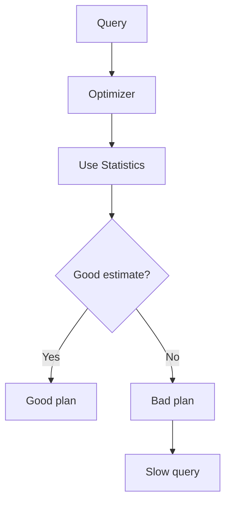

### Running ANALYZE

```sql
ANALYZE posts;
```
```
ANALYZE
Time: 17674,106 ms (00:17,674)
```

**Warning:** ANALYZE is intrusive — 17 seconds for 5M tuples!

### Where Statistics Live

```sql
SELECT n_distinct FROM pg_stats
WHERE attname = 'author' AND tablename = 'posts';
```
```
n_distinct
------------
1000
```

**Reading:** There are 1,000 distinct authors.

### Most Common Values

```sql
SELECT * FROM pg_stats;
```
```
mcv  | mcf
------+--------------
2358 | 0.001039
2972 | 0.001037
...
```

**Reading:**
- `mcv` = Most Common Value
- `mcf` = Most Common Frequency
- Author 2358 appears 0.1039% of the time
- 5M tuples × 0.001039 = ~5,195 posts

### Autovacuum (Analyze)

The **autovacuum daemon** updates statistics automatically.

**Parameters:**
| Parameter | Default | Meaning |
|-----------|---------|---------|
| `autovacuum_analyze_threshold` | 50 | Min changes to trigger |
| `autovacuum_analyze_scale_factor` | 0.1 | % of table |
| `autovacuum_max_workers` | 3 | Parallel workers |

**Trigger formula:**
```
changes > threshold + (table_tuples × scale_factor)
```

---

## Part 8: Auto-Explain

### What is Auto-Explain?

An extension that **automatically logs execution plans** for slow queries.

### Installation

**In `postgresql.conf`:**
```
session_preload_libraries = 'auto_explain'
auto_explain.log_min_duration = '500ms'
```

**Restart required!**

### Configuration Options

| Option | Default | Meaning |
|--------|---------|---------|
| `auto_explain.log_min_duration` | -1 (off) | Min duration to log |
| `auto_explain.log_analyze` | off | Log ANALYZE output |
| `auto_explain.log_buffers` | off | Log buffer usage |
| `auto_explain.log_timing` | on | Log timing |
| `auto_explain.log_triggers` | off | Log trigger info |
| `auto_explain.log_verbose` | off | Verbose output |
| `auto_explain.log_format` | text | text, xml, json, yaml |
| `auto_explain.log_nested_statements` | off | Log nested statements |
| `auto_explain.sample_rate` | 1 | Sample rate (0 to 1) |

### Example Output

**Query:**
```sql
SELECT count(*) FROM posts p
JOIN users u ON u.pk = p.author
WHERE u.username = 'fluca1978'
AND daterange(CURRENT_DATE - 20, CURRENT_DATE) @> p.created_on::date;
```

**Log output:**
```
LOG: duration: 5991.394 ms plan:
Query Text: SELECT count(*)
FROM posts p
JOIN users u ON u.pk = p.author
WHERE u.username = 'fluca1978'
AND daterange(CURRENT_DATE - 20, CURRENT_DATE) @> p.created_on::date
Finalize Aggregate (cost=114848.33..114848.34 rows=1 width=8)
  -> Gather (cost=114848.12..114848.33 rows=2 width=8)
     Workers Planned: 2
     -> Partial Aggregate (cost=113848.12..113848.13 rows=1 width=8)
        -> Hash Join (cost=8.30..113848.09 rows=10 width=0)
           Hash Cond: (p.author = u.pk)
           -> Parallel Seq Scan on posts p
              Filter: (daterange(...) @> (created_on)::date)
           -> Hash (cost=8.29..8.29 rows=1 width=4)
              -> Index Scan using users_username_key on users u
```

---

## Part 9: Complete Summary Diagram

```mermaid
graph TD
    A[Indexes and Performance] --> B[Query Execution]
    A --> C[Optimizer]
    A --> D[Nodes]
    A --> E[Indexes]
    A --> F[EXPLAIN]
    A --> G[Statistics]
    A --> H[Auto-Explain]
    
    B --> B1[Parser]
    B --> B2[Rewriter]
    B --> B3[Optimizer]
    B --> B4[Executor]
    
    C --> C1[Cost-based]
    C --> C2[Cost parameters]
    C --> C3[Genetic algorithm >12 joins]
    
    D --> D1[Seq Scan]
    D --> D2[Index Scan]
    D --> D3[Nested Loop]
    D --> D4[Hash Join]
    D --> D5[Merge Join]
    D --> D6[Parallel nodes]
    D --> D7[Utility nodes]
    
    E --> E1[B-Tree]
    E --> E2[Hash]
    E --> E3[BRIN]
    E --> E4[GIN]
    E --> E5[GiST]
    
    F --> F1[EXPLAIN]
    F --> F2[EXPLAIN ANALYZE]
    F --> F3[Options]
    F --> F4[Formats]
    
    G --> G1[ANALYZE]
    G --> G2[pg_stats]
    G --> G3[autovacuum]
    
    H --> H1[Auto logging]
    H --> H2[Configuration]
```

---

## Part 10: Key Takeaways

### Query Execution
1. **Four stages:** Parse → Rewrite → Optimize → Execute
2. **DBA can only hook** at optimization phase
3. **Cost-based optimizer** picks the cheapest plan

### Nodes
4. **Seq Scan** = read entire table
5. **Index Scan** = use index + fetch tuples
6. **Index Only Scan** = all data in index
7. **Bitmap Index Scan** = build bitmap, then fetch
8. **Nested Loop** = small inner table
9. **Hash Join** = large tables, no sort order
10. **Merge Join** = both sorted by join key
11. **Parallel nodes** = split work among workers

### Indexes
12. **B-Tree** = default, most versatile
13. **Hash** = equality only
14. **BRIN** = large, naturally ordered tables
15. **GIN** = full-text, arrays, JSON
16. **GiST** = geometric, custom types
17. **Multi-column** = most selective first
18. **Partial** = only some rows
19. **Covering** = extra columns in index
20. **Concurrent** = no table lock during creation

### EXPLAIN
21. **EXPLAIN** = show plan, don't execute
22. **EXPLAIN ANALYZE** = show plan AND execute
23. **FORMAT** = TEXT, JSON, XML, YAML
24. **BUFFERS** = cache hit/miss info
25. **WAL** = WAL usage (PostgreSQL 13+)

### Statistics
26. **ANALYZE** = update statistics
27. **pg_stats** = where statistics live
28. **Autovacuum** = automatic statistics update
29. **n_distinct** = number of distinct values
30. **mcv/mcf** = most common values/frequencies

### Auto-Explain
31. **Auto-Explain** = logs slow queries automatically
32. **log_min_duration** = threshold for logging
33. **Restart required** after enabling

---

## Quick Reference Card

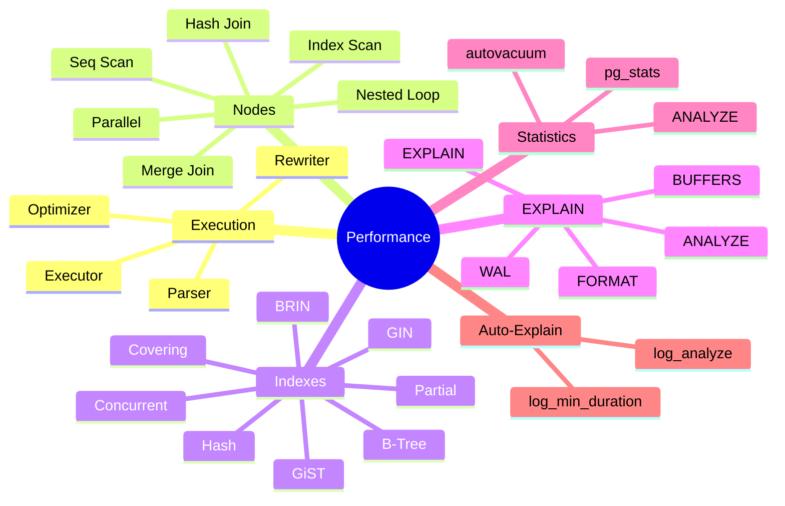

**The Golden Rules:**
1. **Always EXPLAIN** before and after creating an index
2. **Most selective column first** in multi-column indexes
3. **Don't over-index** — each index costs space and slows writes
4. **Watch for unused indexes** — drop them
5. **Keep statistics fresh** — autovacuum does this
6. **Use EXPLAIN ANALYZE** to see actual vs estimated
7. **BUFFERS** reveals cache efficiency
8. **Auto-Explain** catches slow queries automatically
9. **Parallel plans** only help large datasets
10. **Cost parameters** should rarely be changed