# Simple Explanation of Chapter 14: Logging and Auditing

This chapter is about **tracking what happens in your database** — either for debugging, monitoring, or legal compliance. Let me break it all down with simple words and diagrams.

---

## Part 1: Introduction to Logging

### What is Logging?

**Logging** = PostgreSQL writes text files describing what the cluster does.

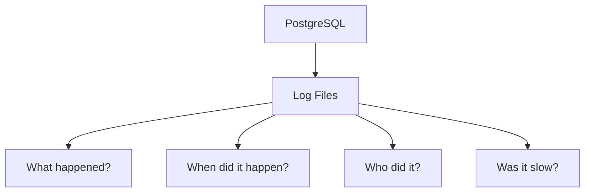

**Important distinction:**
- **Logs** (this chapter) = textual system logs
- **WALs** (Chapter 11) = write-ahead logs for crash recovery

### Where to Log

| Destination | Meaning |
|-------------|---------|
| **stderr** | Standard error (console) |
| **syslog** | External syslog service |
| **csvlog** | CSV format for analysis |
| **eventlog** | Windows event log |

### The Logging Collector

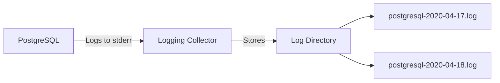

**Why use the logging collector?**
- Syslog can **lose entries** under heavy load
- PostgreSQL's collector **never loses** entries

### Basic Log Configuration

```ini
log_destination = 'stderr'
logging_collector = on
log_directory = 'log'
log_filename = 'postgresql-%Y-%m-%d.log'
log_rotation_age = '1d'
log_rotation_size = '100MB'
```

**What this does:**
- Sends logs to stderr
- Collector stores them in `log/` directory
- Filename includes date
- Rotates every 1 day OR 100 MB

### Log Rotation

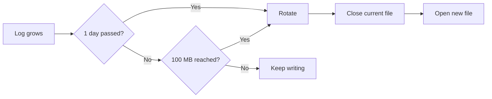

---

## Part 2: When to Log

### Log Levels (Thresholds)

From lowest to highest priority:

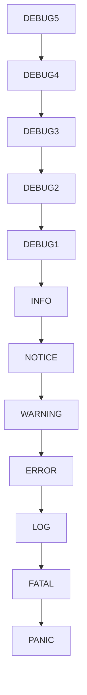

### Two Important Parameters

| Parameter | Controls |
|-----------|----------|
| `log_min_messages` | What the cluster logs |
| `client_min_messages` | What the client sees |

**Example:**
```ini
log_min_messages = 'info'      # Cluster logs info and above
client_min_messages = 'debug1' # Client sees debug1 and above
```

### Duration-Based Logging

```ini
log_min_duration_statement = '100ms'
```

**Meaning:** Log any statement that takes **more than 100 milliseconds**.

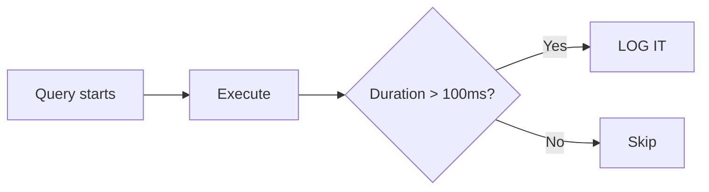

### Transaction Sampling (PostgreSQL 12+)

```ini
log_transaction_sample_rate = 0.5
```

**Meaning:** Log every **other** transaction.

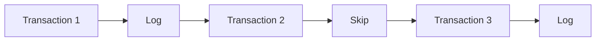

**Use case:** Sample full transactions on a heavily loaded system without logging everything.

---

## Part 3: What to Log

### log_statement — Dangerous but Useful

| Value | Meaning |
|-------|---------|
| `off` | Don't log statements |
| `ddl` | Log CREATE/ALTER/DROP |
| `mod` | Log INSERT/UPDATE/DELETE |
| `all` | Log everything |

⚠️ **Warning:** Logging all statements can:
- Fill disk quickly
- Expose sensitive data in logs

**Better approach:** Use `log_min_duration_statement` to log only slow statements.

### Other Useful Parameters

| Parameter | What It Logs |
|-----------|-------------|
| `log_checkpoints` | When checkpoints happen |
| `log_connections` | When connections are established |
| `log_disconnections` | When connections close |
| `log_lock_waits` | When queries wait for locks |
| `log_temp_files` | When temp files are created |
| `log_autovacuum_min_duration` | Slow autovacuum actions |

### log_line_prefix — The Log Format

**Pattern string** defining what goes at the start of each log line.

| Placeholder | Meaning |
|-------------|---------|
| `%t` | Timestamp |
| `%p` | Process ID |
| `%l` | Session line number |
| `%u` | Username |
| `%d` | Database |
| `%a` | Application name |
| `%h` | Remote host |

**Example:**
```ini
log_line_prefix = '%t [%p]: [%l] user=%u,db=%d,app=%a,client=%h '
```

**Produces:**
```
2020-04-16 11:49:32 CEST [97734]: [4-1] user=luca,db=digikamdb,app=psql,client=192.168.222.1 LOG: ...
```

---

## Part 4: A Complete Logging Example

### Configuration File: `logging.conf`

```ini
log_destination = 'stderr'
logging_collector = on
log_directory = 'log'
log_filename = 'postgresql-%Y-%m-%d.log'
log_rotation_age = '1d'
log_rotation_size = '100MB'
log_line_prefix = '%t [%p]: [%l] user=%u,db=%d,app=%a,client=%h '
log_checkpoints = on
log_connections = on
log_disconnections = on
log_min_duration_statement = '100ms'
```

### Include It

**In `postgresql.conf`:**
```ini
include_if_exists = 'logging.conf'
```

### Restart

```bash
sudo -u postgres pg_ctl -D /postgres/12 restart
```

### Test

```sql
SELECT CURRENT_DATE;        -- Fast, not logged
SELECT 1 + 1;               -- Fast, not logged
SELECT count(*) FROM posts; -- Slow (1 sec), LOGGED!
```

### Check the Log

```
2020-04-16 18:05:00 CEST [29759]: [1] ... LOG: connection received: host=192.168.222.1 port=45106
2020-04-16 18:05:00 CEST [29759]: [2] ... LOG: connection authorized: user=luca database=forumdb
2020-04-16 18:05:05 CEST [29759]: [3] ... LOG: duration: 1018.650 ms statement: SELECT count(*) FROM posts;
2020-04-16 18:05:08 CEST [29759]: [4] ... LOG: disconnection: session time: 0:00:07.159
```

**Reading:**
- Line 1: Connection received
- Line 2: Connection authorized
- Line 3: Slow statement logged
- Line 4: Disconnection

**Notice:** Only the **slow** statement (line 3) was logged, not the fast ones.

---

## Part 5: PgBadger — Log Analysis Tool

### What is PgBadger?

A **Perl application** that reads PostgreSQL logs and produces **HTML dashboards**.

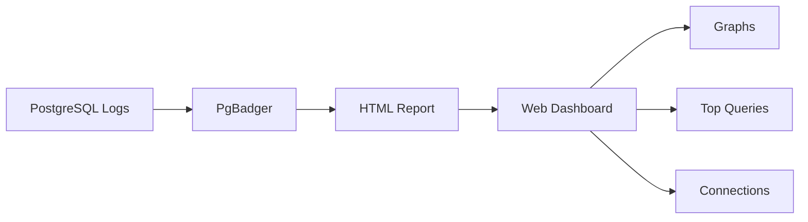

### Installation

```bash
wget https://github.com/darold/pgbadger/archive/v11.2.tar.gz
tar xzvf v11.2.tar.gz
cd pgbadger-11.2
perl Makefile.PL
make
sudo make install
```

### Verify

```bash
$ pgbadger --version
pgBadger version 11.2
```

### PgBadger-Specific Configuration

```ini
log_destination = 'stderr'
logging_collector = on
log_directory = 'log'
log_filename = 'postgresql-%Y-%m-%d.pgbadger.log'
log_rotation_age = '1d'
log_rotation_size = '100MB'
log_min_duration_statement = 0    # Log ALL statements
log_line_prefix = '%t [%p]: [%l] user=%u,db=%d,app=%a,client=%h '
log_checkpoints = on
log_connections = on
log_disconnections = on
log_lock_waits = on
log_temp_files = 0
log_autovacuum_min_duration = 0
log_error_verbosity = default
```

⚠️ **Warning:** `log_min_duration_statement = 0` logs EVERY statement — can expose sensitive data!

### Running PgBadger

```bash
sudo -u postgres pgbadger -o /postgres/reports/first_report.html \
    /postgres/12/log/postgresql-2020-04-17.pgbadger.log
```

**Output:**
```
[========================>] Parsed 313252 bytes of 313252 (100.00%),
queries: 801, events: 34
LOG: Ok, generating html report..
```

### Parallel Mode (for big logs)

```bash
pgbadger -j 4 -o report.html logfile.log
```

`-j 4` = divide log into 4 parts, analyze in parallel.

### What the Report Shows

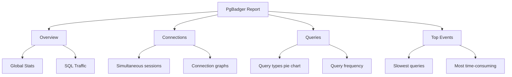

### Incremental Mode

**For scheduled execution:**

```bash
sudo -u postgres pgbadger -I --outdir /postgres/reports/ \
    /postgres/12/log/postgresql-2020-04-17.pgbadger.log
```

**Output:**
```
LOG: Ok, generating HTML daily report into /postgres/reports//2020/04/17/...
LOG: Ok, generating HTML weekly report into /postgres/reports//2020/week-16/...
LOG: Ok, generating global index to access incremental reports...
```

**Directory tree:**
```
/postgres/reports
├── index.html
└── 2020
    └── 04
        └── 17
            └── index.html
```

### Scheduling with Cron

```bash
59 23 * * * pgbadger -I --outdir /postgres/reports/ \
    /postgres/12/log/postgresql-`date +'%Y-%m-%d'`.pgbadger.log
```

**Runs at 11:59 PM every day** to analyze that day's logs.

### Remote Analysis

```bash
pgbadger -I --outdir /postgres/reports \
    ssh://postgres@miguel//postgres/12/log/postgresql-`date +'%Y-%m-%d'`.pgbadger.log
```

**Recommended:** Use SSH key exchange for automation.

---

## Part 6: Auditing

### Logging vs Auditing

| Feature | Logging | Auditing |
|---------|---------|----------|
| **Purpose** | What happened | Who did what to which data |
| **Reconstruction** | Hard (interleaved) | Easy (per-session) |
| **Legal compliance** | Sometimes | Often required |
| **Prepared statements** | Shows placeholders | Shows actual values |

### The Prepared Statement Problem

```sql
PREPARE my_query(text) AS SELECT * FROM categories WHERE title LIKE $1;
EXECUTE my_query('PROGRAMMING%');
```

**In logs:**
```
LOG: PREPARE my_query( text ) AS SELECT * FROM categories WHERE title like $1;
LOG: EXECUTE my_query( 'PROGRAMMING%' );
```

**Problem:** Hard to link the two, especially in high concurrency.

---

## Part 7: PgAudit Extension

### What is PgAudit?

An **extension** that provides reliable auditing by leveraging PostgreSQL's logging.

### Two Auditing Modes

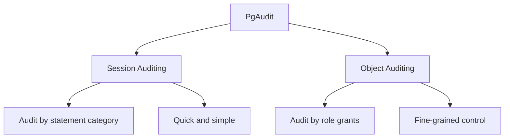

### Installation

```bash
wget https://github.com/pgaudit/pgaudit/archive/1.4.0.tar.gz
tar xzvf 1.4.0.tar.gz
cd pgaudit-1.4.0
make USE_PGXS=1
sudo make USE_PGXS=1 install
```

### Configuration

**In `postgresql.conf`:**
```ini
shared_preload_libraries = 'pgaudit'
```

**Restart required!**

**Enable in database:**
```sql
CREATE EXTENSION pgaudit;
```

### PgAudit Configuration Parameters

| Parameter | Values | Meaning |
|-----------|--------|---------|
| `pgaudit.log` | ALL, NONE, READ, WRITE, ROLE, DDL, FUNCTION, MISC, MISC_SET | What to audit |
| `pgaudit.log_level` | log, info, notice, warning, etc. | Log level |
| `pgaudit.log_parameter` | on/off | Log query parameters |
| `pgaudit.role` | role name | Role for object auditing |

### Session Auditing

```sql
SET pgaudit.log TO 'write, ddl';

SELECT count(*) FROM categories;     -- Not audited (READ)
INSERT INTO categories(...) VALUES(...);  -- Audited (WRITE)
```

**Log output:**
```
LOG: AUDIT: SESSION,1,1,WRITE,INSERT,,,"INSERT INTO categories(...) VALUES(...);",<not logged>
```

**Fields:**
1. `AUDIT` — prefix
2. `SESSION` — audit type
3. `1` — statement number
4. `1` — substatement number
5. `WRITE` — category
6. `INSERT` — statement type
7. `TABLE` — object type (empty for session)
8. `public.categories` — object name (empty for session)
9. `INSERT INTO ...` — full statement
10. `<not logged>` — parameters

### Object Auditing (By Role)

**Step 1: Create auditing role**
```sql
CREATE ROLE auditor WITH NOLOGIN;
```

**Step 2: Grant permissions to audit**
```sql
GRANT DELETE ON ALL TABLES IN SCHEMA public TO auditor;
GRANT INSERT ON posts TO auditor;
GRANT INSERT ON categories TO auditor;
```

**Step 3: Set the role**
```sql
SET pgaudit.role TO auditor;
```

**Step 4: Test**
```sql
INSERT INTO categories(...);  -- AUDITED (INSERT granted)
INSERT INTO tags(...);        -- NOT audited (no grant)
DELETE FROM posts WHERE ...;  -- AUDITED (DELETE granted)
```

**Log output:**
```
LOG: AUDIT: OBJECT,1,1,WRITE,INSERT,TABLE,public.categories,"INSERT INTO categories(...)",<not logged>
LOG: AUDIT: OBJECT,2,1,WRITE,DELETE,TABLE,public.posts,"DELETE FROM posts WHERE...",<not logged>
```

**Notice:** The INSERT into `tags` was **not logged** because `auditor` doesn't have INSERT on `tags`.

### Making It Permanent

**In `postgresql.conf`:**
```ini
pgaudit.role = 'auditor'
```

---

## Part 8: Complete Summary

```mermaid
graph TD
    A[Logging and Auditing] --> B[Logging]
    A --> C[PgBadger]
    A --> D[Auditing]
    A --> E[PgAudit]
    
    B --> B1[log_destination]
    B --> B2[logging_collector]
    B --> B3[log_directory]
    B --> B4[log_filename]
    B --> B5[log_rotation_age/size]
    B --> B6[log_min_messages]
    B --> B7[log_min_duration_statement]
    B --> B8[log_line_prefix]
    B --> B9[log_statement]
    
    C --> C1[Install Perl app]
    C --> C2[Parse logs]
    C --> C3[Generate HTML]
    C --> C4[Incremental mode]
    C --> C5[Remote mode]
    
    D --> D1[Who did what]
    D --> D2[Legal compliance]
    D --> D3[Prepared statement problem]
    
    E --> E1[Install extension]
    E --> E2[Session auditing]
    E --> E3[Object auditing]
    E --> E4[pgaudit.log]
    E --> E5[pgaudit.role]
```

---

## Part 9: Key Takeaways

### Logging Basics
1. **Logs are textual files** PostgreSQL writes about its activity
2. **Logging collector** prevents log loss better than syslog
3. **log_destination** controls where logs go (stderr, csvlog, syslog)
4. **Log rotation** prevents files from growing forever
5. **log_line_prefix** defines log format

### When to Log
6. **log_min_messages** = cluster threshold
7. **client_min_messages** = client threshold
8. **log_min_duration_statement** = log slow queries only
9. **log_transaction_sample_rate** = sample transactions

### What to Log
10. **log_statement** = all/off/ddl/mod (⚠️ dangerous)
11. **log_checkpoints, log_connections, log_disconnections** = useful events
12. **log_line_prefix placeholders:** %t, %p, %l, %u, %d, %a, %h

### PgBadger
13. **Reads logs**, produces **HTML dashboards**
14. **Parallel mode** (-j) for big logs
15. **Incremental mode** (-I) for scheduled analysis
16. **Remote mode** via SSH
17. **Requires specific log config** for best results

### Auditing vs Logging
18. **Logging** = raw events, hard to reconstruct sessions
19. **Auditing** = per-session, easier reconstruction
20. **Prepared statements** complicate log reconstruction

### PgAudit
21. **Extension** that provides reliable auditing
22. **Two modes:** Session and Object
23. **pgaudit.log** = categories to audit
24. **pgaudit.role** = role-based object auditing
25. **AUDIT** prefix in logs
26. **Tracks statement number**, category, object, and full SQL

---

## Quick Reference Card

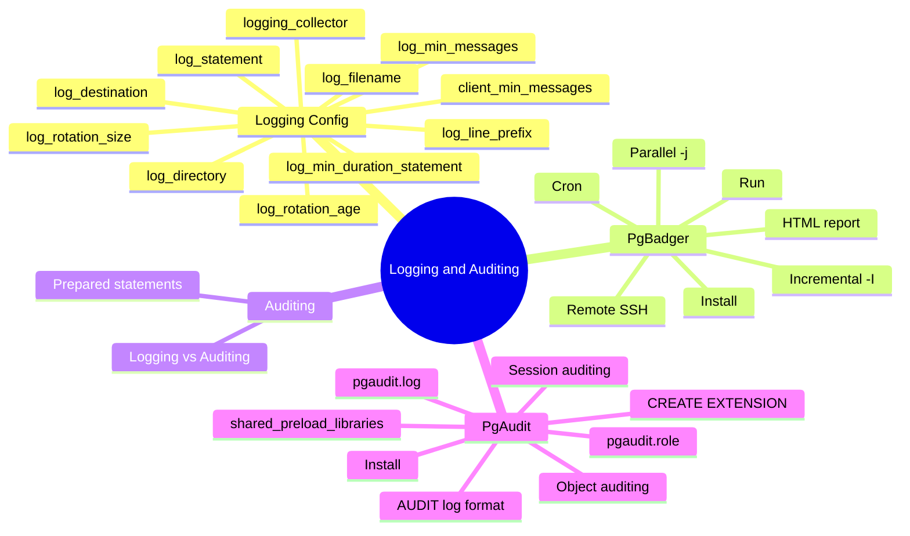

**The Golden Rules:**
1. **Always configure logging** — you never know when you'll need it
2. **Use logging_collector** instead of syslog for reliability
3. **Rotate logs** to prevent disk fill
4. **Don't log all statements** in production — use log_min_duration_statement
5. **log_line_prefix** should include timestamp, user, database
6. **PgBadger** turns raw logs into actionable dashboards
7. **Schedule PgBadger** with cron for automatic analysis
8. **Use PgAudit** for legal compliance (GDPR, HIPAA, etc.)
9. **Session auditing** for broad coverage
10. **Object auditing** for fine-grained control
11. **AUDIT log lines** are easy to find with grep
12. **Remember:** Auditing ≠ Logging, but they share infrastructure