# Simple Explanation of Chapter 15: Backup and Restore

This chapter is about **protecting your data** by making copies you can restore if something goes wrong. Let me break it all down with simple words and diagrams.

---

## Part 1: Why Backups Matter

### The Problem

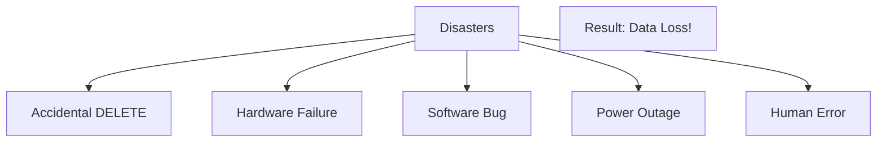

### The Solution: Backups

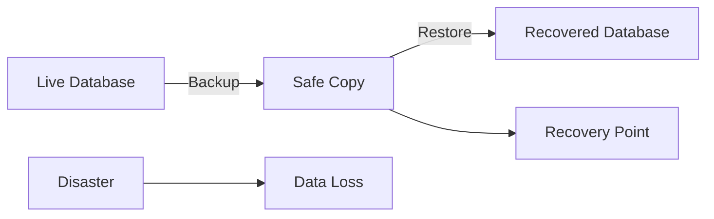

### Two Types of Backups

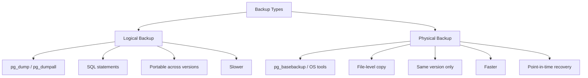

---

## Part 2: Logical Backups vs Physical Backups

### Side-by-Side Comparison

| Feature | Logical Backup | Physical Backup |
|---------|---------------|-----------------|
| **Method** | SQL statements | File copy |
| **Tools** | `pg_dump`, `pg_dumpall` | `pg_basebackup`, `rsync`, `tar` |
| **Speed** | Slower (reads data) | Faster (copies files) |
| **Size** | Smaller (compressed) | Larger (full PGDATA) |
| **Portability** | Cross-version, cross-DBMS | Same version only |
| **Impact** | Uses database resources | Filesystem only |
| **Consistency** | Snapshot at start | WAL replay needed |
| **PITR** | ❌ No | ✅ Yes |

### Visual Comparison

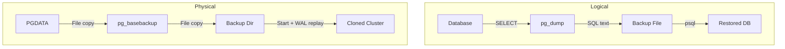

---

## Part 3: Logical Backups

### The Three Tools

| Tool | Purpose |
|------|---------|
| **pg_dump** | Dump a single database |
| **pg_dumpall** | Dump entire cluster (all databases + roles) |
| **pg_restore** | Restore from custom/directory/tar formats |

### Backup Formats

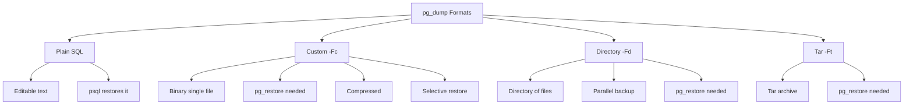

### Basic pg_dump Usage

```bash
# Plain SQL to stdout
pg_dump -U postgres forumdb

# Plain SQL to file
pg_dump -U postgres -f backup.sql forumdb

# Custom format (compressed, restorable with pg_restore)
pg_dump -U postgres -Fc -f backup.dump forumdb

# Directory format (parallel capable)
pg_dump -U postgres -Fd -f backup_dir forumdb

# Verbose
pg_dump -U postgres -v -f backup.sql forumdb
```

### Understanding the Output

```sql
-- PostgreSQL database dump

SET client_encoding = 'UTF8';
SET standard_conforming_strings = on;
SELECT pg_catalog.set_config('search_path', '', false);

CREATE TABLE public.categories (
    pk integer NOT NULL,
    title text NOT NULL,
    description text
);

COPY public.categories (pk, title, description) FROM stdin;
1	DATABASE	Database related discussions
2	UNIX	Unix and Linux discussions
\.
```

**Key points:**
- `SET` statements prepare the session
- `search_path` is cleared for security
- `COPY` is used for bulk loading (fast)
- All lines are ordered to respect foreign keys

### Restoring from Plain SQL

```bash
# Create target database
psql -U postgres template1 -c "CREATE DATABASE forumdb_test WITH OWNER luca;"

# Restore
psql -U luca forumdb_test -f backup.sql
```

**⚠️ Watch out for `search_path`!**

After restore, you may need to set search_path:

```sql
SELECT pg_catalog.set_config('search_path', 'public, "$user"', false);
```

### Include CREATE DATABASE

```bash
pg_dump -U postgres --create -f backup.sql forumdb
```

**Output:**
```sql
CREATE DATABASE forumdb WITH TEMPLATE = template0 ENCODING = 'UTF8'
    LC_COLLATE = 'C' LC_CTYPE = 'C';
ALTER DATABASE forumdb OWNER TO luca;
\connect forumdb
```

Now restoring the backup will **create the database** first.

### Limiting What to Back Up

| Option | Effect |
|--------|--------|
| `-s` | Schema only (no data) |
| `-a` | Data only (no schema) |
| `-t table` | Only specific table |
| `-T table` | Exclude specific table |
| `--inserts` | Use INSERT instead of COPY (portable) |
| `--column-inserts` | INSERT with column names (more portable) |

**Examples:**
```bash
# Schema only
pg_dump -U postgres -s -f structure.sql forumdb

# Data only
pg_dump -U postgres -a -f content.sql forumdb

# Only users table
pg_dump -U postgres -t users -f users.sql forumdb

# Exclude users table
pg_dump -U postgres -T users -f no_users.sql forumdb
```

### pg_restore — Restoring Custom Formats

```bash
# Restore with database recreation
pg_restore -C -d template1 -U postgres backup.dump

# Restore to existing database
pg_restore -d forumdb -U postgres backup.dump

# Verbose
pg_restore -v -d forumdb backup.dump

# Parallel restore (directory or custom format)
pg_restore -j 4 -d forumdb backup_dir/
```

### Selective Restore with TOC

**Step 1: Get the Table of Contents**
```bash
pg_restore --list backup_dir/ > my_toc.txt
```

**Output:**
```
;
; Archive created at 2020-05-02 17:42:46 CEST
; dbname: forumdb
; TOC Entries: 56
; Format: DIRECTORY
...
3360; 0 0 ACL - SCHEMA public postgres
2; 3079 34878 EXTENSION - pgaudit
218; 1255 34883 FUNCTION public f_load_data() luca
211; 1259 34915 TABLE public tags luca
3350; 0 34915 TABLE DATA public tags luca
```

**Step 2: Edit the TOC**

Comment out (with `;`) lines you don't want:
```
;3350; 0 34915 TABLE DATA public tags luca
```

**Step 3: Restore with Custom TOC**
```bash
pg_restore -C -d template1 -U postgres -L my_toc.txt backup_dir/
```

**Result:** Table `tags` is created but **empty** (data skipped).

### pg_dumpall — Whole Cluster

```bash
# Dump entire cluster
pg_dumpall -U postgres -f cluster.sql
```

**Content:**
```sql
-- Roles first
CREATE ROLE auditor;
ALTER ROLE auditor WITH NOSUPERUSER INHERIT NOCREATEROLE NOCREATEDB
    NOLOGIN NOREPLICATION NOBYPASSRLS;
CREATE ROLE book_authors;
...

-- Then each database
\connect postgres
-- tables, data, etc.

\connect forumdb
-- tables, data, etc.
```

**Restore with psql:**
```bash
psql -U postgres template1 -f cluster.sql
```

### Parallel Backup

```bash
pg_dump -U postgres -Fd -j 3 -f backup_dir forumdb
```

**How it works:**
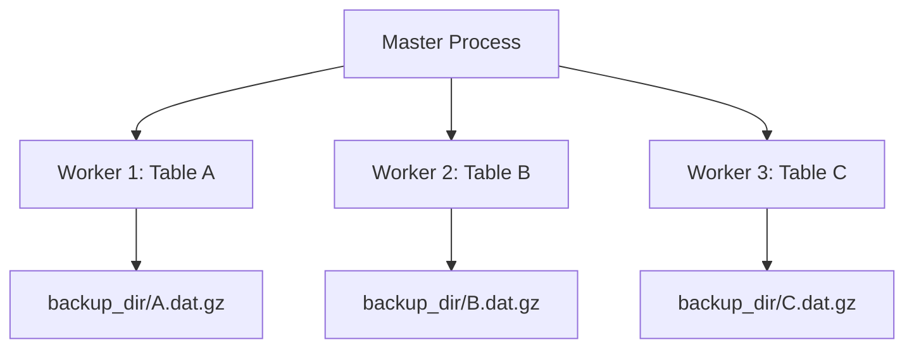

**Requirements:**
- Directory format (`-Fd`) only
- `-j N` = N parallel workers + 1 master
- Needs N+1 connections available

### Automated Backup Script

```bash
#!/bin/sh
BACKUP_ROOT=/backup

for database in $(psql -U postgres -A -t -c \
    "SELECT datname FROM pg_database WHERE datname <> 'template0'" template1)
do
    backup_dir=$BACKUP_ROOT/$database/$(date +'%Y-%m-%d')
    
    if [ -d $backup_dir ]; then
        echo "Skipping $database, already done today!"
        continue
    fi
    
    mkdir -p $backup_dir
    pg_dump -U postgres -Fd -f $backup_dir $database
    echo "Backup $database done!"
done
```

**Crontab:**
```bash
30 23 * * * /path/to/backup_script.sh
```

---

## Part 4: Physical Backups

### What is a Physical Backup?

A **file-level copy** of the entire PGDATA directory + WALs.

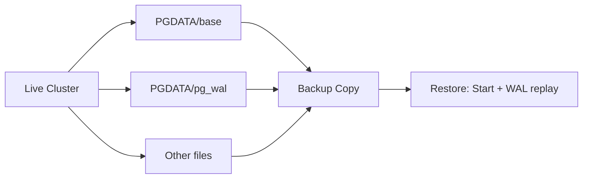

### Why Physical Backups?

| Advantage | Explanation |
|-----------|-------------|
| **Fast** | No query execution, just file copy |
| **Transparent** | Cluster doesn't notice much |
| **PITR capable** | Recover to any point in time |
| **No SQL needed** | Works even on broken systems |

### Requirements

**In `postgresql.conf`:**
```ini
max_wal_senders = 2      # At least 2 for WAL streaming
```

**In `pg_hba.conf`:**
```
host replication postgres 127.0.0.1/32 trust
```

**Important:** `replication` is a **special keyword**, not a real database.

### Using pg_basebackup

```bash
sudo -u postgres pg_basebackup -D /backup/pg_backup \
    -l 'My Physical Backup' -v -h localhost -p 5432 -U postgres
```

**Output:**
```
pg_basebackup: checkpoint completed
pg_basebackup: write-ahead log start point: D/4C000028 on timeline 1
pg_basebackup: starting background WAL receiver
pg_basebackup: created temporary replication slot "pg_basebackup_19254"
pg_basebackup: write-ahead log end point: D/4C000138
pg_basebackup: waiting for background process to finish streaming ...
pg_basebackup: syncing data to disk ...
pg_basebackup: base backup completed
```

**Options:**
| Option | Meaning |
|--------|---------|
| `-D` | Backup destination directory |
| `-l` | Label for the backup |
| `-v` | Verbose |
| `-h` | Host |
| `-p` | Port |
| `-U` | User |

### Verifying with pg_verifybackup (PostgreSQL 13+)

```bash
sudo -u postgres pg_verifybackup /backup/pg_backup
```
```
backup successfully verified
```

**What it does:**
1. Validates backup manifest
2. Scans for missing/modified files
3. Verifies checksums
4. Checks WAL records

### Starting the Cloned Cluster

⚠️ **Warning:** The clone has the **same configuration** as the original! Change ports if starting locally.

```bash
sudo -u postgres pg_ctl -D /backup/pg_backup -o '-p 5433' start
```

**Log output:**
```
LOG: database system was interrupted; last known up at 2020-05-10 11:19:09
LOG: redo starts at D/4C000028
LOG: consistent recovery state reached at D/4C000138
LOG: redo done at D/4C000138
LOG: database system is ready to accept connections
```

**What happened:** The cloned cluster performed **crash recovery** using the WALs — this is normal!

### Restoring from Physical Backup

**Two approaches:**

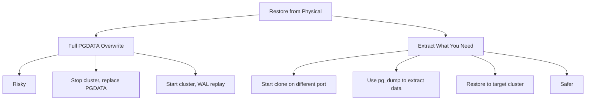

**Recommended:** Start clone elsewhere, extract data, restore only what's needed.

**Last resort:** Overwrite PGDATA — very risky!

---

## Part 5: Backup Strategy Decision Tree

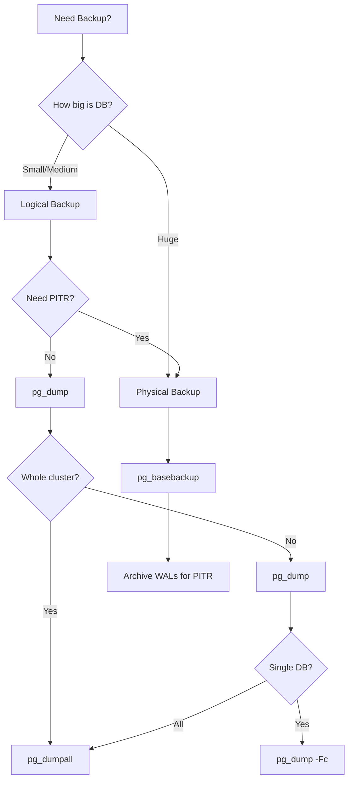

---

## Part 6: Complete Summary

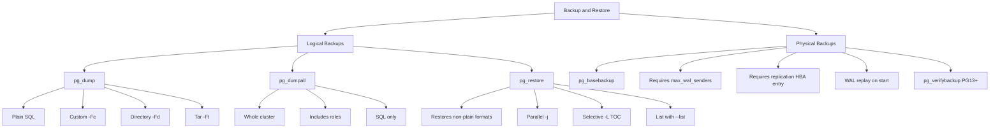

---

## Part 7: Key Takeaways

### Backup Basics
1. **Backups protect against** accidental deletion, hardware failure, and disasters
2. **Two main types:** Logical (SQL) and Physical (file copy)
3. **A backup is only valid if it can be restored** — test your backups!

### Logical Backups
4. **pg_dump** = single database
5. **pg_dumpall** = entire cluster (includes roles)
6. **pg_restore** = restores custom/directory/tar formats
7. **Four formats:** Plain SQL, Custom (`-Fc`), Directory (`-Fd`), Tar (`-Ft`)
8. **COPY** is default (fast); **--inserts** is portable
9. **search_path cleared** after restore for security
10. **--create** includes CREATE DATABASE in the dump
11. **Parallel backup** with `-j N` for directory format
12. **Selective restore** with `-L` and edited TOC

### Physical Backups
13. **pg_basebackup** = clone entire PGDATA + WALs
14. **Requires** `max_wal_senders >= 2` and a replication HBA entry
15. **Clone performs crash recovery** on first start
16. **pg_verifybackup** (PG13+) verifies backup integrity
17. **Enables PITR** (Point-In-Time Recovery)
18. **Faster** than logical for large databases
19. **Same version only** — no cross-version restore

### Best Practices
20. **Test your backups** — restore to a test cluster
21. **Automate backups** with cron
22. **Use parallel mode** for large databases
23. **Store backups** on different storage (network, offsite)
24. **Document your restore procedure**
25. **Use advanced tools** like pgBackRest for production

---

## Quick Reference Card

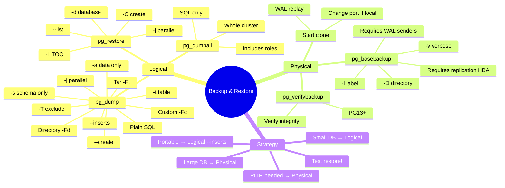

**The Golden Rules:**
1. **Backup is only good if it can be restored** — test it!
2. **Use pg_dump for portability**, pg_basebackup for speed
3. **Include `--create`** if restoring to a new cluster
4. **Parallel backups** for large databases
5. **Physical backups need WALs** for consistency
6. **Clone performs crash recovery** on start — it's normal
7. **Store backups off-site** — same disk = same disaster
8. **Automate with cron** and verify logs
9. **Document the restore procedure** — you'll forget under pressure
10. **Consider pgBackRest** for production PITR needs