# Simple Explanation of Chapter 16: Configuration and Monitoring

This chapter is about **tuning your PostgreSQL cluster** and **watching what it's doing**. Let me break it all down with simple words and diagrams.

---

## Part 1: Cluster Configuration

### The Main Configuration Files

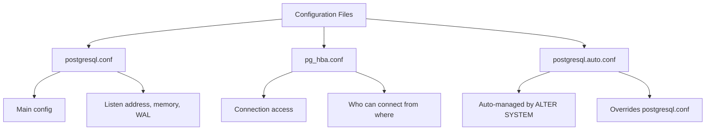

### Configuration File Format

```ini
# Comment - starts with #
max_wal_senders = 2    # Inline comment
shared_buffers = '512MB'
log_destination = 'stderr'
```

**Rules:**
- One parameter per line
- `key = value` format
- Comments start with `#`
- **Last definition wins** if parameter appears multiple times

### Including Other Files

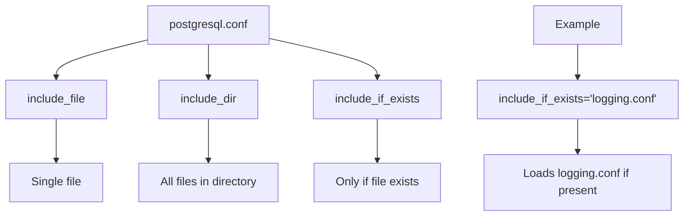

### Finding Configuration Errors

```sql
SELECT name, setting, sourcefile, sourceline, applied, error
FROM pg_file_settings
ORDER BY name;
```

**Output:**
```
+-----------------+----------+------------------------------+------------+---------+------------------------------+
| name            | setting  | sourcefile                   | sourceline | applied | error                        |
+-----------------+----------+------------------------------+------------+---------+------------------------------+
| log_destination | stderr   | /postgres/12/postgresql.conf | 420        | f       |                              |
| log_destination | stderr   | /postgres/12/logging.conf    | 1          | f       |                              |
| log_destination | stderror | /postgres/12/pgbadger.conf   | 1          | f       | setting could not be applied |
+-----------------+----------+------------------------------+------------+---------+------------------------------+
```

**Reading:**
- `log_destination` appears in 3 files
- Only the last one is applied
- The typo `stderror` breaks everything

### Configuration Contexts

| Context | When Changes Apply |
|---------|-------------------|
| `internal` | Compile time only |
| `postmaster` | Requires full restart |
| `sighup` | Requires reload |
| `superuser-backend` | Next admin connection |
| `backend` | Next normal connection |
| `superuser` | Immediately for admin |
| `user` | Immediately for user |

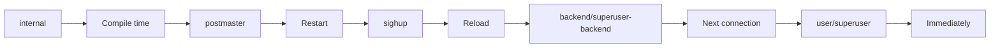

---

## Part 2: Key Configuration Settings

### WAL Settings

| Parameter | Purpose | Important |
|-----------|---------|-----------|
| `fsync` | Force disk sync | **NEVER turn off!** |
| `wal_sync_method` | Which fsync call | Test with `pg_test_fsync` |
| `synchronous_commit` | Immediate vs delayed COMMIT | `on` for safety |
| `checkpoint_timeout` | Time between checkpoints | Default 300s |
| `max_wal_size` | WAL size before checkpoint | Default 1GB |

### Memory Settings

| Parameter | Purpose | Recommendation |
|-----------|---------|----------------|
| `shared_buffers` | Main cache | 25-45% of RAM |
| `work_mem` | Per-operation memory | Start with 4-16MB |
| `maintenance_work_mem` | VACUUM, CREATE INDEX | 64-256MB |
| `wal_buffers` | WAL cache | 16MB (matches segment) |

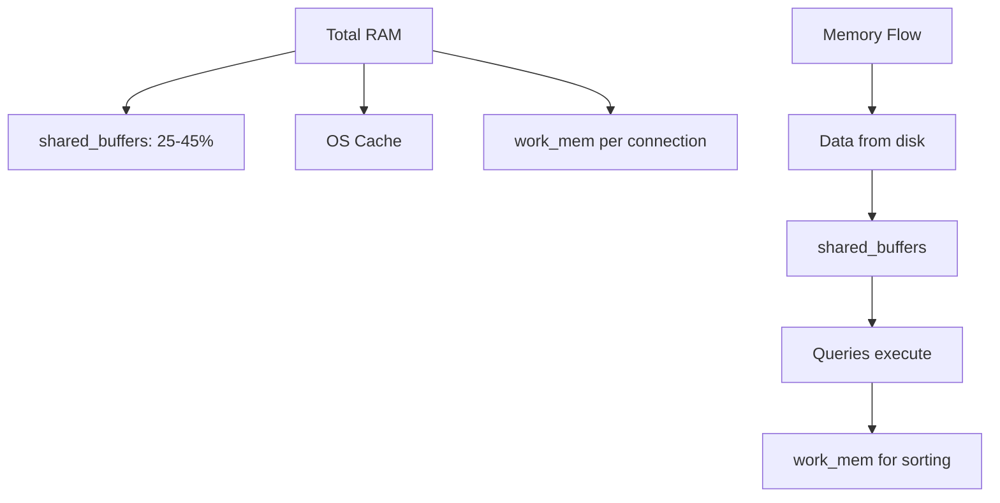

### Process Information Settings

| Parameter | Purpose |
|-----------|---------|
| `update_process_title` | Show query in `ps` output |
| `cluster_name` | Identify cluster in `ps` |

### Networking Settings

| Parameter | Purpose | Default |
|-----------|---------|---------|
| `listen_addresses` | Which IP to listen on | `localhost` |
| `port` | TCP port | 5432 |
| `max_connections` | Max clients | 100 |
| `superuser_reserved_connections` | Reserved slots | 3 |
| `authentication_timeout` | Login timeout | 60s |

### Archive and Replication Settings

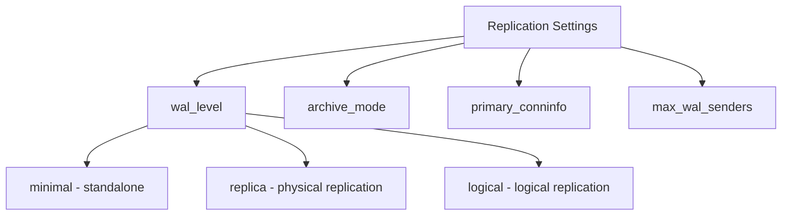

### Statistics Collector Settings

| Parameter | Purpose |
|-----------|---------|
| `track_activities` | Monitor running queries |
| `track_counts` | Table/index usage counts |
| `track_functions` | Function usage stats |
| `track_io_timing` | I/O timing measurements |

---

## Part 3: Modifying Configuration at Runtime

### ALTER SYSTEM

```sql
ALTER SYSTEM SET archive_mode = 'on';
```

**Creates/updates `postgresql.auto.conf`:**
```ini
# Do not edit this file manually!
# It will be overwritten by the ALTER SYSTEM command.
archive_mode = 'on'
```

**Reset to default:**
```sql
ALTER SYSTEM SET archive_mode TO DEFAULT;
-- or
ALTER SYSTEM RESET archive_mode;
-- or
ALTER SYSTEM RESET ALL;
```

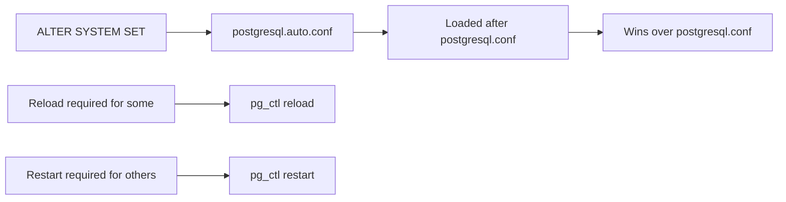

---

## Part 4: Configuration Generators

### PGTune / PGConfig

An **online tool** that generates configuration based on your hardware.

**Inputs:**
- OS (Linux, Windows, etc.)
- Architecture (32/64-bit)
- Total RAM
- Application profile (Web, OLTP, DW, etc.)
- Hard drive type (SSD, HDD)
- Max connections
- PostgreSQL version

**Outputs:**
- `postgresql.conf` recommendations
- OR `ALTER SYSTEM` commands

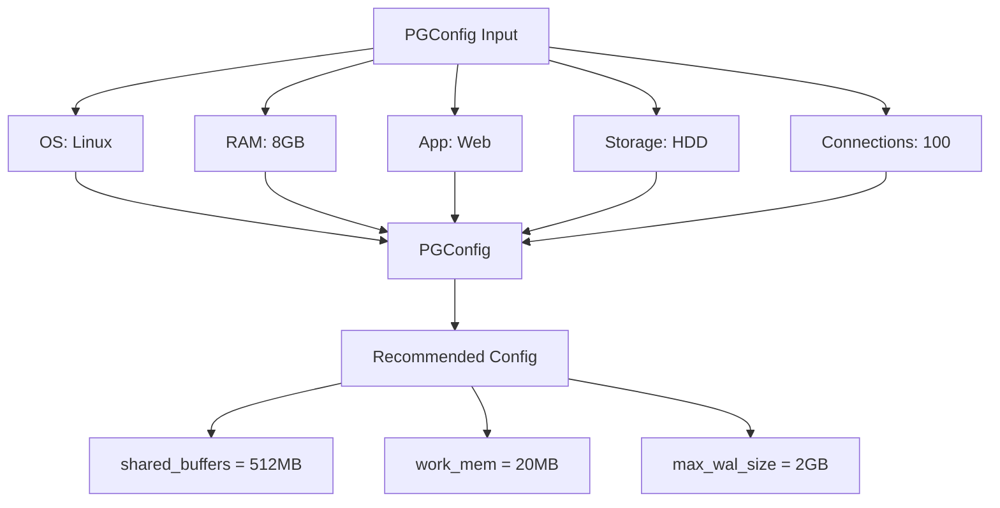

---

## Part 5: Monitoring the Cluster

### The Statistics Collector

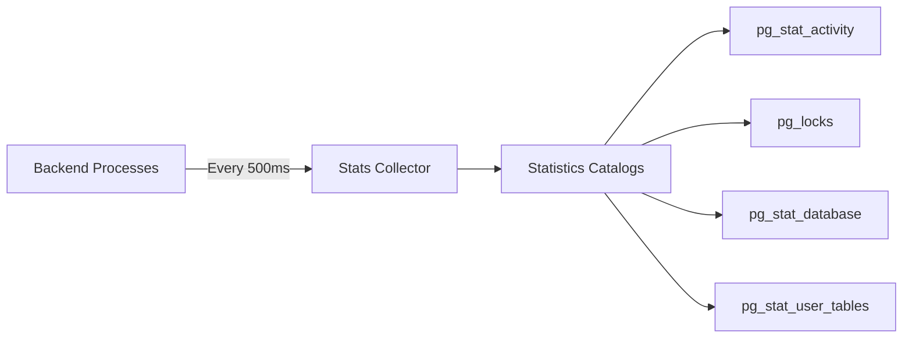

**Key facts:**
- Not real-time (500ms granularity)
- Frozen during transactions
- Lost on crash
- Reset with `pg_stat_reset()`

### Monitoring Running Queries — pg_stat_activity

```sql
SELECT usename, datname, client_addr, application_name,
       backend_start, query_start, state, query
FROM pg_stat_activity;
```

**Output:**
```
+----------+----------+-----------------+------------------+----------------------+----------------------+--------+---------------------------+
| usename  | datname  | client_addr     | application_name | backend_start        | query_start          | state  | query                     |
+----------+----------+-----------------+------------------+----------------------+----------------------+--------+---------------------------+
| luca     | forumdb  | 192.168.222.1   | psql             | 2020-05-13 16:42:50  | 2020-05-13 16:44:20  | idle   | INSERT INTO tags...       |
+----------+----------+-----------------+------------------+----------------------+----------------------+--------+---------------------------+
```

**Key fields:**
- `usename` — who
- `datname` — which database
- `client_addr` — from where
- `application_name` — which tool
- `state` — active, idle, idle in transaction
- `query` — last executed query

### Monitoring Locks — pg_locks

```sql
SELECT a.usename, a.application_name, a.datname, a.query,
       l.granted, l.mode
FROM pg_locks l
JOIN pg_stat_activity a ON a.pid = l.pid;
```

**Output:**
```
+----------+------------------+----------+---------------------------+---------+------------------+
| usename  | application_name | datname  | query                     | granted | mode             |
+----------+------------------+----------+---------------------------+---------+------------------+
| luca     | psql             | forumdb  | delete from tags;         | t       | RowExclusiveLock |
| luca     | psql             | forumdb  | insert into tags values...| t       | ExclusiveLock    |
+----------+------------------+----------+---------------------------+---------+------------------+
```

### Finding Blocked Queries

```sql
SELECT query, state, wait_event_type, wait_event,
       now() - state_change AS locked_since
FROM pg_stat_activity
WHERE wait_event_type IS NOT NULL
ORDER BY locked_since DESC;
```

### Monitoring Databases — pg_stat_database

```sql
SELECT datname, xact_commit, xact_rollback, blks_read,
       conflicts, deadlocks, tup_fetched, tup_inserted,
       tup_updated, tup_deleted, stats_reset
FROM pg_stat_database;
```

**Key metrics:**
- `xact_commit` — committed transactions
- `xact_rollback` — rolled back transactions
- `deadlocks` — deadlock count
- `stats_reset` — when stats were last reset

### Monitoring Tables — pg_stat_user_tables

```sql
SELECT relname, seq_scan, idx_scan, n_tup_ins, n_tup_del,
       n_live_tup, n_dead_tup, last_vacuum, last_autovacuum
FROM pg_stat_user_tables;
```

**Key fields:**
- `seq_scan` / `idx_scan` — how often accessed
- `n_live_tup` — visible tuples
- `n_dead_tup` — dead tuples (need VACUUM)
- `last_vacuum` / `last_autovacuum` — last cleanup

### Other Statistics Catalogs

| Catalog | Purpose |
|---------|---------|
| `pg_stat_replication` | Replication status |
| `pg_stat_wal_receiver` | WAL receiver status |
| `pg_stat_subscription` | Subscription status |
| `pg_stat_bgwriter` | Background writer stats |
| `pg_stat_archiver` | WAL archiver stats |
| `pg_statio_user_tables` | I/O per table |
| `pg_statio_user_indexes` | I/O per index |

---

## Part 6: pg_stat_statements Extension

### What is pg_stat_statements?

An extension that **tracks all executed statements** with:
- How many times
- Min/max/avg time
- Rows returned
- Buffer usage

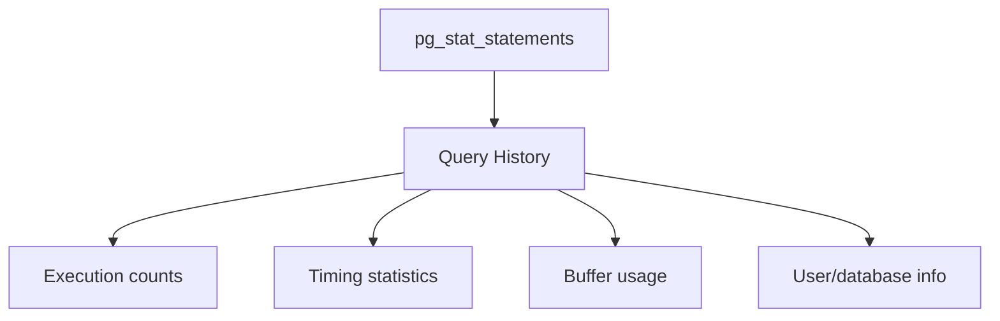

### Installation

**Step 1: Configure `postgresql.conf`:**
```ini
shared_preload_libraries = 'pg_stat_statements'
```

**Step 2: Restart cluster**

**Step 3: Create extension in database:**
```sql
CREATE EXTENSION pg_stat_statements;
```

### Using pg_stat_statements

```sql
SELECT auth.rolname, query, db.datname, calls, min_time, max_time
FROM pg_stat_statements
JOIN pg_authid auth ON auth.oid = userid
JOIN pg_database db ON db.oid = dbid
ORDER BY calls DESC;
```

**Output:**
```
+----------+--------------------------------------------------------+----------+-------+----------+-----------+
| rolname  | query                                                  | datname  | calls | min_time | max_time  |
+----------+--------------------------------------------------------+----------+-------+----------+-----------+
| postgres | SELECT count(*) FROM posts WHERE last_edited_on >= ... | forumdb  | 11    | 0.181    | 4.442902  |
+----------+--------------------------------------------------------+----------+-------+----------+-----------+
```

**Reading:** Query ran 11 times, taking 0.181s to 4.44s.

### Resetting Data

```sql
SELECT pg_stat_statements_reset();
```

**Use case:** Start fresh statistics after configuration change.

### Tuning Parameters

| Parameter | Default | Purpose |
|-----------|---------|---------|
| `pg_stat_statements.max` | 5000 | Max queries tracked |
| `pg_stat_statements.save` | on | Survive restart |
| `pg_stat_statements.track` | top | What to track |
| `pg_stat_statements.track_utility` | on | Track non-DML |

**`track` values:**
- `top` — Direct client queries only
- `all` — Include nested (function) statements
- `none` — Disabled

---

## Part 7: Complete Summary

```mermaid
graph TD
    A[Configuration and Monitoring] --> B[Configuration]
    A --> C[Monitoring]
    A --> D[pg_stat_statements]
    
    B --> B1[postgresql.conf]
    B --> B2[pg_hba.conf]
    B --> B3[postgresql.auto.conf]
    B --> B4[include directives]
    B --> B5[Configuration contexts]
    B --> B6[pg_settings catalog]
    B --> B7[pg_file_settings catalog]
    B --> B8[ALTER SYSTEM]
    B --> B9[PGConfig generator]
    
    C --> C1[pg_stat_activity]
    C --> C2[pg_locks]
    C --> C3[pg_stat_database]
    C --> C4[pg_stat_user_tables]
    C --> C5[pg_stat_user_indexes]
    C --> C6[Other stats catalogs]
    
    D --> D1[Track all queries]
    D --> D2[calls, min_time, max_time]
    D --> D3[Join with pg_authid/pg_database]
    D --> D4[pg_stat_statements_reset]
```

---

## Part 8: Key Takeaways

### Configuration
1. **`postgresql.conf`** is the main config file
2. **`postgresql.auto.conf`** is managed by ALTER SYSTEM
3. **`include_if_exists`** for optional config files
4. **Last definition wins** if parameter appears multiple times
5. **Configuration contexts** determine when changes apply:
   - `internal` — compile time
   - `postmaster` — restart
   - `sighup` — reload
   - `user` — immediate
6. **`pg_settings`** shows current configuration
7. **`pg_file_settings`** reveals errors and conflicts
8. **ALTER SYSTEM** writes to `postgresql.auto.conf`

### Memory Settings
9. **`shared_buffers`** = 25-45% of RAM
10. **`work_mem`** = per-operation memory (careful with many connections!)
11. **`maintenance_work_mem`** = VACUUM/CREATE INDEX memory

### WAL Settings
12. **`fsync`** = NEVER turn off!
13. **`synchronous_commit`** = on for safety, off for bulk loading
14. **`wal_buffers`** = 16MB (matches WAL segment)

### Monitoring
15. **Statistics are not real-time** (500ms granularity)
16. **Statistics lost on crash**
17. **`pg_stat_activity`** = running queries
18. **`pg_locks`** = lock contention
19. **`pg_stat_database`** = commit/rollback counts
20. **`pg_stat_user_tables`** = table usage, vacuum times
21. **Wait events** = find blocked queries

### pg_stat_statements
22. **Requires `shared_preload_libraries`** + restart
23. **Tracks all queries** with counts and timings
24. **Join with `pg_authid`** for user info
25. **Join with `pg_database`** for database info
26. **`pg_stat_statements_reset()`** to start fresh
27. **Minimal overhead** — safe for production

---

## Quick Reference Card

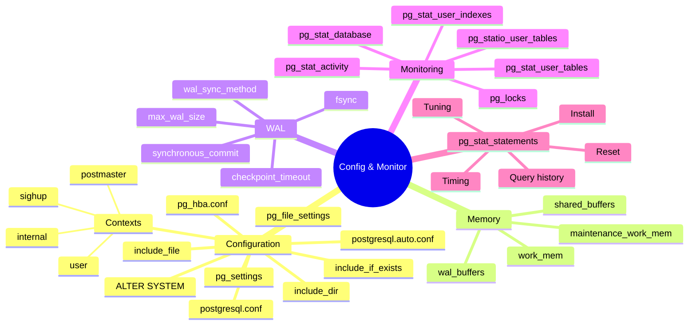

**The Golden Rules:**
1. **Never disable `fsync`** — data loss risk!
2. **`shared_buffers`** = 25-45% of RAM
3. **`work_mem` × max_connections** < available RAM
4. **Use `include_if_exists`** for optional config files
5. **Check `pg_file_settings`** for errors
6. **Remember configuration contexts** — some need restart
7. **Monitor `pg_stat_activity`** for running queries
8. **Monitor `pg_locks`** for deadlocks
9. **Install `pg_stat_statements`** for query history
10. **Statistics are frozen in transactions**
11. **`ALTER SYSTEM`** is easier than editing files
12. **PGConfig** gives you a starting point, not a final answer


# Simple Explanation of Chapter 16: Configuration and Monitoring

This chapter is about **tuning your PostgreSQL cluster** and **watching what it's doing**. Let me break it all down with simple words and diagrams.

---

## Part 1: Cluster Configuration

### The Main Configuration Files


### Configuration File Format

```ini
# Comment - starts with #
max_wal_senders = 2    # Inline comment
shared_buffers = '512MB'
log_destination = 'stderr'
```

**Rules:**
- One parameter per line
- `key = value` format
- Comments start with `#`
- **Last definition wins** if parameter appears multiple times

### Including Other Files


### Finding Configuration Errors

```sql
SELECT name, setting, sourcefile, sourceline, applied, error
FROM pg_file_settings
ORDER BY name;
```

**Output:**

| name | setting | sourcefile | sourceline | applied | error |
|------|---------|------------|------------|---------|-------|
| log_destination | stderr | /postgres/12/postgresql.conf | 420 | f | |
| log_destination | stderr | /postgres/12/logging.conf | 1 | f | |
| log_destination | stderror | /postgres/12/pgbadger.conf | 1 | f | setting could not be applied |

**Reading:**
- `log_destination` appears in 3 files
- Only the last one is applied
- The typo `stderror` breaks everything

### Configuration Contexts

| Context | When Changes Apply |
|---------|-------------------|
| `internal` | Compile time only |
| `postmaster` | Requires full restart |
| `sighup` | Requires reload |
| `superuser-backend` | Next admin connection |
| `backend` | Next normal connection |
| `superuser` | Immediately for admin |
| `user` | Immediately for user |


---

## Part 2: Key Configuration Settings

### WAL Settings

| Parameter | Purpose | Important |
|-----------|---------|-----------|
| `fsync` | Force disk sync | **NEVER turn off!** |
| `wal_sync_method` | Which fsync call | Test with `pg_test_fsync` |
| `synchronous_commit` | Immediate vs delayed COMMIT | `on` for safety |
| `checkpoint_timeout` | Time between checkpoints | Default 300s |
| `max_wal_size` | WAL size before checkpoint | Default 1GB |

### Memory Settings

| Parameter | Purpose | Recommendation |
|-----------|---------|----------------|
| `shared_buffers` | Main cache | 25-45% of RAM |
| `work_mem` | Per-operation memory | Start with 4-16MB |
| `maintenance_work_mem` | VACUUM, CREATE INDEX | 64-256MB |
| `wal_buffers` | WAL cache | 16MB (matches segment) |


### Process Information Settings

| Parameter | Purpose |
|-----------|---------|
| `update_process_title` | Show query in `ps` output |
| `cluster_name` | Identify cluster in `ps` |

### Networking Settings

| Parameter | Purpose | Default |
|-----------|---------|---------|
| `listen_addresses` | Which IP to listen on | `localhost` |
| `port` | TCP port | 5432 |
| `max_connections` | Max clients | 100 |
| `superuser_reserved_connections` | Reserved slots | 3 |
| `authentication_timeout` | Login timeout | 60s |

### Archive and Replication Settings


### Statistics Collector Settings

| Parameter | Purpose |
|-----------|---------|
| `track_activities` | Monitor running queries |
| `track_counts` | Table/index usage counts |
| `track_functions` | Function usage stats |
| `track_io_timing` | I/O timing measurements |

---

## Part 3: Modifying Configuration at Runtime

### ALTER SYSTEM

```sql
ALTER SYSTEM SET archive_mode = 'on';
```

**Creates/updates `postgresql.auto.conf`:**
```ini
# Do not edit this file manually!
# It will be overwritten by the ALTER SYSTEM command.
archive_mode = 'on'
```

**Reset to default:**
```sql
ALTER SYSTEM SET archive_mode TO DEFAULT;
-- or
ALTER SYSTEM RESET archive_mode;
-- or
ALTER SYSTEM RESET ALL;
```


---

## Part 4: Configuration Generators

### PGTune / PGConfig

An **online tool** that generates configuration based on your hardware.

**Inputs:**
- OS (Linux, Windows, etc.)
- Architecture (32/64-bit)
- Total RAM
- Application profile (Web, OLTP, DW, etc.)
- Hard drive type (SSD, HDD)
- Max connections
- PostgreSQL version

**Outputs:**
- `postgresql.conf` recommendations
- OR `ALTER SYSTEM` commands


---

## Part 5: Monitoring the Cluster

### The Statistics Collector


**Key facts:**
- Not real-time (500ms granularity)
- Frozen during transactions
- Lost on crash
- Reset with `pg_stat_reset()`

### Monitoring Running Queries — pg_stat_activity

```sql
SELECT usename, datname, client_addr, application_name,
       backend_start, query_start, state, query
FROM pg_stat_activity;
```

**Output:**

| usename | datname | client_addr | application_name | backend_start | query_start | state | query |
|---------|---------|-------------|------------------|---------------|-------------|-------|-------|
| luca | forumdb | 192.168.222.1 | psql | 2020-05-13 16:42:50 | 2020-05-13 16:44:20 | idle | INSERT INTO tags... |

**Key fields:**
- `usename` — who
- `datname` — which database
- `client_addr` — from where
- `application_name` — which tool
- `state` — active, idle, idle in transaction
- `query` — last executed query

### Monitoring Locks — pg_locks

```sql
SELECT a.usename, a.application_name, a.datname, a.query,
       l.granted, l.mode
FROM pg_locks l
JOIN pg_stat_activity a ON a.pid = l.pid;
```

**Output:**

| usename | application_name | datname | query | granted | mode |
|---------|------------------|---------|-------|---------|------|
| luca | psql | forumdb | delete from tags; | t | RowExclusiveLock |
| luca | psql | forumdb | insert into tags values... | t | ExclusiveLock |

### Finding Blocked Queries

```sql
SELECT query, state, wait_event_type, wait_event,
       now() - state_change AS locked_since
FROM pg_stat_activity
WHERE wait_event_type IS NOT NULL
ORDER BY locked_since DESC;
```

### Monitoring Databases — pg_stat_database

```sql
SELECT datname, xact_commit, xact_rollback, blks_read,
       conflicts, deadlocks, tup_fetched, tup_inserted,
       tup_updated, tup_deleted, stats_reset
FROM pg_stat_database;
```

**Key metrics:**
- `xact_commit` — committed transactions
- `xact_rollback` — rolled back transactions
- `deadlocks` — deadlock count
- `stats_reset` — when stats were last reset

### Monitoring Tables — pg_stat_user_tables

```sql
SELECT relname, seq_scan, idx_scan, n_tup_ins, n_tup_del,
       n_live_tup, n_dead_tup, last_vacuum, last_autovacuum
FROM pg_stat_user_tables;
```

**Key fields:**
- `seq_scan` / `idx_scan` — how often accessed
- `n_live_tup` — visible tuples
- `n_dead_tup` — dead tuples (need VACUUM)
- `last_vacuum` / `last_autovacuum` — last cleanup

### Other Statistics Catalogs

| Catalog | Purpose |
|---------|---------|
| `pg_stat_replication` | Replication status |
| `pg_stat_wal_receiver` | WAL receiver status |
| `pg_stat_subscription` | Subscription status |
| `pg_stat_bgwriter` | Background writer stats |
| `pg_stat_archiver` | WAL archiver stats |
| `pg_statio_user_tables` | I/O per table |
| `pg_statio_user_indexes` | I/O per index |

---

## Part 6: pg_stat_statements Extension

### What is pg_stat_statements?

An extension that **tracks all executed statements** with:
- How many times
- Min/max/avg time
- Rows returned
- Buffer usage


### Installation

**Step 1: Configure `postgresql.conf`:**
```ini
shared_preload_libraries = 'pg_stat_statements'
```

**Step 2: Restart cluster**

**Step 3: Create extension in database:**
```sql
CREATE EXTENSION pg_stat_statements;
```

### Using pg_stat_statements

```sql
SELECT auth.rolname, query, db.datname, calls, min_time, max_time
FROM pg_stat_statements
JOIN pg_authid auth ON auth.oid = userid
JOIN pg_database db ON db.oid = dbid
ORDER BY calls DESC;
```

**Output:**

| rolname | query | datname | calls | min_time | max_time |
|---------|-------|---------|-------|----------|----------|
| postgres | SELECT count(*) FROM posts WHERE last_edited_on >= ... | forumdb | 11 | 0.181 | 4.442902 |

**Reading:** Query ran 11 times, taking 0.181s to 4.44s.

### Resetting Data

```sql
SELECT pg_stat_statements_reset();
```

**Use case:** Start fresh statistics after configuration change.

### Tuning Parameters

| Parameter | Default | Purpose |
|-----------|---------|---------|
| `pg_stat_statements.max` | 5000 | Max queries tracked |
| `pg_stat_statements.save` | on | Survive restart |
| `pg_stat_statements.track` | top | What to track |
| `pg_stat_statements.track_utility` | on | Track non-DML |

**`track` values:**
- `top` — Direct client queries only
- `all` — Include nested (function) statements
- `none` — Disabled

---

## Part 7: Complete Summary

```mermaid
graph TD
    A[Configuration and Monitoring] --> B[Configuration]
    A --> C[Monitoring]
    A --> D[pg_stat_statements]
    
    B --> B1[postgresql.conf]
    B --> B2[pg_hba.conf]
    B --> B3[postgresql.auto.conf]
    B --> B4[include directives]
    B --> B5[Configuration contexts]
    B --> B6[pg_settings catalog]
    B --> B7[pg_file_settings catalog]
    B --> B8[ALTER SYSTEM]
    B --> B9[PGConfig generator]
    
    C --> C1[pg_stat_activity]
    C --> C2[pg_locks]
    C --> C3[pg_stat_database]
    C --> C4[pg_stat_user_tables]
    C --> C5[pg_stat_user_indexes]
    C --> C6[Other stats catalogs]
    
    D --> D1[Track all queries]
    D --> D2[calls, min_time, max_time]
    D --> D3[Join with pg_authid/pg_database]
    D --> D4[pg_stat_statements_reset]
```

---

## Part 8: Key Takeaways

### Configuration
1. **`postgresql.conf`** is the main config file
2. **`postgresql.auto.conf`** is managed by ALTER SYSTEM
3. **`include_if_exists`** for optional config files
4. **Last definition wins** if parameter appears multiple times
5. **Configuration contexts** determine when changes apply:
   - `internal` — compile time
   - `postmaster` — restart
   - `sighup` — reload
   - `user` — immediate
6. **`pg_settings`** shows current configuration
7. **`pg_file_settings`** reveals errors and conflicts
8. **ALTER SYSTEM** writes to `postgresql.auto.conf`

### Memory Settings
9. **`shared_buffers`** = 25-45% of RAM
10. **`work_mem`** = per-operation memory (careful with many connections!)
11. **`maintenance_work_mem`** = VACUUM/CREATE INDEX memory

### WAL Settings
12. **`fsync`** = NEVER turn off!
13. **`synchronous_commit`** = on for safety, off for bulk loading
14. **`wal_buffers`** = 16MB (matches WAL segment)

### Monitoring
15. **Statistics are not real-time** (500ms granularity)
16. **Statistics lost on crash**
17. **`pg_stat_activity`** = running queries
18. **`pg_locks`** = lock contention
19. **`pg_stat_database`** = commit/rollback counts
20. **`pg_stat_user_tables`** = table usage, vacuum times
21. **Wait events** = find blocked queries

### pg_stat_statements
22. **Requires `shared_preload_libraries`** + restart
23. **Tracks all queries** with counts and timings
24. **Join with `pg_authid`** for user info
25. **Join with `pg_database`** for database info
26. **`pg_stat_statements_reset()`** to start fresh
27. **Minimal overhead** — safe for production

---

## Quick Reference Card

```mermaid
mindmap
  root((Config & Monitor))
    Configuration
      postgresql.conf
      postgresql.auto.conf
      pg_hba.conf
      include_file
      include_dir
      include_if_exists
      ALTER SYSTEM
      pg_settings
      pg_file_settings
      Contexts
        internal
        postmaster
        sighup
        user
    Memory
      shared_buffers
      work_mem
      maintenance_work_mem
      wal_buffers
    WAL
      fsync
      synchronous_commit
      wal_sync_method
      checkpoint_timeout
      max_wal_size
    Monitoring
      pg_stat_activity
      pg_locks
      pg_stat_database
      pg_stat_user_tables
      pg_stat_user_indexes
      pg_statio_user_tables
    pg_stat_statements
      Install
      Query history
      Timing
      Reset
      Tuning
```

**The Golden Rules:**
1. **Never disable `fsync`** — data loss risk!
2. **`shared_buffers`** = 25-45% of RAM
3. **`work_mem` × max_connections** < available RAM
4. **Use `include_if_exists`** for optional config files
5. **Check `pg_file_settings`** for errors
6. **Remember configuration contexts** — some need restart
7. **Monitor `pg_stat_activity`** for running queries
8. **Monitor `pg_locks`** for deadlocks
9. **Install `pg_stat_statements`** for query history
10. **Statistics are frozen in transactions**
11. **`ALTER SYSTEM`** is easier than editing files
12. **PGConfig** gives you a starting point, not a final answer


