# Simple Explanation of Chapter 17: Physical Replication

This chapter is about **copying your entire database to another server in real time** so you always have a backup ready. Let me break it all down with simple words and diagrams.

---

## Part 1: What is Physical Replication?

### The Core Idea

**Physical replication** = copying the **entire database cluster** (byte-for-byte) to another server, continuously.

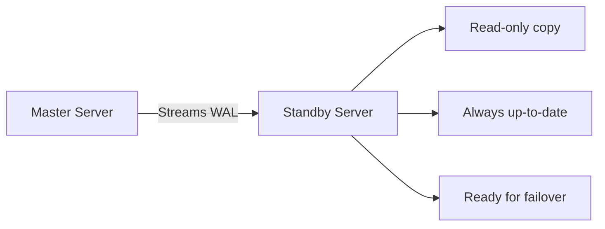

### Two Types of Replication

| Type | How It Works | Trade-off |
|------|-------------|-----------|
| **Asynchronous** | Master sends WAL, doesn't wait for confirmation | Fast, but possible data loss |
| **Synchronous** | Master waits for standby confirmation | Safe, but slower |

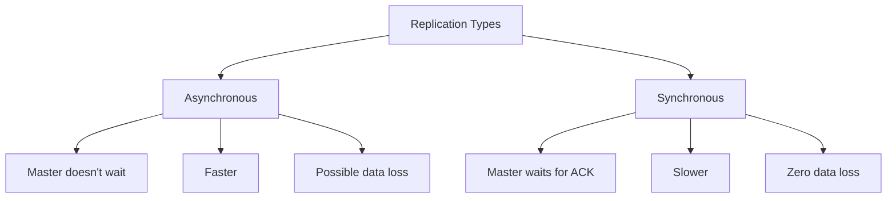

### Why Replicas?

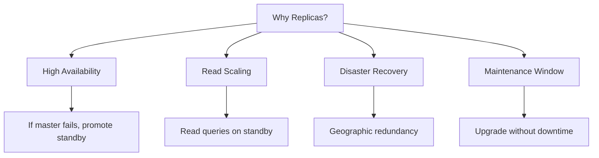

---

## Part 2: WAL Basics (Recap)

### What is WAL?

**Write-Ahead Log** = a sequential log of all changes.


### WAL Segments

- **Size:** 16 MB each
- **Location:** `$PGDATA/pg_wal/`
- **Naming:** `000000010000000000000001`
- **Recycled:** After checkpoints (unless archived)

### wal_level

| Level | Purpose |
|-------|---------|
| `minimal` | Standalone |
| `replica` | Physical replication (default) |
| `logical` | Logical replication |

---

## Part 3: WAL Archiving and PITR

### Point-In-Time Recovery (PITR)

**Goal:** Restore database to **any point in the past**.

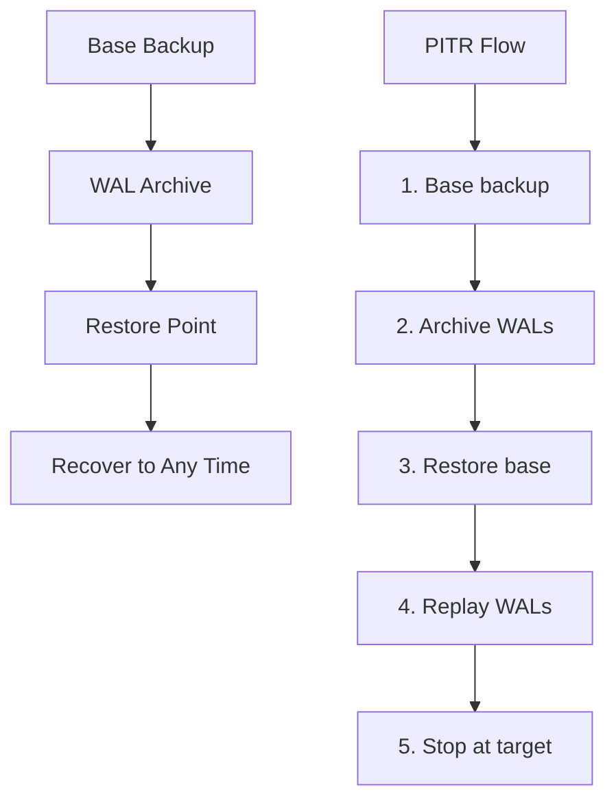

### Setting Up WAL Archiving

**In `postgresql.conf`:**
```ini
archive_mode = on
archive_command = 'test ! -f /walbackup/%f && cp %p /walbackup/%f'
wal_level = replica
archive_timeout = 10  # Force segment creation every 10s
```

**What each does:**
- `archive_mode = on` → Enable archiving
- `archive_command` → Copy WALs to archive
- `wal_level = replica` → Store enough info
- `archive_timeout` → Force segment close after timeout

### Manual Base Backup (Old Way)

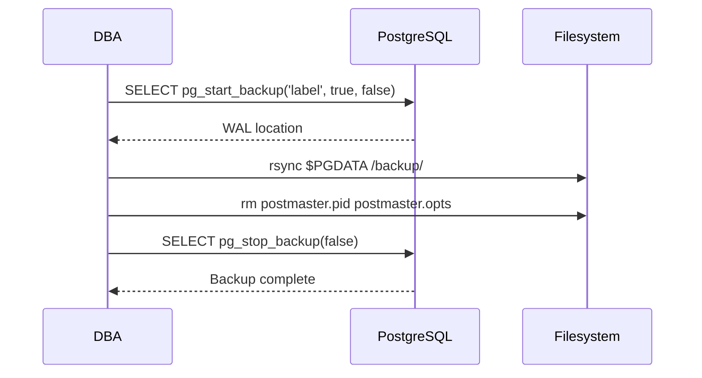

### Recovery Process

**Step 1: Create recovery signal file**
```bash
touch /databackup/main/recovery.signal
```

**Step 2: Configure recovery in `postgresql.conf`:**
```ini
data_directory = '/databackup/main'
hba_file = '/databackup/main/pg_hba.conf'
ident_file = '/databackup/main/pg_ident.conf'
port = 5433
restore_command = 'cp /walbackup/%f "%p"'
recovery_target_xid = 498
```

**Step 3: Start the server**
```bash
pg_ctl -D /databackup/main/ start
```

**Step 4: What happens in the logs:**
```
LOG: starting point-in-time recovery to XID 498
LOG: restored log file "00000001000000000000000D" from archive
LOG: redo starts at 0/D0007E8
LOG: consistent recovery state reached at 0/10000088
LOG: recovery stopping after commit of transaction 498
LOG: recovery has paused
LOG: database system is ready to accept read only connections
```

### Making It Read-Write

```sql
SELECT pg_wal_replay_resume();
```

**Effect:** Removes `recovery.signal`, allows writes.

---

## Part 4: Streaming Replication Setup

### The Two Servers

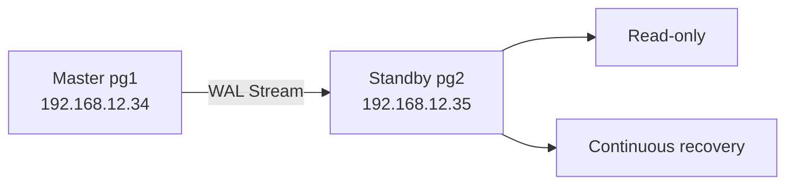

### Master Configuration

**Step 1: Allow network listening**
```ini
listen_addresses = '*'
```

**Step 2: Create replication user**
```sql
CREATE USER replicarole WITH REPLICATION ENCRYPTED PASSWORD 'SuperSecret';
```

**Step 3: Allow replication in `pg_hba.conf`**
```
host replication replicarole 192.168.12.35/32 md5
```

**Step 4: Reload**
```sql
SELECT pg_reload_conf();
```

### Standby Preparation

**Step 1: Stop standby**
```bash
systemctl stop postgresql
```

**Step 2: Clear PGDATA**
```bash
rm -rf /var/lib/postgresql/12/main
mkdir /var/lib/postgresql/12/main
chown postgres.postgres /var/lib/postgresql/12/main
chmod 0700 /var/lib/postgresql/12/main
```

**Step 3: Base backup from master**
```bash
pg_basebackup -h pg1 -U replicarole -p 5432 \
    -D /var/lib/postgresql/12/main \
    -Fp -Xs -P -R -S master
```

**Options explained:**

| Option | Meaning |
|--------|---------|
| `-h pg1` | Master host |
| `-U replicarole` | Replication user |
| `-p 5432` | Master port |
| `-D` | Standby PGDATA |
| `-Fp` | Plain format |
| `-Xs` | Stream WALs during backup |
| `-P` | Show progress |
| `-R` | Write recovery config |
| `-S` | Use replication slot |

**Step 4: Start standby**
```bash
systemctl start postgresql
```

**Log output:**
```
LOG: entering standby mode
LOG: redo starts at 0/22000060
LOG: consistent recovery state reached at 0/23000060
LOG: database system is ready to accept read only connections
LOG: started streaming WAL from primary at 0/23000000 on timeline 1
```

### The `standby.signal` File

**Created automatically by `pg_basebackup -R`.** Its presence tells PostgreSQL:
> "Start in standby mode and recover from WAL."

---

## Part 5: The WAL Problem and Solutions

### The Problem

**What if standby goes down for a while?**

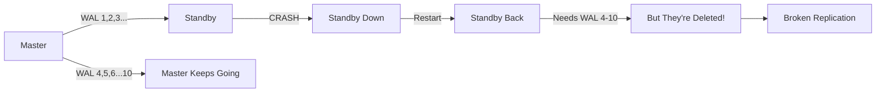

### Solution 1: wal_keep_segments

```ini
wal_keep_segments = 100
```

**Meaning:** Keep at least 100 WAL segments (1.6 GB).

| Pros | Cons |
|------|------|
| Simple | Static size |
| Always reserved | Wastes space |
| | Can still fall behind |

### Solution 2: Replication Slots (Recommended)

```sql
SELECT * FROM pg_create_physical_replication_slot('master');
```
```
+-----------+-----+
| slot_name | lsn |
+-----------+-----+
| master    |     |
+-----------+-----+
```

**How it works:**
- Master keeps WALs **until standby confirms** receipt
- **Dynamic** — space used only when needed
- **Automatic** — no manual configuration

**In `postgresql.auto.conf` on standby:**
```ini
primary_conninfo = 'user=replicarole password=SuperSecret host=pg1 port=5432'
primary_slot_name = 'master'
```

**Drop the slot:**
```sql
SELECT pg_drop_replication_slot('master');
```

---

## Part 6: Monitoring Replication

### pg_stat_replication (On Master)

```sql
SELECT * FROM pg_stat_replication;
```
```
+------------------+--------------------------------+
| pid              | 1435                           |
| usename          | replicarole                    |
| application_name | 12/main                        |
| client_addr      | 192.168.12.35                  |
| state            | streaming                      |
| sent_lsn         | 0/23000060                     |
| write_lsn        | 0/23000060                     |
| flush_lsn        | 0/23000060                     |
| replay_lsn       | 0/23000060                     |
| sync_state       | async                          |
| reply_time       | 2020-05-01 17:23:19.723054+02  |
+------------------+--------------------------------+
```

**Key fields:**

| Field | Meaning |
|-------|---------|
| `state` | `streaming`, `catchup`, `startup` |
| `sent_lsn` | Last WAL sent to standby |
| `write_lsn` | Last WAL written on standby |
| `flush_lsn` | Last WAL flushed on standby |
| `replay_lsn` | Last WAL applied on standby |
| `sync_state` | `async` or `sync` |
| `reply_time` | Last heartbeat from standby |

**Health check:** If `sent_lsn == replay_lsn`, standby is **in sync**.

---

## Part 7: Cascading Replication

### The Concept

Instead of all standbys connecting to master, **chain them**:

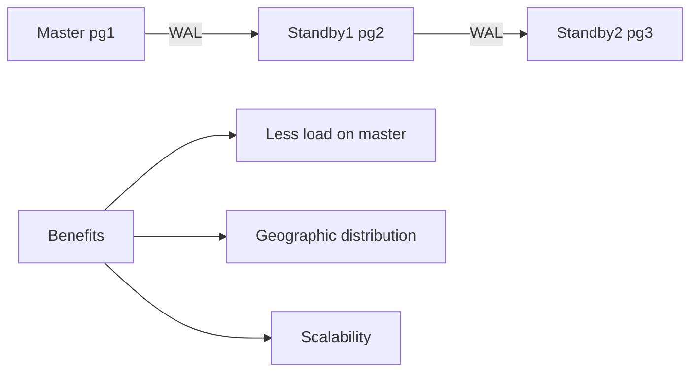

### Setup

**On standby1 (`pg2`):**
```sql
-- Allow standby2 to connect
-- Add to pg_hba.conf:
host replication replicarole 192.168.12.36/32 md5

-- Reload
systemctl reload postgresql

-- Create slot
SELECT * FROM pg_create_physical_replication_slot('standby1');
```

**On standby2 (`pg3`):**
```bash
# Stop, clear PGDATA
systemctl stop postgresql
rm -rf /var/lib/postgresql/12/main/*

# Base backup from standby1
pg_basebackup -h pg2 -U replicarole -p 5432 \
    -D /var/lib/postgresql/12/main \
    -Fp -Xs -P -R -S standby1

# Start
systemctl start postgresql
```

**Verify on master (`pg1`):**
```
pg_stat_replication shows standby1 (pg2)
```

**Verify on standby1 (`pg2`):**
```
pg_stat_replication shows standby2 (pg3)
```

---

## Part 8: Synchronous Replication

### Switching from Async to Sync

**On master (`pg1`):**
```ini
synchronous_standby_names = 'pg2'
synchronous_commit = on
```

**Restart master:**
```bash
systemctl restart postgresql
```

**On standby (`pg2`):**
```ini
# In postgresql.auto.conf:
primary_conninfo = 'user=replicarole password=SuperSecret host=pg1 port=5432 application_name=pg2'
primary_slot_name = 'master'
```

**Restart standby:**
```bash
systemctl restart postgresql
```

### Verify Sync State

**On master:**
```sql
SELECT application_name, sync_state FROM pg_stat_replication;
```
```
+------------------+------------+
| application_name | sync_state |
+------------------+------------+
| pg2              | sync       |
+------------------+------------+
```

**`sync_state` values:**
- `async` — asynchronous
- `sync` — synchronous
- `potential` — could be sync

### Sync Parameters

| Parameter | Meaning |
|-----------|---------|
| `synchronous_commit = on` | Wait for sync standbys |
| `synchronous_standby_names = 'pg2'` | Which standbys are sync |
| `synchronous_standby_names = '*'` | Any standby can be sync |
| `synchronous_commit = off` | Never wait (fast but risk) |

### The Trade-off

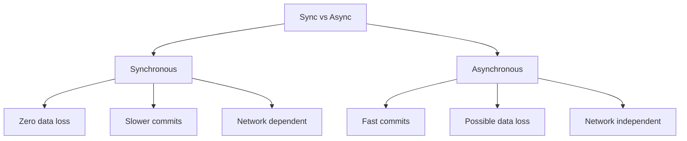

**Sync requires:** Good network, similar hardware, low latency.

---

## Part 9: Complete Summary

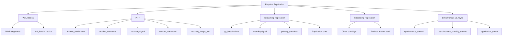

---

## Part 10: Key Takeaways

### WAL Basics
1. **16 MB segments** stored in `pg_wal`
2. **`wal_level = replica`** for physical replication
3. **`archive_mode = on`** for PITR capability

### PITR
4. **Base backup** + **WAL archive** = PITR capability
5. **`recovery.signal`** tells PostgreSQL to recover
6. **`restore_command`** copies WALs from archive
7. **`recovery_target_xid`** specifies where to stop
8. **`pg_wal_replay_resume()`** ends recovery (read-write)

### Streaming Replication Setup
9. **Create replication user** with `REPLICATION`
10. **`pg_hba.conf`** allows replication connections
11. **`pg_basebackup`** clones master to standby
12. **`-R` option** writes recovery config automatically
13. **`-S` option** uses a replication slot

### Replication Slots
14. **Prevent WAL loss** when standby disconnects
15. **Dynamic** — space used only when needed
16. **Created** with `pg_create_physical_replication_slot()`
17. **Dropped** with `pg_drop_replication_slot()`

### Monitoring
18. **`pg_stat_replication`** (on master) shows standby status
19. **`sent_lsn == replay_lsn`** = standby in sync
20. **`sync_state`** = `async` or `sync`
21. **`reply_time`** = last heartbeat

### Cascading
22. **Chain standbys** to reduce master load
23. **Each standby** can feed another
24. **Create slots** on intermediate standbys

### Synchronous
25. **`synchronous_commit = on`** for safety
26. **`synchronous_standby_names`** lists which standbys
27. **`application_name`** on standby must match
28. **Trade-off:** Zero data loss vs latency

---

## Quick Reference Card

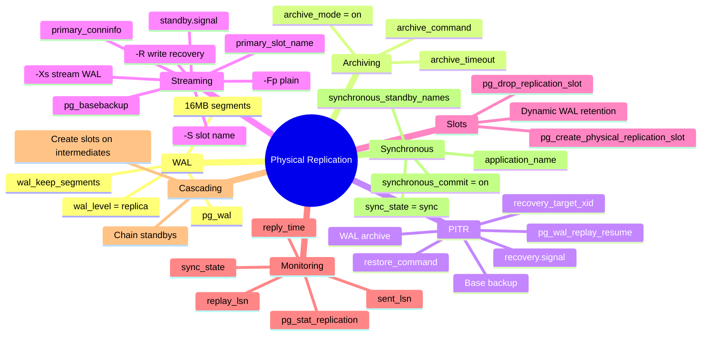

**The Golden Rules:**
1. **Always use replication slots** — prevents WAL loss
2. **`wal_level = replica`** for physical replication
3. **Test PITR** before you need it
4. **`pg_basebackup -R`** writes recovery config
5. **Monitor `pg_stat_replication`** regularly
6. **Cascading** reduces master load
7. **Synchronous** = zero loss but slower
8. **Asynchronous** = faster but possible loss
9. **Replication slots** are better than `wal_keep_segments`
10. **Standby is read-only** until promoted