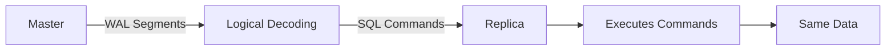
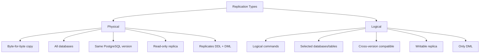
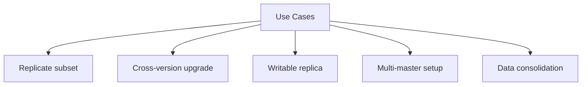
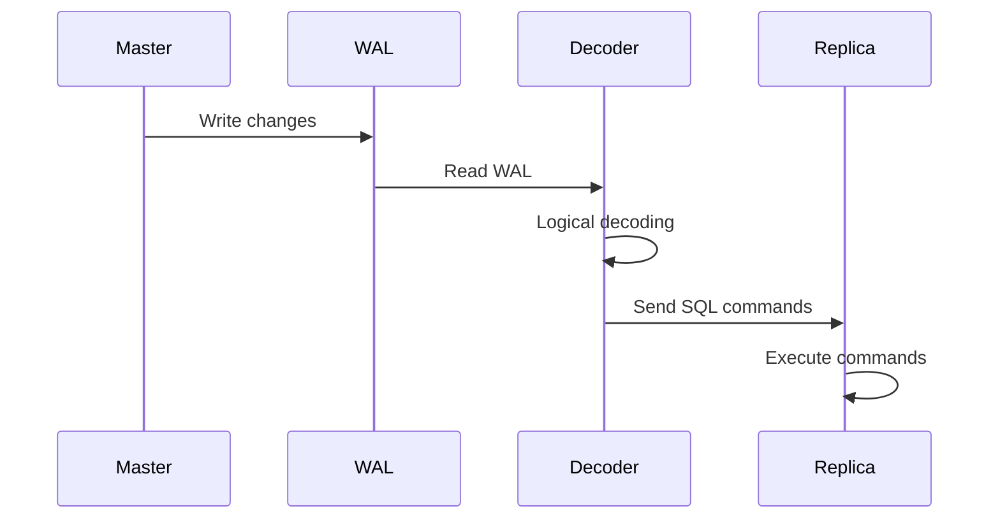
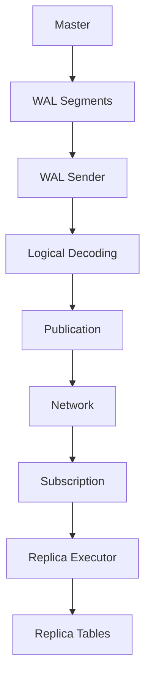
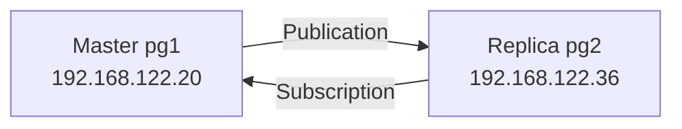
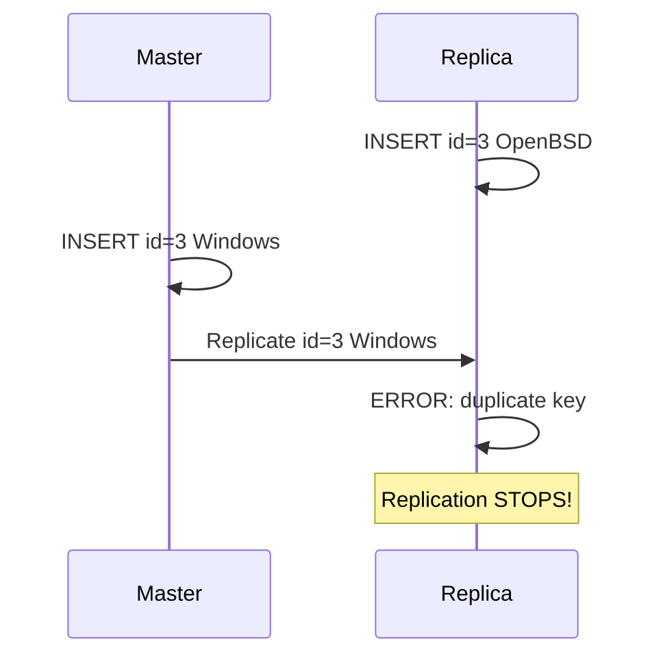
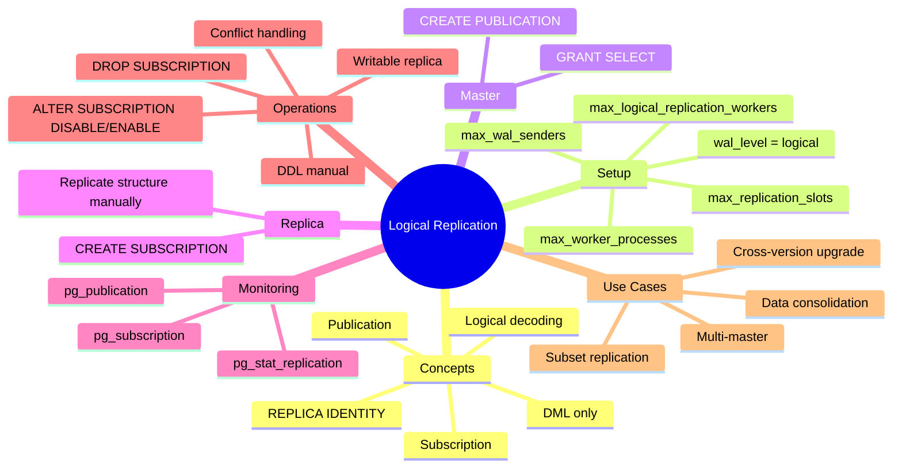

# Simple Explanation of Chapter 18: Logical Replication

This chapter is about **replicating only specific data** (databases, tables) using **logical commands** instead of copying everything byte-for-byte. Let me break it all down with simple words and diagrams.

---

## Part 1: What is Logical Replication?

### The Core Idea

**Logical replication** = replicate **only the DML commands** (INSERT, UPDATE, DELETE) — not the physical data files.



### Physical vs Logical



### Key Differences Table

| Feature | Physical | Logical |
|---------|----------|---------|
| **What** | Entire cluster | Selected databases/tables |
| **How** | Byte-for-byte | SQL commands |
| **Speed** | Faster | Slower |
| **Version** | Same only | Cross-version |
| **Replica** | Read-only | Writable |
| **DDL** | Replicated | NOT replicated |
| **DML** | Replicated | Replicated |

### Why Use Logical Replication?



---

## Part 2: How Logical Replication Works

### The Flow



### The Internal Process



### REPLICA IDENTITY

Tells PostgreSQL **which tuple** was updated/deleted.

| Value | Meaning |
|-------|---------|
| `DEFAULT` | Use primary key |
| `USING INDEX idx` | Use specific index |
| `FULL` | Use entire row |
| `NOTHING` | No info (for append-only) |

```sql
ALTER TABLE t1 REPLICA IDENTITY FULL;
```

---

## Part 3: Setting Up Logical Replication

### The Two Servers



### Master Configuration

**In `postgresql.conf`:**
```ini
listen_addresses = '*'
wal_level = logical
max_replication_slots = 10
max_wal_senders = 10
```

**Create replication user:**
```sql
CREATE USER replicarole WITH REPLICATION ENCRYPTED PASSWORD 'SuperSecret';
```

**Allow in `pg_hba.conf`:**
```
host all replicarole 192.168.122.36/32 md5
```

**Restart master:**
```bash
systemctl restart postgresql
```

### Replica Configuration

**In `postgresql.conf`:**
```ini
listen_addresses = '*'
wal_level = logical
max_logical_replication_workers = 4
max_worker_processes = 10
```

**Restart replica:**
```bash
systemctl restart postgresql
```

### Create Publication (Master)

```sql
CREATE DATABASE db_source;
\c db_source

CREATE TABLE t1 (id integer NOT NULL PRIMARY KEY, name varchar(64));

GRANT SELECT ON ALL TABLES IN SCHEMA public TO replicarole;

CREATE PUBLICATION all_tables_pub FOR ALL TABLES;
```

### Create Subscription (Replica)

```sql
CREATE DATABASE db_destination;
\c db_destination

-- Recreate same table structure
CREATE TABLE t1 (id integer NOT NULL PRIMARY KEY, name varchar(64));

-- Create subscription
CREATE SUBSCRIPTION sub_all_tables
    CONNECTION 'user=replicarole password=SuperSecret host=pg1 port=5432 dbname=db_source'
    PUBLICATION all_tables_pub;
```

### Test It

**On master:**
```sql
INSERT INTO t1 VALUES (1, 'Linux'), (2, 'FreeBSD');
```

**On replica:**
```sql
SELECT * FROM t1;
```
```
+----+---------+
| id | name    |
+----+---------+
| 1  | Linux   |
| 2  | FreeBSD |
+----+---------+
```

**Logical replication works!**

---

## Part 4: Monitoring Logical Replication

### On Master — pg_stat_replication

```sql
SELECT * FROM pg_stat_replication;
```
```
+------------------+--------------------------------+
| application_name | sub_all_tables                 |
| client_addr      | 192.168.122.36                 |
| state            | streaming                      |
| sent_lsn         | 0/19F0D18                      |
| replay_lsn       | 0/19F0D18                      |
| sync_state       | async                          |
| reply_time       | 2020-05-23 11:25:42.417701+02  |
+------------------+--------------------------------+
```

### On Master — pg_publication

```sql
SELECT * FROM pg_publication;
```
```
+--------------+----------------+
| pubname      | all_tables_pub |
| puballtables | t              |
| pubinsert    | t              |
| pubupdate    | t              |
| pubdelete    | t              |
| pubtruncate  | t              |
+--------------+----------------+
```

### On Replica — pg_subscription

```sql
SELECT * FROM pg_subscription;
```
```
+--------------+---------------------------------------------------+
| subname      | sub_all_tables                                    |
| subenabled   | t                                                 |
| subconninfo  | user=replicarole password=SuperSecret host=pg1...|
| subslotname  | sub_all_tables                                    |
| subpublications | {all_tables_pub}                               |
+--------------+---------------------------------------------------+
```

---

## Part 5: Writable Replica — The Big Advantage

### Physical Replica = Read-Only

```sql
-- On physical replica
INSERT INTO t1 VALUES (3, 'OpenBSD');
-- ERROR: cannot execute INSERT in a read-only transaction
```

### Logical Replica = Writable

```sql
-- On logical replica
INSERT INTO t1 VALUES (3, 'OpenBSD');
-- INSERT 0 1 (works!)
```

### But Be Careful!

**If you insert a conflicting key, replication breaks:**



**Log on replica:**
```
ERROR: duplicate key value violates unique constraint "t1_pkey"
DETAIL: Key (id)=(3) already exists.
```

**Log on master:**
```
LOG: logical decoding found consistent point at 0/19FE398
```

### How to Fix

```sql
-- On replica
DROP SUBSCRIPTION sub_all_tables;
TRUNCATE t1;
CREATE SUBSCRIPTION sub_all_tables
    CONNECTION '...'
    PUBLICATION all_tables_pub;
```

---

## Part 6: DDL Commands Are NOT Replicated

### The Problem

**On master:**
```sql
ALTER TABLE t1 ADD description varchar(64);
```

**Master:**
```
+-------------+-----------------------+-------------+
| id          | name                  | description |
+-------------+-----------------------+-------------+
| 1           | Linux                 |             |
| 2           | FreeBSD               |             |
+-------------+-----------------------+-------------+
```

**Replica:**
```
+-------------+-----------------------+
| id          | name                  |
+-------------+-----------------------+
| 1           | Linux                 |
| 2           | FreeBSD               |
+-------------+-----------------------+
```

**Replica is missing the new column!**

### What Happens When You INSERT/UPDATE

**On master:**
```sql
DELETE FROM t1 WHERE id = 5;
```

**Replica log:**
```
ERROR: logical replication target relation "public.t1" is missing some replicated columns
```

**Replication STOPS!**

### Solution: Manually Apply DDL

```sql
-- On replica
ALTER TABLE t1 ADD description varchar(64);
```

**Then replication resumes.**

> **Rule:** Always replicate DDL commands on the replica server manually.

---

## Part 7: Disabling Logical Replication

### Normal Case

```sql
DROP SUBSCRIPTION sub_all_tables;
```

### When Master Is Unreachable

**Problem:**
```sql
DROP SUBSCRIPTION sub_all_tables;
-- ERROR: could not connect to publisher
-- DETAIL: could not connect to server: Connection refused
```

**Solution — Three Steps:**

```sql
-- Step 1: Disable
ALTER SUBSCRIPTION sub_all_tables DISABLE;

-- Step 2: Detach from slot
ALTER SUBSCRIPTION sub_all_tables SET (slot_name = NONE);

-- Step 3: Drop
DROP SUBSCRIPTION sub_all_tables;
```

### Re-enabling

```sql
-- Disable (temporary)
ALTER SUBSCRIPTION sub_all_tables DISABLE;

-- Enable (re-attach)
ALTER SUBSCRIPTION sub_all_tables ENABLE;
```

---

## Part 8: Complete Summary

```mermaid
graph TD
    A[Logical Replication] --> B[Concepts]
    A --> C[Setup]
    A --> D[Monitoring]
    A --> E[Writable Replica]
    A --> F[Limitations]
    
    B --> B1[DML only]
    B --> B2[Logical decoding]
    B --> B3[Publication/Subscription]
    B --> B4[REPLICA IDENTITY]
    
    C --> C1[wal_level = logical]
    C --> C2[max_replication_slots]
    C --> C3[max_wal_senders]
    C --> C4[CREATE PUBLICATION]
    C --> C5[CREATE SUBSCRIPTION]
    
    D --> D1[pg_stat_replication]
    D --> D2[pg_publication]
    D --> D3[pg_subscription]
    
    E --> E1[Can write]
    E --> E2[Be careful with conflicts]
    E --> E3[Fix: drop & re-create]
    
    F --> F1[No DDL]
    F --> F2[Manual DDL on replica]
    F --> F3[Conflict handling]
```



---

## Part 9: Key Takeaways

### Concepts
1. **Logical replication** replicates SQL commands, not data blocks
2. **Logical decoding** extracts commands from WAL
3. **Publication** (master) + **Subscription** (replica)
4. **REPLICA IDENTITY** identifies which row changed

### Comparison with Physical
5. **Logical** = selective (databases/tables)
6. **Physical** = entire cluster
7. **Logical** = cross-version compatible
8. **Physical** = same version only
9. **Logical** = writable replica
10. **Physical** = read-only replica
11. **Logical** = DML only
12. **Physical** = DML + DDL

### Setup
13. **`wal_level = logical`** on both servers
14. **`max_replication_slots`** = enough for all subscribers
15. **`max_wal_senders`** = enough for all slots + physical
16. **`max_logical_replication_workers`** on replica
17. **`max_worker_processes`** on replica

### Commands
18. **CREATE PUBLICATION** on master
19. **CREATE SUBSCRIPTION** on replica
20. **DROP SUBSCRIPTION** to stop replication
21. **ALTER SUBSCRIPTION ... DISABLE** to pause
22. **ALTER SUBSCRIPTION ... ENABLE** to resume

### Monitoring
23. **`pg_stat_replication`** on master
24. **`pg_publication`** on master
25. **`pg_subscription`** on replica

### Important Rules
26. **DDL is NOT replicated** — apply manually
27. **Conflicts stop replication** — fix by dropping/re-creating
28. **Writable replica** is powerful but risky
29. **Use logical replication for hot upgrades**
30. **No DDL replication** is the biggest limitation

---

## Quick Reference Card



**The Golden Rules:**
1. **Use logical replication** for selective data or cross-version
2. **Use physical replication** for full cluster, same version
3. **Always set `wal_level = logical`** on both servers
4. **DDL is NOT replicated** — apply manually
5. **Watch for conflicts** on writable replicas
6. **Monitor `pg_stat_replication`** on master
7. **`REPLICA IDENTITY`** matters for UPDATE/DELETE
8. **Disable before dropping** if master unreachable
9. **Logical replication enables hot upgrades**
10. **Test before production** — conflicts can break replication