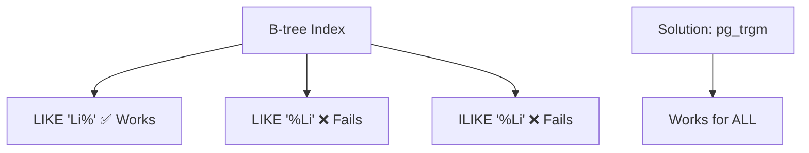
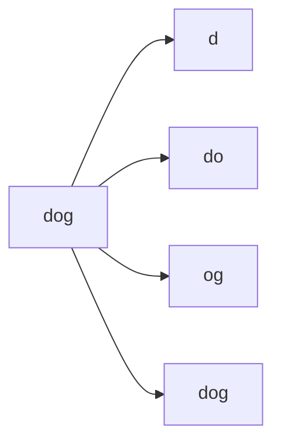
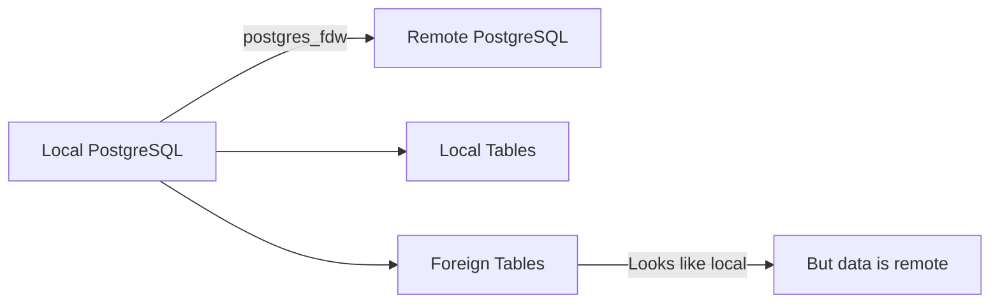
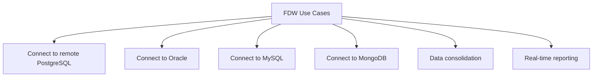
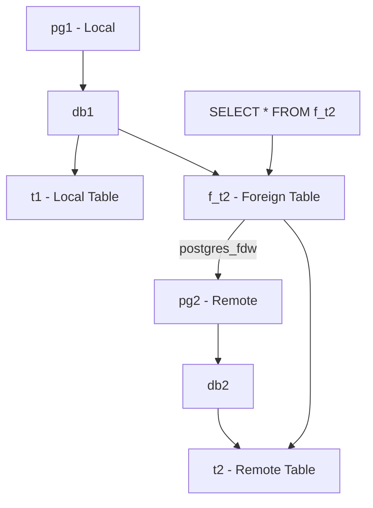
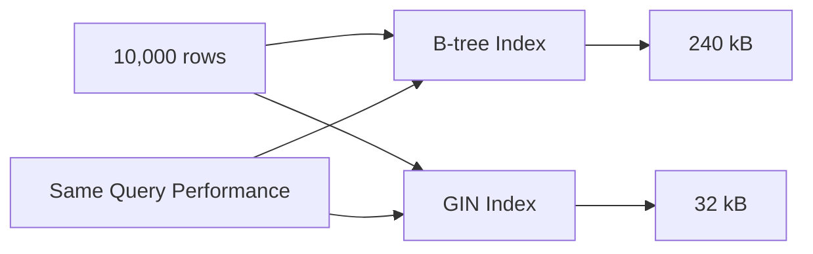
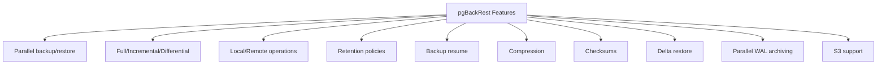
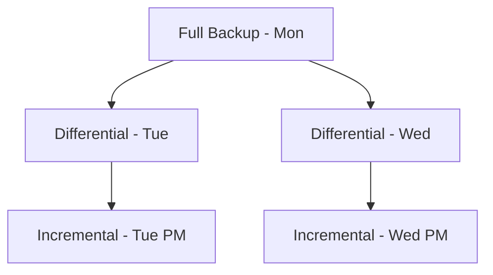
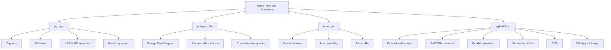
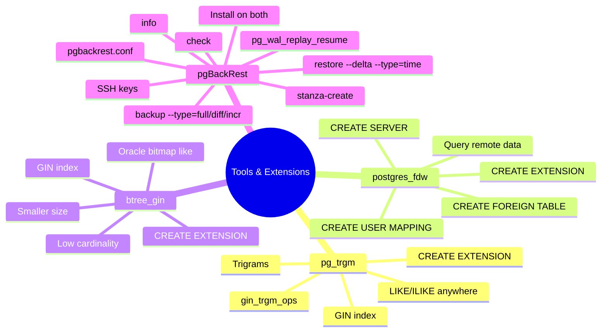

# Simple Explanation of Chapter 19: Useful Tools and Extensions

This chapter is an **appendix** — a collection of useful tools and extensions to make your DBA life easier. Let me break it all down with simple words and diagrams.

---

## Part 1: pg_trgm Extension — Fuzzy Text Search

### The Problem

**B-tree indexes** work well for `LIKE 'search%'` but **NOT** for:
- `LIKE '%search'` (ends with)
- `LIKE '%search%'` (contains)
- `ILIKE` (case-insensitive)



### How pg_trgm Works

**Trigrams** = split text into 3-character chunks.

**Example:** `dog` → `d`, `do`, `og`, `dog`



### Installation

```sql
CREATE EXTENSION pg_trgm;
```

### Creating the Index

```sql
CREATE INDEX db_source_name_gin ON t1 USING gin (name gin_trgm_ops);
```

### Before vs After

**Without pg_trgm:**
```sql
EXPLAIN ANALYZE SELECT * FROM t1 WHERE name ILIKE '%Li';
```
```
Seq Scan on t1 (cost=...rows=1 width=104)
Filter: ((name)::text ~~* '%Li'::text)
Execution Time: 29.975 ms
```

**With pg_trgm:**
```sql
EXPLAIN ANALYZE SELECT * FROM t1 WHERE name ILIKE '%Li';
```
```
Bitmap Heap Scan on t1 (cost=8.00..12.01 rows=1 width=104)
Recheck Cond: ((name)::text ~~* '%Li'::text)
  -> Bitmap Index Scan on db_source_name_gin
Index Cond: ((name)::text ~~* '%Li'::text)
Execution Time: 0.152 ms
```

**Result:** 30ms → 0.15ms (200x faster!)

### When to Use pg_trgm

| Use Case | Works? |
|----------|--------|
| `LIKE 'search%'` | ✅ |
| `LIKE '%search'` | ✅ |
| `LIKE '%search%'` | ✅ |
| `ILIKE` (any pattern) | ✅ |
| Fuzzy matching | ✅ |

---

## Part 2: postgres_fdw — Foreign Data Wrappers

### What is FDW?

**Foreign Data Wrapper** = access data from **another database** as if it were a **local table**.



### Use Cases



### Setup Example

**Scenario:** Two servers — `pg1` (local) and `pg2` (remote).

**Step 1: Install extension on local server**
```sql
CREATE EXTENSION postgres_fdw;
```

**Step 2: Create server connection**
```sql
CREATE SERVER remote_pg2
FOREIGN DATA WRAPPER postgres_fdw
OPTIONS (host '192.168.12.36', dbname 'db2');
```

**Step 3: Create user mapping**
```sql
CREATE USER MAPPING FOR CURRENT_USER
SERVER remote_pg2
OPTIONS (user 'postgres', password '');
```

**Step 4: Create foreign table**
```sql
CREATE FOREIGN TABLE f_t2 (id integer, name varchar(64))
SERVER remote_pg2
OPTIONS (schema_name 'public', table_name 't2');
```

**Step 5: Query it!**
```sql
SELECT * FROM f_t2;
```
```
+----+------+
| id | name |
+----+------+
| 1  | Unix |
+----+------+
```

### Visual



---

## Part 3: btree_gin Extension — Smaller Indexes

### What is GIN?

**GIN** = Generalized Inverted Index

- Good for **many rows with low cardinality** (few distinct values)
- **Much smaller** than B-tree for such cases
- Similar to **Oracle Bitmap Indexes**

### The Problem

**B-tree index on low-cardinality column:**
- Column `sex` has only 2 values: `'M'`, `'F'`
- B-tree index stores **all values**, so it's large
- Wastes space for little benefit

### The Solution: btree_gin

```sql
CREATE EXTENSION btree_gin;
CREATE INDEX sex_gin ON users USING gin (sex);
```

### Size Comparison

**Example:** 10,000 rows, `sex` column with 5,000 `'M'` and 5,000 `'F'`

| Index Type | Size |
|-----------|------|
| B-tree (`sex_btree`) | **240 kB** |
| GIN (`sex_gin`) | **32 kB** |

**Result:** GIN is **7.5x smaller!**

### Visual



### When to Use btree_gin

| Scenario | Recommended |
|----------|-------------|
| High cardinality | B-tree |
| Low cardinality | **btree_gin** |
| Many rows, few values | **btree_gin** |
| Disk space constrained | **btree_gin** |
| Unique values | B-tree |

---

## Part 4: pgBackRest — Professional Backup Tool

### What is pgBackRest?

A **powerful backup and PITR tool** designed for heavy-load servers.



### Key Concepts

| Concept | Meaning |
|---------|---------|
| **Stanza** | Configuration for one PostgreSQL cluster |
| **Repository** | Where backups are stored (local/remote/S3) |
| **Full backup** | Complete copy |
| **Differential** | Changes since last full |
| **Incremental** | Changes since last backup (any type) |



### Setup: SSH Key Exchange

**Step 1: Generate SSH keys on both servers**
```bash
ssh-keygen -t rsa -b 4096
# Press Enter for no passphrase
```

**Step 2: Copy public keys**
```bash
# On pg1: copy id_rsa.pub content to pgdr's authorized_keys
# On pgdr: copy id_rsa.pub content to pg1's authorized_keys
```

**Step 3: Test passwordless SSH**
```bash
postgres@pgdr:~$ ssh postgres@192.168.12.35
# Should connect without password
```

### Installation

**On both servers:**
```bash
# Debian/Ubuntu
apt-get update && apt-get install -y pgbackrest

# RedHat/Fedora
yum install -y pgbackrest
```

### Repository Server Configuration (`pgdr`)

**File:** `/etc/pgbackrest/pgbackrest.conf`

```ini
[global]
start-fast=y
archive-async=y
process-max=2
repo-path=/var/lib/pgbackrest
repo1-retention-full=2
repo1-retention-archive=5
repo1-retention-diff=3
log-level-console=info
log-level-file=info

[pg1]
pg1-host=192.168.12.35
pg1-host-user=postgres
pg1-path=/var/lib/postgresql/12/main
pg1-port=5432
```

**Key options:**

| Option | Meaning |
|--------|---------|
| `start-fast=y` | Force checkpoint immediately |
| `archive-async=y` | Async WAL transfer |
| `process-max=2` | 2 parallel processes |
| `repo-path` | Repository location |
| `repo1-retention-full=2` | Keep 2 full backups |
| `repo1-retention-archive=5` | Keep 5 WAL archives |
| `repo1-retention-diff=3` | Keep 3 differential backups |

### PostgreSQL Server Configuration (`pg1`)

**File:** `/etc/pgbackrest/pgbackrest.conf`

```ini
[global]
backup-host=192.168.12.37
backup-user=postgres
backup-ssh-port=22
log-level-console=info
log-level-file=info

[pg1]
pg1-path=/var/lib/postgresql/12/main
pg1-port=5432
```

**Also modify `postgresql.conf`:**
```ini
archive_mode = on
wal_level = logical
archive_command = 'pgbackrest --stanza=pg1 archive-push %p'
```

**Restart PostgreSQL:**
```bash
systemctl restart postgresql
```

### Creating the Stanza

```bash
sudo -iu postgres pgbackrest --stanza=pg1 stanza-create
```

**Output:**
```
2020-05-30 15:31:46.777 P00 INFO: stanza-create command begin 2.27
2020-05-30 15:31:48.151 P00 INFO: stanza-create command end: completed successfully (1375ms)
```

### Checking the Stanza

```bash
sudo -iu postgres pgbackrest --stanza=pg1 check
```

**Output:**
```
2020-05-30 15:51:46.614 P00 INFO: WAL segment 00000001000000000000000B successfully archived to
'/var/lib/pgbackrest/archive/pg1/12-1/0000000100000000/00000001000000000000000B-...gz'
2020-05-30 15:51:46.715 P00 INFO: check command end: completed successfully (10126ms)
```

### Running Backups

**Full backup:**
```bash
sudo -iu postgres pgbackrest --stanza=pg1 --type=full backup
```

**Differential backup:**
```bash
sudo -iu postgres pgbackrest --stanza=pg1 --type=diff backup
```

**Incremental backup:**
```bash
sudo -iu postgres pgbackrest --stanza=pg1 --type=incr backup
```

### Viewing Backup Info

```bash
sudo -iu postgres pgbackrest --stanza=pg1 info
```

**Output:**
```
stanza: pg1
status: ok
cipher: none
db (current)
  wal archive min/max (12-1): 000000010000000000000001/000000010000000000000011
  full backup: 20200530-155639F
    timestamp start/stop: 2020-05-30 15:56:39 / 2020-05-30 15:58:07
    database size: 33.5MB, backup size: 33.5MB
    repository size: 4MB, repository backup size: 4MB
  diff backup: 20200530-155639F_20200530-160644D
    database size: 33.5MB, backup size: 8.3KB
  incr backup: 20200530-155639F_20200530-160728I
    database size: 33.5MB, backup size: 8.3KB
```

### Retention Policy

With `repo1-retention-full=2`:
- After 2 full backups, the oldest is **automatically deleted**
- Its dependent differential/incremental backups are also deleted


### PITR with pgBackRest

**Scenario:** Table dropped accidentally at 16:23:38

**Step 1: Stop PostgreSQL**
```bash
systemctl stop postgresql
```

**Step 2: Restore to target time**
```bash
sudo -u postgres pgbackrest --stanza=pg1 --delta \
    --log-level-console=info \
    --type=time "--target=2020-05-30 16:23:38" restore
```

**Step 3: Start PostgreSQL**
```bash
systemctl start postgresql
```

**Step 4: Check logs**
```
LOG: restored log file "000000020000000000000016" from archive
LOG: recovery stopping before commit of transaction 508, time 2020-05-30 16:52:48
LOG: recovery has paused
HINT: Execute pg_wal_replay_resume() to continue.
```

**Step 5: Resume**
```sql
SELECT pg_wal_replay_resume();
```

**Step 6: Verify**
```sql
SELECT count(*) FROM users;
```
```
+-------+
| count |
+-------+
| 10000 |
+-------+
```

**Recovery successful!**

---

## Part 5: Complete Summary



---

## Part 6: Key Takeaways

### pg_trgm
1. **Solves LIKE/ILIKE problem** where B-tree fails
2. **Trigrams** = 3-character chunks
3. **GIN index** with `gin_trgm_ops`
4. **Works for `%search`, `search%`, `%search%`**
5. **Massive speedup** (200x in example)

### postgres_fdw
6. **Foreign Data Wrapper** = access remote tables as local
7. **Works with PostgreSQL, Oracle, MySQL, etc.**
8. **Four steps:** CREATE EXTENSION, SERVER, USER MAPPING, FOREIGN TABLE
9. **Query transparently** — no application changes
10. **Ideal for data consolidation and reporting**

### btree_gin
11. **GIN** = Generalized Inverted Index
12. **Smaller than B-tree** for low cardinality
13. **Similar to Oracle Bitmap Indexes**
14. **7.5x smaller** in the example
15. **Same query performance, less space**

### pgBackRest
16. **Professional backup tool**
17. **Stanza** = cluster configuration
18. **Full, Differential, Incremental** backups
19. **Parallel operations** for speed
20. **Retention policies** for automatic cleanup
21. **PITR** = restore to any point in time
22. **SSH key exchange** required
23. **`--delta`** for faster restore
24. **`--type=time --target=...`** for PITR

---

## Quick Reference Card



**The Golden Rules:**
1. **Use pg_trgm** when LIKE/ILIKE needs indexes
2. **Use postgres_fdw** to access remote data as local
3. **Use btree_gin** for low-cardinality columns
4. **pgBackRest** is production-grade backup
5. **Always exchange SSH keys** for pgBackRest
6. **Create stanza** before any backup
7. **Check stanza** after creation
8. **Use retention policies** to manage space
9. **PITR needs WAL archiving** enabled
10. **`--delta` restore** is faster but overwrites

---

## Common Commands Cheat Sheet

```bash
# pg_trgm
CREATE EXTENSION pg_trgm;
CREATE INDEX idx ON table USING gin (column gin_trgm_ops);

# postgres_fdw
CREATE EXTENSION postgres_fdw;
CREATE SERVER name FOREIGN DATA WRAPPER postgres_fdw OPTIONS (...);
CREATE USER MAPPING FOR user SERVER name OPTIONS (...);
CREATE FOREIGN TABLE name (...) SERVER name OPTIONS (...);

# btree_gin
CREATE EXTENSION btree_gin;
CREATE INDEX idx ON table USING gin (column);

# pgBackRest
sudo -iu postgres pgbackrest --stanza=pg1 stanza-create
sudo -iu postgres pgbackrest --stanza=pg1 check
sudo -iu postgres pgbackrest --stanza=pg1 --type=full backup
sudo -iu postgres pgbackrest --stanza=pg1 --type=diff backup
sudo -iu postgres pgbackrest --stanza=pg1 --type=incr backup
sudo -iu postgres pgbackrest --stanza=pg1 info
sudo -u postgres pgbackrest --stanza=pg1 --delta --type=time "--target=TIMESTAMP" restore
```