# Simple Explanation of Chapter 20: Toward PostgreSQL 13

This final chapter is about **what's new in PostgreSQL 13** and **how to upgrade** from older versions. Let me break it all down with simple words and diagrams.

---

## Part 1: What's New in PostgreSQL 13?

The new features are organized into **five categories**:

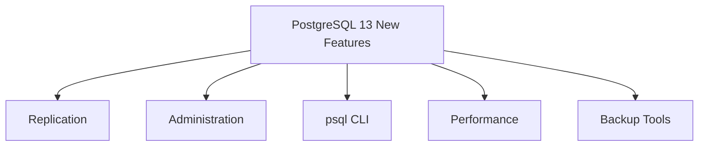

---

## Part 2: Replication Improvements

### Streaming Replication

| Feature | What It Means |
|---------|---------------|
| **Reload without restart** | Standbys can apply config changes with just a reload |
| **Recovery target error** | If target not reached, server errors instead of promoting |
| **Promote paused standby** | Can promote even if standby is paused |
| **Temporary slots** | WAL receivers can use temp slots |
| **max_wal_slot_keep_size** | Limit WAL slot size, invalidate excess |

### Visual: Recovery Target Change

**PostgreSQL 12 (old behavior):**


**PostgreSQL 13 (new behavior):**


### New Replication Parameters

| Parameter | Purpose |
|-----------|---------|
| `wal_receiver_create_temp_slot` | Use temporary slots |
| `max_wal_slot_keep_size` | Limit slot size |

---

## Part 3: Administration Improvements

### New Commands and Options

| Command | What's New |
|---------|-----------|
| `VACUUM PARALLEL` | Parallel index vacuuming |
| `ALTER VIEW ... RENAME` | Rename view columns |
| `DROP DATABASE WITH FORCE` | Force disconnect users |
| `INSERT OVERRIDING USER VALUE` | Override non-identity columns |
| `TRUNCATE` | Faster on large tables |
| `EXPLAIN WAL` | See WAL usage |

### VACUUM PARALLEL

```sql
VACUUM (PARALLEL 4) big_table;
```

**Visual:**
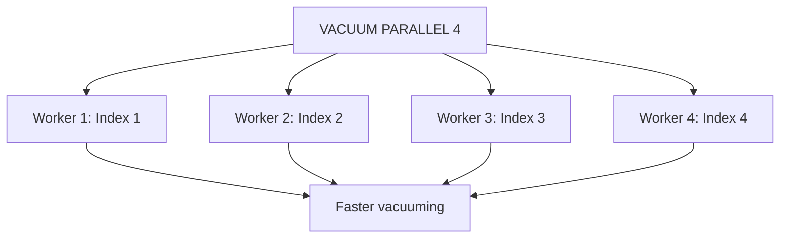

### DROP DATABASE WITH FORCE

```sql
-- Old way (fails if users connected)
DROP DATABASE mydb;
-- ERROR: database is being accessed by other users

-- New way (PG13)
DROP DATABASE mydb WITH FORCE;
-- Immediately disconnects users and drops
```

### New System Views

| View | Purpose |
|------|---------|
| `pg_stat_progress_basebackup` | Backup progress |
| `pg_stat_progress_analyze` | ANALYZE progress |
| `pg_stat_replication` | More logical replication info |
| `pg_stat_activity` | Shows parallel leader |

---

## Part 4: psql CLI Improvements

### Transaction State Indicators

**PostgreSQL 13 shows transaction state in the prompt:**

```sql
template1=# BEGIN;
BEGIN
template1=*# SELECT current_date;
--         ^ * means "inside transaction"
 current_date
--------------
 2020-07-25

template1=*# ROLLBACK;
ROLLBACK
template1=#
```

**Symbols:**

| Symbol | Meaning |
|--------|---------|
| `=` | Normal state |
| `*` | Inside transaction |
| `!` | Transaction aborted |

**Visual:**
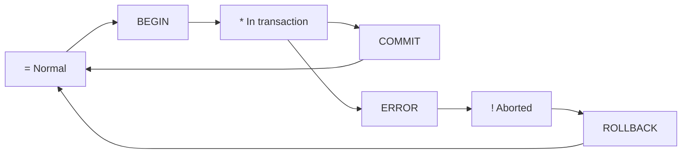

### \dt+ Shows Persistence

```sql
forumdb=> \dt+
```
```
+--------+------------+-------+----------+-------------+------------+
| Schema | Name       | Type  | Owner    | Persistence | Size       |
+--------+------------+-------+----------+-------------+------------+
| public | categories | table | postgres | unlogged    | 16 kB      |
| public | users      | table | postgres | permanent   | 8192 bytes |
+--------+------------+-------+----------+-------------+------------+
```

**New column:** `Persistence` shows if table is `permanent`, `unlogged`, or `temporary`.

---

## Part 5: Performance Improvements

### PL/pgSQL Improvements

- **Faster execution** of simple immutable expressions
- **Lookup mechanism** for number-to-text conversion

### Optimizer Improvements

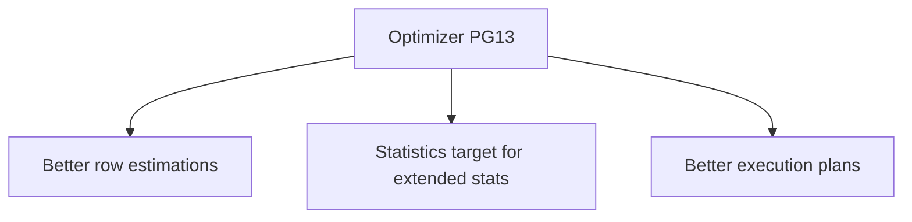

### Incremental Sort

**New parameter:** `enable_incrementalsort` (default on)

**Visual:**
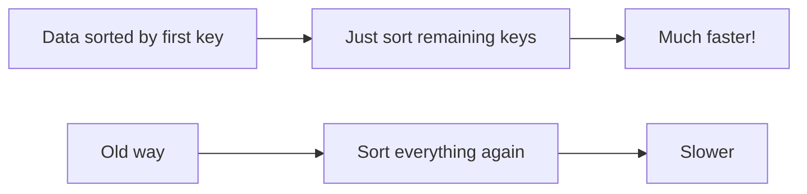

**Example:**
- Data is already sorted by `(a, b)` from an index
- Query needs `ORDER BY a, b, c`
- **Incremental sort** only sorts by `c` within `(a, b)` groups

### wal_skip_threshold

```ini
wal_skip_threshold = '2MB'
```

**What it does:**
- If COMMIT involves data larger than threshold
- AND wal_level = minimal
- Then **sync data files directly** instead of WAL full-page write

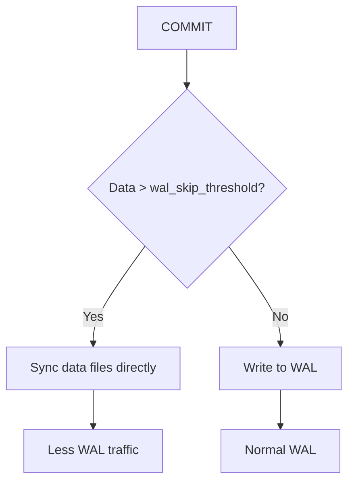

---

## Part 6: Backup Tools Improvements

### pg_verifybackup (New)

Already introduced in Chapter 15, now part of PostgreSQL 13.

```bash
pg_verifybackup /backup/pg_backup
# backup successfully verified
```

### pg_basebackup Improvements

- **Progress estimation** now available
- Feeds `pg_stat_progress_basebackup` view

### pg_rewind Improvements

- **Uses standby recovery command** to fetch WALs
- **Supports standby configuration** (writes `recovery.signal`)

---

## Part 7: Upgrading to PostgreSQL 13

### Three Approaches

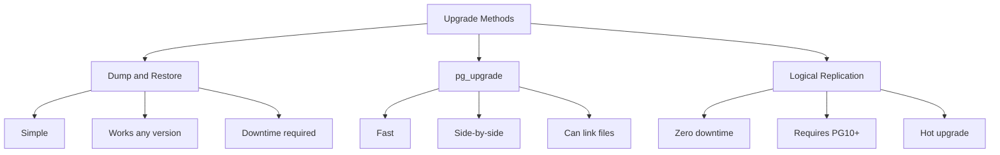

### Comparison Table

| Method | Downtime | Speed | Version Support | Complexity |
|--------|----------|-------|-----------------|------------|
| **Dump/Restore** | High | Slow | Any | Low |
| **pg_upgrade** | Low | Fast | Any | Medium |
| **Logical Replication** | Zero | Medium | PG10+ | High |

### Method 1: Dump and Restore

```bash
# On old cluster
pg_dumpall -U postgres -f cluster.sql

# On new cluster (PostgreSQL 13)
psql -U postgres template1 -f cluster.sql
```

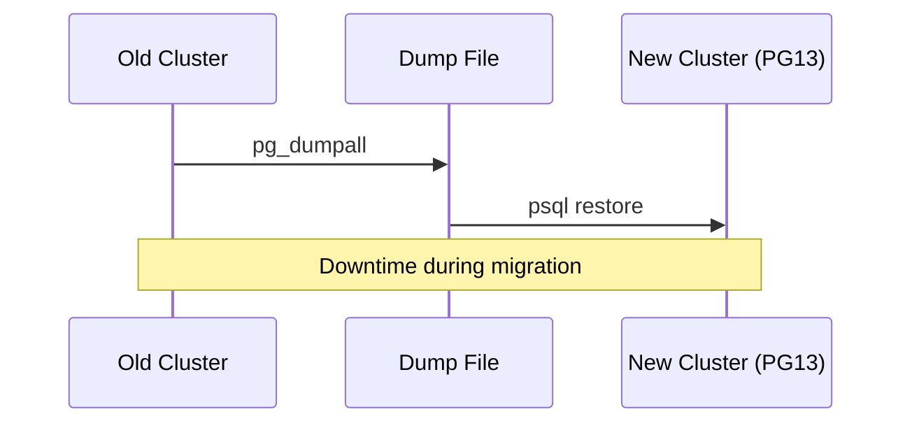

**Pros:**
- Simple
- Works with any version
- Consistent

**Cons:**
- Offline migration (downtime)
- Slow for large databases
- Requires space for dump file

### Method 2: pg_upgrade

```bash
pg_upgrade \
    -b /usr/lib/postgresql/12/bin \
    -B /usr/lib/postgresql/13/bin \
    -d /var/lib/postgresql/12/main \
    -D /var/lib/postgresql/13/main \
    -v
```

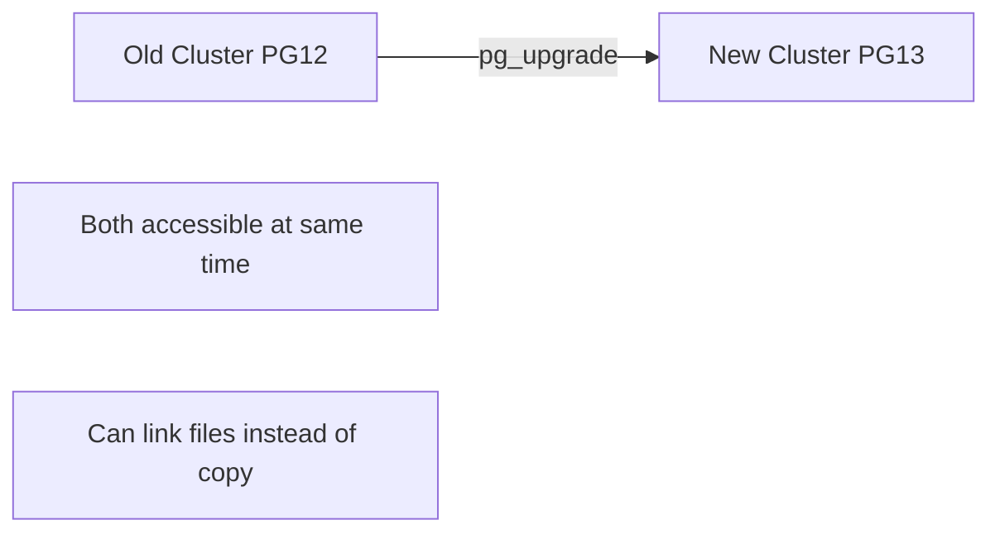

**Pros:**
- Fast
- Side-by-side operation
- Can link files (saves space)
- Low downtime

**Cons:**
- More complex
- Requires both versions installed
- Not all upgrades are simple

### Method 3: Logical Replication (PG10+)

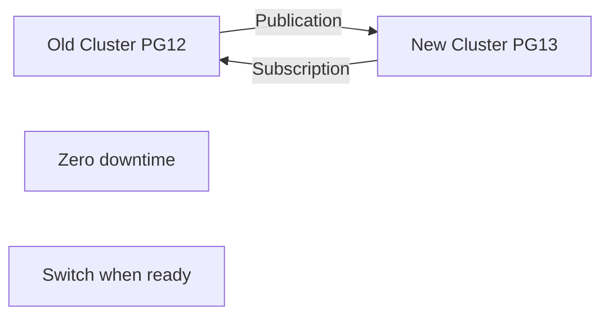

**Steps:**
1. Set up logical replication from old to new cluster
2. Wait for replication to catch up
3. Stop application, switch over to new cluster
4. Decommission old cluster

**Pros:**
- Zero downtime
- Hot upgrade
- Can test before switchover

**Cons:**
- Requires PG10 or later
- More complex setup
- DDL not replicated (manual)

---

## Part 8: Complete Summary Diagram

```mermaid
graph TD
    A[PostgreSQL 13] --> B[Replication]
    A --> C[Administration]
    A --> D[psql]
    A --> E[Performance]
    A --> F[Backup Tools]
    A --> G[Upgrade Methods]
    
    B --> B1[Reload without restart]
    B --> B2[Recovery target error]
    B --> B3[Promote paused standby]
    B --> B4[Temporary slots]
    
    C --> C1[VACUUM PARALLEL]
    C --> C2[DROP DATABASE FORCE]
    C --> C3[ALTER VIEW RENAME]
    C --> C4[New progress views]
    
    D --> D1[Transaction indicator]
    D --> D2[\dt+ persistence]
    D --> D3[Better descriptions]
    
    E --> E1[PL/pgSQL faster]
    E --> E2[Incremental sort]
    E --> E3[wal_skip_threshold]
    E --> E4[Better row estimates]
    
    F --> F1[pg_verifybackup]
    F --> F2[pg_basebackup progress]
    F --> F3[pg_rewind improvements]
    
    G --> G1[Dump/Restore]
    G --> G2[pg_upgrade]
    G --> G3[Logical Replication]
```

---

## Part 9: Key Takeaways

### Replication
1. **Reload without restart** for config changes
2. **Recovery target error** if not reached (safer!)
3. **Promote paused standby** (higher priority)
4. **Temporary slots** for WAL receivers
5. **`max_wal_slot_keep_size`** to limit slot size

### Administration
6. **`VACUUM PARALLEL`** for faster index vacuuming
7. **`DROP DATABASE WITH FORCE`** disconnects users
8. **`ALTER VIEW ... RENAME`** column renaming
9. **`INSERT OVERRIDING USER VALUE`** for non-identity columns
10. **New progress views:** `pg_stat_progress_basebackup`, `pg_stat_progress_analyze`

### psql
11. **`*` after prompt** = inside transaction
12. **`!` after prompt** = transaction aborted
13. **`\dt+`** shows persistence (permanent/unlogged/temp)

### Performance
14. **PL/pgSQL faster** for immutable expressions
15. **Incremental sort** (`enable_incrementalsort`)
16. **`wal_skip_threshold`** for large COMMITs
17. **Better statistics** for extended stats

### Backup
18. **`pg_verifybackup`** verifies backups
19. **`pg_basebackup`** estimates progress
20. **`pg_rewind`** uses standby recovery command

### Upgrading
21. **Dump/Restore** = simple, works any version, downtime
22. **pg_upgrade** = fast, side-by-side, low downtime
23. **Logical Replication** = zero downtime, PG10+, complex

---

## Quick Reference Card

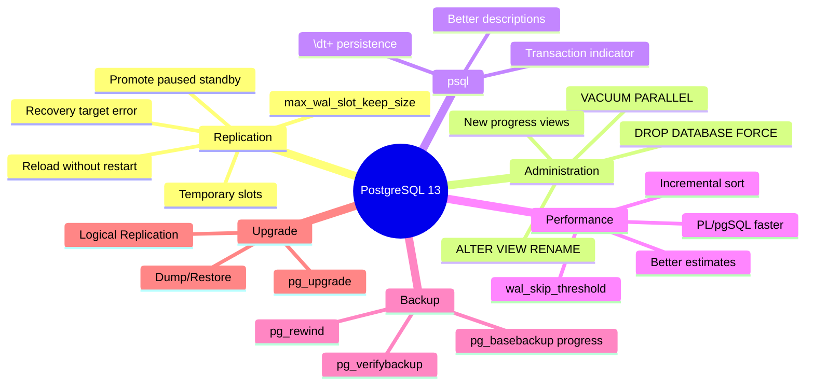

**The Golden Rules:**
1. **PostgreSQL 13** is a solid evolution with many improvements
2. **Reload without restart** for replication config
3. **VACUUM PARALLEL** speeds up maintenance
4. **DROP DATABASE WITH FORCE** solves stuck drops
5. **Transaction indicators** in psql help avoid mistakes
6. **Incremental sort** speeds up ORDER BY
7. **wal_skip_threshold** reduces WAL traffic
8. **pg_verifybackup** ensures backups are valid
9. **Three upgrade paths:** dump/restore, pg_upgrade, logical
10. **Choose upgrade method** based on downtime tolerance and version

---

## Final Words

> "Now, thanks to the knowledge you have gained throughout this whole book, you are able to install PostgreSQL 13 or even a higher version and go find the features you like the most and fit your needs best. Use this book as a teammate during your journey of exploring PostgreSQL, and feel free to jump back and forth between chapters depending on what aspect of PostgreSQL 13 you are learning about or faced with."

**Congratulations on completing the book!** 🎉

You now have a comprehensive understanding of:
- PostgreSQL fundamentals and installation
- Database and table management
- Advanced SQL and window functions
- Server-side programming (functions, triggers, rules)
- Partitioning strategies
- Users, roles, and security
- Transactions, MVCC, WAL, and checkpoints
- Extension ecosystem
- Performance tuning and indexing
- Logging and auditing
- Backup and restore strategies
- Configuration and monitoring
- Physical and logical replication
- Useful tools and extensions
- What's new in PostgreSQL 13